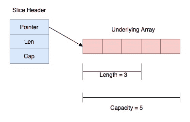
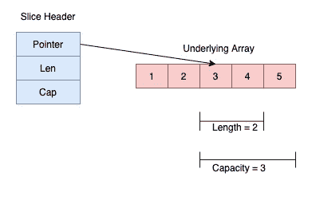

# 切片

> 原文：<https://golangbyexample.com/slice-in-golang/>

这是 golang 综合教程系列的第 18 章。本系列其他章节参考本链接–[格朗综合教程系列](https://golangbyexample.com/golang-comprehensive-tutorial/)

**下一教程**–[地图](https://golangbyexample.com/maps-in-golang)
T5】上一教程–[数组](https://golangbyexample.com/understanding-array-golang-complete-guid)

现在让我们来看看当前的教程。下面是当前教程的目录。

# **概述**

数组的大小是它的一部分，这限制了 go 中数组的表现力和功能。这就是切片进入画面的地方。切片比数组更强大，使用更方便。事实上，Slice 更类似于另一种编程语言中的数组。

切片指向基础数组，并在内部由切片头表示。与数组不同，切片的大小是灵活的，可以更改。

**切片的内部表示**

在内部，一个切片由三个东西表示。

*   指向基础数组的指针
*   基础数组的当前长度
*   总容量，即底层数组可以扩展到的最大容量。

上面的内部表示由 **SliceHeader** 结构描述，如下所示:

```go
type SliceHeader struct {
        Pointer uintptr
        Len  int
        Cap  int
}
```

切片头中的**指针**字段是指向底层数组的指针。Len 是切片的当前长度，Cap 是切片的容量。与数组类似，切片索引从**零**开始，直到**切片长度 _ 1**。因此，3 个长度和 5 个容量的切片如下所示

<figure class="wp-block-image size-large"></figure>

# ****创造**一片**

创建切片有四种方法

*   使用[] <type>{}格式</type>

*   从另一个切片或数组创建切片

*   使用 make

*   使用新的

让我们一个一个地看上面的每一个方法。

## **使用[] <类型> {}格式**

声明切片的最常见方式是这样的

```go
s := []int
```

它声明一个长度为 0、容量为 0 的空切片。我们也可以在声明过程中初始化切片。

```go
s := []int{1,2}
```

它声明了一个长度为 2，容量为 2 的整数片。容量将等于指定的实际切片元素。我们还有 go 提供的两个库函数，可以用来知道切片的**长度**和**容量**。

*   **len()** 函数–用于切片长度

*   **cap()** 功能–用于切片的容量

让我们看一个小程序，它显示了以上几点

```go
package main

import "fmt"

func main() {
    sample := []int{}
    fmt.Println(len(sample))
    fmt.Println(cap(sample))
    fmt.Println(sample)

    letters := []string{"a", "b", "c"}
    fmt.Println(len(letters))
    fmt.Println(cap(letters))
    fmt.Println(letters)
}
```

**输出**

```go
0
0
[]

3
3
[a b c]
```

如果未指定实际元素，则切片的长度和容量都为零。当指定实际元素时，长度和容量都等于指定的实际元素数量。

## **从另一个切片或数组创建切片**

可以通过重新切片现有切片或数组来创建切片。

### **从数组** 创建切片

通过重新切片现有数组来创建新切片的格式如下

```go
[n]sample[start:end]
```

上述操作将从数组返回一个新的切片，从索引**开始**到索引**结束-1。**因此索引**结束**处的元素不包含在新创建的切片中。重新切片时，开始和结束索引都是可选的。

*   起始索引的默认值为零

*   结束索引的默认值是数组的长度

我们来看一个例子。

```go
package main

import "fmt"

func main() {
    numbers := [5]int{1, 2, 3, 4, 5}

    //Both start and end
    num1 := numbers[2:4]
    fmt.Println("Both start and end")
    fmt.Printf("num1=%v\n", num1)
    fmt.Printf("length=%d\n", len(num1))
    fmt.Printf("capacity=%d\n", cap(num1))

    //Only start
    num2 := numbers[2:]
    fmt.Println("\nOnly start")
    fmt.Printf("num1=%v\n", num2)
    fmt.Printf("length=%d\n", len(num2))
    fmt.Printf("capacity=%d\n", cap(num2))

    //Only end
    num3 := numbers[:3]
    fmt.Println("\nOnly end")
    fmt.Printf("num1=%v\n", num3)
    fmt.Printf("length=%d\n", len(num3))
    fmt.Printf("capacity=%d\n", cap(num3))

    //None
    num4 := numbers[:]
    fmt.Println("\nOnly end")
    fmt.Printf("num1=%v\n", num4)
    fmt.Printf("length=%d\n", len(num4))
    fmt.Printf("capacity=%d\n", cap(num4))
}
```

**输出**

```go
Both start and end
num1=[3 4]
length=2
capacity=3

Only start
num1=[3 4 5]
length=3
capacity=3

Only end
num1=[1 2 3]
length=3
capacity=5

Only end
num1=[1 2 3 4 5]
length=5
capacity=5
```

请注意，在上面的示例中

*   新创建切片的长度= ( **结束**–**开始**)

*   新创建切片的容量= ( **长度 _ 数组**–**开始**)

数字 1 切片看起来像

<figure class="wp-block-image size-large"></figure>

新创建的切片仍然引用原始数组。在数组的任何一个索引处检查这个变更元素，然后重新打印切片

```go
numbers[3] = 8
fmt.Printf("num1=%v\n", num2)
fmt.Printf("num3=%v\n", num3)
fmt.Printf("num4=%v\n", num4)
```

以下是输出:

```go
num1=[3 8 5]
num3=[1 2 3 8]
num4=[1 2 3 8 5]
```

这证明了每个新切片仍然引用原始数组。

### **从切片创建切片**

我们讨论的关于从数组重新切片的内容也同样适用于这里。下面的例子说明了同样的事情

```go
package main

import "fmt"

func main() {
    numbers := []int{1, 2, 3, 4, 5}

    //Both start and end
    num1 := numbers[2:4]
    fmt.Println("Both start and end")
    fmt.Printf("num1=%v\n", num1)
    fmt.Printf("length=%d\n", len(num1))
    fmt.Printf("capacity=%d\n", cap(num1))

    //Only start
    num2 := numbers[2:]
    fmt.Println("\nOnly start")
    fmt.Printf("num1=%v\n", num2)
    fmt.Printf("length=%d\n", len(num2))
    fmt.Printf("capacity=%d\n", cap(num2))

    //Only end
    num3 := numbers[:3]
    fmt.Println("\nOnly end")
    fmt.Printf("num1=%v\n", num3)
    fmt.Printf("length=%d\n", len(num3))
    fmt.Printf("capacity=%d\n", cap(num3))

    //None
    num4 := numbers[:]
    fmt.Println("\nOnly end")
    fmt.Printf("num1=%v\n", num4)
    fmt.Printf("length=%d\n", len(num4))
    fmt.Printf("capacity=%d\n", cap(num4))
}
```

**输出**

```go
Both start and end
num1=[3 4]
length=2
capacity=3

Only start
num1=[3 4 5]
length=3
capacity=3

Only end
num1=[1 2 3]
length=3
capacity=5

Only end
num1=[1 2 3 4 5]
length=5
capacity=5
```

这里，新创建的切片也引用了原始切片所引用的同一底层数组。在原始切片的任何一个索引处检查此更改元素，然后重新打印所有新创建的切片

```go
numbers[3] = 8
fmt.Printf("num1=%v\n", num2)
fmt.Printf("num3=%v\n", num3)
fmt.Printf("num4=%v\n", num4)
```

以下是输出:

```go
num1=[3 8 5]
num3=[1 2 3 8]
num4=[1 2 3 8 5]
```

## **使用制作功能**

**make** 是 go 提供的内置功能，也可以用来创建切片。下面是 make 函数的签名

```go
func make([]{type}, length, capacity int) []{type}
```

使用 make 函数创建切片时，容量是可选参数。当省略容量时，切片的容量等于为切片指定的长度。使用 make 函数时，幕后 go 会分配一个等于容量的数组。已分配数组的所有元素都用类型的默认零值初始化。让我们看一个程序来说明这一点。

```go
package main

import "fmt"

func main() {
    numbers := make([]int, 3, 5)
    fmt.Printf("numbers=%v\n", numbers)
    fmt.Printf("length=%d\n", len(numbers))
    fmt.Printf("capacity=%d\n", cap(numbers))

    //With capacity ommited
    numbers = make([]int, 3)
    fmt.Println("\nCapacity Ommited")
    fmt.Printf("numbers=%v\n", numbers)
    fmt.Printf("length=%d\n", len(numbers))
    fmt.Printf("capacity=%d\n", cap(numbers))
}
```

**输出**

```go
numbers=[0 0 0]
length=3
capacity=5

Capacity Ommited
numbers=[0 0 0]
length=3
capacity=3
```

## **使用新功能**

**new** 是 go 提供的内置功能，也可以用来创建切片。这不是一种非常流行的创建切片的方式，因为**使**在功能方面更加灵活。一般不使用，也使用**新的**函数返回一个指向零切片的指针。我们来看一个例子。在下面的例子中，我们使用解引用操作符**' ***作为**新的**函数返回一个指向零切片的指针。

```go
package main

import "fmt"

func main() {
    numbers := new([]int)
    fmt.Printf("numbers=%v\n", *numbers)
    fmt.Printf("length=%d\n", len(*numbers))
    fmt.Printf("capacity=%d\n", cap(*numbers))
}
```

**输出**

```go
numbers=[]
length=0
capacity=0
```

# **长度与容量**

在继续之前，让我们强调理解长度和容量的注意事项。让我们创建一个容量大于长度的简单切片。

```go
numbers := make([]int, 3, 5)
```

*   访问其长度后面的切片将导致运行时错误“索引超出范围”。访问的索引是否在容量范围内并不重要。所以下面这一行会导致运行时错误。

```go
numbers[4] = 5
```

*   切片的长度可以通过重新切片来增加到其容量。所以下面重新切片会把长度从 3 增加到 5。

```go
numbers = numbers[0:5]
```

*   切片的长度也可以通过重新切片来减少。所以下面的重新切片将把长度从 3 减少到 2

```go
numbers = numbers[0:2]
```

*   拥有容量的优势在于，可以在初始化期间预先分配数组大小的容量。这是一种性能提升，因为如果需要在此数组中包含更多元素，那么已经为它们分配了空间。

让我们看看说明以上几点的程序

```go
package main

import "fmt"

func main() {
    numbers := make([]int, 3, 5)
    fmt.Printf("numbers=%v\n", numbers)
    fmt.Printf("length=%d\n", len(numbers))
    fmt.Printf("capacity=%d\n", cap(numbers))

    //This line will cause a runtime error index out of range [4] with length 3
    //numbers[4] = 5

    //Increasing the length from 3 to 5
    numbers = numbers[0:5]
    fmt.Println("\nIncreasing length from 3 to 5")
    fmt.Printf("numbers=%v\n", numbers)
    fmt.Printf("length=%d\n", len(numbers))
    fmt.Printf("capacity=%d\n", cap(numbers))

    //Decresing the length from 3 to 2
    numbers = numbers[0:2]
    fmt.Println("\nDecreasing length from 3 to 2")
    fmt.Printf("numbers=%v\n", numbers)
    fmt.Printf("length=%d\n", len(numbers))
    fmt.Printf("capacity=%d\n", cap(numbers))
}
```

**输出**

```go
numbers=[0 0 0]
length=3
capacity=5

Increasing length from 3 to 5
numbers=[0 0 0 0 0]
length=5
capacity=5

Decreasing length from 3 to 2
numbers=[0 0]
length=2
capacity=5
```

# **访问和修改切片元素**

可以通过指定索引来访问切片元素。还可以使用索引为 Slice 元素分配一个新值。此外，请注意，底层数组中的任何更改都将反映在切片中，正如我们在上面看到的那样。让我们看一个访问和修改的小例子

```go
package main

import "fmt"

func main() {
    array := [5]int{1, 2, 3, 4, 5}
    slice := array[:]

    //Modifying the slice
    slice[1] = 7
    fmt.Println("Modifying Slice")
    fmt.Printf("Array=%v\n", array)
    fmt.Printf("Slice=%v\n", slice)

    //Modifying the array. Would reflect back in slice too
    array[1] = 2
    fmt.Println("\nModifying Underlying Array")
    fmt.Printf("Array=%v\n", array)
    fmt.Printf("Slice=%v\n", slice)
}
```

**输出**

```go
Modifying Slice
Array=[1 7 3 4 5]
Slice=[1 7 3 4 5]

Modifying Underlying Array
Array=[1 2 3 4 5]
Slice=[1 2 3 4 5]
```

# **迭代切片的不同方式**

可以使用以下方法迭代数组:

*   用于循环

*   使用范围循环

让我们看看两者的代码示例

```go
package main

import "fmt"

func main() {
    letters := []string{"a", "b", "c"}
    //Using for loop
    fmt.Println("Using for loop")
    len := len(letters)
    for i := 0; i < len; i++ {
        fmt.Println(letters[i])
    }

    //Using for-range operator
    fmt.Println("\nUsing for-range loop")
    for i, letter := range letters {
        fmt.Printf("%d %s\n", i, letter)
    }
}
```

**输出**

```go
Using for loop
a
b
c

Using for-range loop
0 a
1 b
2 c
```

# **追加到切片**

go **内建的**包提供了一个**追加**功能，可以用来追加到片末。下面是这个函数的签名

```go
func append(slice []Type, elems ...Type) []Type
```

第一个参数是切片本身。第二个是可变的参数数量

```go
elems ...Type
```

**' ... '**运算符是变量语法。所以基本上**...类型**意味着追加函数可以接受类型**类型**的可变数量的参数。下面是使用该功能的方法。在下面的代码中，我们将 4 追加到一个包含两个元素的切片中。它在末尾追加并返回原始切片。这就是为什么我们再次收集**号**变量的结果。将结果赋给其他变量也是可以的。

```go
numbers := []int{1,2}
numbers = append(numbers, 4) //Slice will become [1, 2, 4]
```

附加许多元素也是可以的，因为第二个参数是变量参数。

```go
numbers := []int{1,2}
numbers = append(numbers, 3, 4, 5) //Slice will become [1, 2, 3, 4, 5]
```

后台的这个功能增加了切片的长度和容量。有两种情况

*   当切片长度小于容量时。

在这种情况下，在使用 append 函数时，切片的长度将增加 1，而其容量没有任何变化。让我们看一个例子

```go
package main

import "fmt"

func main() {
    numbers := make([]int, 3, 5)
    numbers[0] = 1
    numbers[1] = 2
    numbers[2] = 3
    fmt.Printf("numbers=%v\n", numbers)
    fmt.Printf("length=%d\n", len(numbers))
    fmt.Printf("capacity=%d\n", cap(numbers))

    //Append number 4
    numbers = append(numbers, 4)
    fmt.Println("\nAppend Number 4")
    fmt.Printf("numbers=%v\n", numbers)
    fmt.Printf("length=%d\n", len(numbers))
    fmt.Printf("capacity=%d\n", cap(numbers))

    //Append number 5
    numbers = append(numbers, 4)
    fmt.Println("\nAppend Number 5")
    fmt.Printf("numbers=%v\n", numbers)
    fmt.Printf("length=%d\n", len(numbers))
    fmt.Printf("capacity=%d\n", cap(numbers))
}
```

**输出**

```go
numbers=[1 2 3]
length=3
capacity=5

Append Number 4
numbers=[1 2 3 4]
length=4
capacity=5

Append Number 5
numbers=[1 2 3 4 4]
length=5
capacity=5
```

容量在所有情况下都不会改变，它是 5，而长度增加 1。

*   当切片长度等于容量时。

在这种情况下，由于没有更多的容量，因此无法容纳新的元素。因此，在这种情况下，将在引擎盖下分配两倍容量的数组。切片指向的当前数组将被复制到新数组中。现在切片将开始指向这个新数组。因此，容量将翻倍，长度将增加 1。让我们看一个例子

```go
package main

import "fmt"

func main() {
    numbers := make([]int, 3, 3)
    numbers[0] = 1
    numbers[1] = 2
    numbers[2] = 3

    fmt.Printf("numbers=%v\n", numbers)
    fmt.Printf("length=%d\n", len(numbers))
    fmt.Printf("capacity=%d\n", cap(numbers))

    //Append number 4
    numbers = append(numbers, 4)
    fmt.Println("\nAppend Number 4")
    fmt.Printf("numbers=%v\n", numbers)
    fmt.Printf("length=%d\n", len(numbers))
    fmt.Printf("capacity=%d\n", cap(numbers))
}
```

**输出**

```go
numbers=[1 2 3]
length=3
capacity=3

Append Number 4
numbers=[1 2 3 4]
length=4
capacity=6
```

请注意，在上面的示例中，容量增加了一倍。

也可以将一个切片附加到另一个切片。下面是它的格式。

```go
res := append(slice1, slice2...)
```

注意**' ... '**第二片后。**“...”**是运算符，表示参数是可变参数。这意味着在运行时 slice2 将扩展到它的单个元素，这些元素作为多个参数传递给 append 函数。

```go
package main

import "fmt"

func main() {
    numbers1 := []int{1, 2}
    numbers2 := []int{3, 4}
    numbers := append(numbers1, numbers2...)
    fmt.Printf("numbers=%v\n", numbers)
    fmt.Printf("length=%d\n", len(numbers))
    fmt.Printf("capacity=%d\n", cap(numbers))
}
```

**输出**

```go
numbers=[1 2 3 4]
length=4
capacity=4
```

# **复制一个切片**

go **内置**包提供**复制**功能，可用于复制切片。下面是这个函数的签名。它接收两个切片 **dst** 和 **src** ，并将数据从 **src** 复制到 **dst** 。它返回复制的元素数量。

```go
func copy(dst, src []Type) int
```

使用复制功能时，需要考虑两种情况:

*   如果 **src** 的长度大于 dst 的长度，那么复制的元素数就是 **dst** 的长度

*   如果 **dst** 的长度大于 src 的长度，那么复制的元素数就是 **src** 的长度

基本上复制的元素数量是**长度的最小值(src，dst)。**

还要注意的是，一旦复制完成，那么 **dst** 中的任何变化都不会反映在 **src** 中，反之亦然让我们来看一个例子。

```go
package main

import "fmt"

func main() {
    src := []int{1, 2, 3, 4, 5}
    dst := make([]int, 5)

    numberOfElementsCopied := copy(dst, src)
    fmt.Printf("Number Of Elements Copied: %d\n", numberOfElementsCopied)
    fmt.Printf("dst: %v\n", dst)
    fmt.Printf("src: %v\n", src)

    //After changing numbers2
    dst[0] = 10
    fmt.Println("\nAfter changing dst")
    fmt.Printf("dst: %v\n", dst)
    fmt.Printf("src: %v\n", src)
}
```

**输出**

```go
Number Of Elements Copied: 5
dst: [1 2 3 4 5]
src: [1 2 3 4 5]

After changing dst
dst: [10 2 3 4 5]
src: [1 2 3 4 5]
```

# T1】零切片 T3】

切片的默认零值是零。零切片的长度和容量都为零。虽然也可以附加到零切片。让我们看一个例子

```go
package main

import "fmt"

func main() {
    var numbers []int
    fmt.Printf("numbers=%v\n", numbers)
    fmt.Printf("length=%d\n", len(numbers))
    fmt.Printf("capacity=%d\n", cap(numbers))
    numbers = append(numbers, 1)
    fmt.Printf("numbers=%v\n", numbers)
    fmt.Printf("length=%d\n", len(numbers))
    fmt.Printf("capacity=%d\n", cap(numbers))
}
```

**输出**

```go
numbers=[]
length=0
capacity=0
numbers=[1]
length=1
capacity=1
```

# **多维切片**

由于多维数组是数组的数组，类似地，多维切片是切片的切片。为了理解这一点，让我们首先看看切片的定义。

**切片头中的数据**字段是指向底层数组的指针。对于一维切片，我们有以下声明

```go
oneDSlice := make([]int, 2)
```

要声明一个二维切片，声明应该是

```go
twoDSlice = make([][]int, 2)
```

上面的声明意味着我们要创建一个由 2 个切片组成的**切片**。仔细理解这一点。但是在这里等一下，我们没有在这里指定第二维度，意思是内部 2 个切片的长度是多少。在切片的情况下，每个内部切片必须明确初始化，如下所示

```go
for i := range twoDSlice {
    twoDSlice[i] = make([]int, 3)
}
```

所以在原始切片上使用范围，我们使用 make 指定 2 个切片的长度。下面是另一种方法，但是指定了切片元素

```go
var twoDSlice = make([][]int, 2)
twoDSlice[0] = []int{1, 2, 3}
twoDSlice[1] = []int{4, 5, 6}
```

基本上，通过上面的声明，我们创建了一个 2*3 维的切片，这是一个二维切片。同样的想法可以扩展到二维、三维等等。

以上两点的完整工作示例

```go
package main

import "fmt"

func main() {
    twoDSlice1 := make([][]int, 3)
    for i := range twoDSlice1 {
        twoDSlice1[i] = make([]int, 3)
    }
    fmt.Printf("Number of rows in slice: %d\n", len(twoDSlice1))
    fmt.Printf("Number of columns in arsliceray: %d\n", len(twoDSlice1[0]))
    fmt.Printf("Total number of elements in slice: %d\n", len(twoDSlice1)*len(twoDSlice1[0]))
    fmt.Println("First Slice")
    for _, row := range twoDSlice1 {
        for _, val := range row {
            fmt.Println(val)
        }
    }
    twoDSlice2 := make([][]int, 2)
    twoDSlice2[0] = []int{1, 2, 3}
    twoDSlice2[1] = []int{4, 5, 6}
    fmt.Println()
    fmt.Printf("Number of rows in slice: %d\n", len(twoDSlice2))
    fmt.Printf("Number of columns in arsliceray: %d\n", len(twoDSlice2[0]))
    fmt.Printf("Total number of elements in slice: %d\n", len(twoDSlice2)*len(twoDSlice2[0]))
    fmt.Println("Second Slice")
    for _, row := range twoDSlice2 {
        for _, val := range row {
            fmt.Println(val)
        }
    }
}
```

**输出**

```go
Number of rows in slice: 2
Number of columns in arsliceray: 3
Total number of elements in slice: 6
First Slice
0
0
0
0
0
0

Number of rows in slice: 2
Number of columns in arsliceray: 3
Total number of elements in slice: 6
Second Slice
1
2
3
4
5
6
```

我们在上面提到，我们正在创建一个 2*3 维的二维切片。话虽如此，你可能会想到的想法是，内部切片是否可能有不同的长度。是的，有可能。与具有相同长度的内部数组的数组不同，在切片的情况下，因为我们单独初始化每个内部切片，所以内部切片可能具有不同的长度

让我们看一个例子

```go
package main

import "fmt"

func main() {
    twoDSlice := make([][]int, 2)
    twoDSlice[0] = []int{1, 2, 3}
    twoDSlice[1] = []int{4, 5}

    fmt.Printf("Number of rows in slice: %d\n", len(twoDSlice))
    fmt.Printf("Len of first row: %d\n", len(twoDSlice[0]))
    fmt.Printf("Len of second row: %d\n", len(twoDSlice[1]))
    fmt.Println("Traversing slice")
    for _, row := range twoDSlice {
        for _, val := range row {
            fmt.Println(val)
        }
    }
}
```

**输出**

```go
Number of rows in slice: 2
Len of first row: 3
Len of second row: 2
Traversing slice
1
2
3
4
5
```

让我们看看一个三维切片的小例子。在下面的程序中，我们正在创建一个 2*2*3 维的切片。

```go
package main

import "fmt"

func main() {
    sample := make([][][]int, 2)
    for i := range sample {
        sample[i] = make([][]int, 2)
        for j := range sample[i] {
            sample[i][j] = make([]int, 3)
        }
    }

    fmt.Printf("Length of first dimension: %d\n", len(sample))
    fmt.Printf("Length of second dimension: %d\n", len(sample[0]))
    fmt.Printf("Length of third dimension: %d\n", len(sample[0][0]))
    fmt.Printf("Overall Dimension of the slice: %d*%d*%d\n", len(sample), len(sample[0]), len(sample[0][0]))
    fmt.Printf("Total number of elements in slice: %d\n", len(sample)*len(sample[0])*len(sample[0][0]))
    for _, first := range sample {
        for _, second := range first {
            for _, value := range second {
                fmt.Println(value)
            }
        }
    }
}
```

**输出**

```go
Length of first dimension: 2
Length of second dimension: 2
Length of third dimension: 3
Overall Dimension of the slice: 2*2*3
Total number of elements in slice: 12
0
0
0
0
0
0
0
0
0
0
0
0
```

# **结论**

这都是关于格朗的切片。希望你喜欢这篇文章。请在评论中分享反馈/改进/错误

**下一教程**–[地图](https://golangbyexample.com/maps-in-golang)
T5】上一教程–[数组](https://golangbyexample.com/understanding-array-golang-complete-guid)