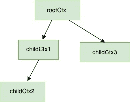
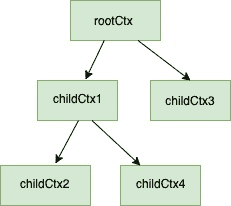

# 使用上下文包——完整指南

> 原文：<https://golangbyexample.com/using-context-in-golang-complete-guide/>

# **简介**:

## **定义:**

上下文是 GO 提供的包。让我们首先了解一些已经存在的问题，以及哪个上下文包试图解决。

## **问题陈述:**

*   假设您启动了一个函数，您需要将一些公共参数传递给下游函数。您不能将这些公共参数作为参数传递给所有下游函数。

*   你启动了一个 goroutine，然后又启动了更多的 goroutine，以此类推。假设你正在做的任务不再需要了。那么如何通知所有子 goroutines 优雅地退出，以便释放资源

*   任务应该在指定的超时时间内完成，比如说 2 秒。如果不是，它应该优雅地退出或返回。

*   一项任务应该在最后期限内完成，如下午 5 点前结束。如果没有完成，那么它应该优雅地退出并返回

如果您注意到所有上述问题都适用于 HTTP 请求，但是这些问题也适用于许多不同的领域。

对于 web HTTP 请求，需要在客户端断开连接时取消，或者请求必须在指定的超时时间内完成，并且请求范围值(如 request_id)需要对所有下游功能可用。

## **何时使用(部分用例):**

*   向下游传递数据。例如，一个 HTTP 请求创建一个 **request_id，request_user** ，它需要被传递给所有的下游函数进行分布式跟踪。

*   当您想中途停止操作时，应该停止 HTTP 请求，因为客户端已断开连接

*   当你想在开始后的指定时间内停止操作时，例如超时，HTTP 请求应该在 2 秒内完成，否则应该中止。

*   当您想在某个时间之前停止操作时，例如，cron 正在运行，如果没有完成，需要在 5 分钟内中止。

# **上下文接口**

理解上下文的核心是了解**上下文**接口

```go
type Context interface {
    //It retures a channel when a context is cancelled, timesout (either when deadline is reached or timeout time has finished)
    Done() 
```

# **创建新上下文**

## **上下文。背景():**

上下文包函数 Background()返回一个空的上下文，它实现了**上下文**接口

1.  它没有价值
2.  它从未被取消
3.  它没有截止日期

那么使用上下文是什么。背景()。上下文。Background()是从它派生的所有上下文的根。随着我们的前进，情况会变得更清楚

## **上下文。ToDo():**

*   上下文包 ToDo 函数返回一个空的上下文。当周围的函数没有被传递一个上下文，并且想要在当前函数中使用该上下文作为占位符，并且计划在不久的将来添加实际的上下文时，使用这个上下文。将其添加为占位符的一个用途是，它有助于静态代码分析工具中的验证。

*   它也是一个与上下文相同的空上下文。背景()

以上两种方法描述了一种创建新上下文的方法。更多的上下文可以从这些上下文中衍生出来。这就是上下文树出现的地方

# **上下文树**

在理解上下文树之前，请确保在使用**上下文**时，它是在后台隐式创建的。你会发现在 go 上下文包本身没有提到。

无论何时使用上下文，空的上下文都来自上下文。Background()是所有上下文的根。上下文。ToDo()的行为也类似于根上下文，但如上所述，它更像是一个上下文占位符，供将来使用。这个空的上下文根本没有功能，我们可以通过从中派生一个新的上下文来添加功能。基本上，一个新的上下文是通过包装一个已经存在的不可变上下文并添加额外的信息来创建的。让我们看一些创建上下文树的例子

**二级树**

```go
rootCtx := context.Background()
childCtx := context.WithValue(rootCtx, "msgId", "someMsgId")
```

在上面

*   **rootCtx** 是没有功能的空上下文

*   **childCtx** 是从 rootCtx 派生的，具有存储请求范围的值的功能。在上面的示例中，它存储了{“msgId”:“somemgid”}的键值对

**三级树**

```go
rootCtx := context.Background()
childCtx := context.WithValue(rootCtx, "msgId", "someMsgId")
childOfChildCtx, cancelFunc := context.WithCancel(childCtx)
```

在上面

*   **rootCtx** 是没有功能的空上下文

*   **childCtx** 是从 rootCtx 派生的，具有存储请求范围的值的功能。在上面的示例中，它存储了{“msgId”:“somemgid”}的键值对

*   **childOfChildCtx** 来源于 ChildCtx。它具有存储请求范围的值的功能，还具有触发取消信号的功能。cancelFunc 可用于触发抵消信号

**多级树**

```go
rootCtx := context.Background()
childCtx1 := context.WithValue(rootCtx, "msgId", "someMsgId")
childCtx2, cancelFunc := context.WithCancel(childCtx1)
childCtx3 := context.WithValue(rootCtx, "user_id", "some_user_id)
```

在上图中:

*   **rootCtx** 是没有功能的空上下文

*   **childCtx1** 源自**rootcx**，具有存储请求范围值的功能。在上面的示例中，它存储了{“msgId”:“somemgid”}的键值对

*   **childCtx2** 来源于 **childCtx1** 。它具有触发抵消信号的功能。cancelFunc 可用于触发抵消信号

*   **childCtx3** 来源于**rootcx**。它具有存储当前用户的功能

上面的三级树看起来如下



因为它是一棵树，所以也可以为特定的节点创建更多的子节点。例如，我们可以从 **childCtx1** 中导出一个新的上下文 **childCtx4**

```go
childCtx4 := context.WithValue(childCtx1, "current_time", "some_time)
```

添加了上述节点的树如下所示:



此时此刻，可能还不清楚如何使用 WithValue()或 WithCancel()函数。现在只要理解无论何时使用上下文，都会创建一个以根为 **emptyCtx** 的上下文树。随着我们继续前进，这些功能将变得清晰

# **源自上下文**

派生上下文可以通过 4 种方式创建

*   传递请求范围的值-使用上下文包的 **WithValue()** 函数

*   带取消信号-使用上下文包的**带取消()**功能

*   有截止日期-使用上下文包的**和**功能

*   带超时-使用上下文包的**带超时()**功能

让我们详细了解以上每一项

## **上下文。WithValue()**

用于传递请求范围的值。函数的完整签名是

```go
withValue(parent Context, key, val interface{}) (ctx Context)
```

它接受父上下文、键、值，并返回一个派生上下文。该派生上下文具有与**值**相关联的**键**。这里，父上下文可以是任何一个上下文。背景()或任何其他上下文。此外，从该上下文派生的任何上下文都将具有该值。

```go
#Root Context
ctxRoot := context.Background() - #Root context 

#Below ctxChild has acess to only one pair {"a":"x"}
ctxChild := context.WithValue(ctxRoot, "a", "x") 

#Below ctxChildofChild has access to both pairs {"a":"x", "b":"y"} as it is derived from ctxChild
ctxChildofChild := context.WithValue(ctxChild, "b", "y") 
```

**示例:**

完成带有值()的**的工作示例。**在下面的例子中，我们为每个传入的请求注入一个 msgId。如果你注意到下面的程序

*   inejctMsgID 是一个网络 HTTP 中间件函数，在上下文中填充**“msgID”**字段

*   HelloWorld 是 API“localhost:8080/welcome”的处理函数，它从上下文中获取这个 msgID，并将其作为响应头发送回来

```go
package main

import (
    "context"
    "net/http"
    "github.com/google/uuid"
)

func main() {
    helloWorldHandler := http.HandlerFunc(HelloWorld)
    http.Handle("/welcome", inejctMsgID(helloWorldHandler))
    http.ListenAndServe(":8080", nil)
}

//HelloWorld hellow world handler
func HelloWorld(w http.ResponseWriter, r *http.Request) {
    msgID := ""
    if m := r.Context().Value("msgId"); m != nil {
        if value, ok := m.(string); ok {
            msgID = value
        }
    }
    w.Header().Add("msgId", msgID)
    w.Write([]byte("Hello, world"))
}

func inejctMsgID(next http.Handler) http.Handler {
    return http.HandlerFunc(func(w http.ResponseWriter, r *http.Request) {
        msgID := uuid.New().String()
        ctx := context.WithValue(r.Context(), "msgId", msgID)
        req := r.WithContext(ctx)
        next.ServeHTTP(w, req)

    })
}
```

运行上述程序后，只需对上述请求进行 curl 调用

```go
curl -v http://localhost/welcome
```

以下是回应。请注意 **MsgId** ，它被填充到响应头中。injectMsgId 函数充当中间件，并向请求上下文注入唯一的 MsgId。

```go
curl -v http://localhost:8080/welcome
*   Trying ::1...
* TCP_NODELAY set
* Connected to localhost (::1) port 8080 (#0)
> GET /do HTTP/1.1
> Host: localhost:8080
> User-Agent: curl/7.54.0
> Accept: */*
> 
< HTTP/1.1 200 OK
< Msgid: a03ff1d4-1464-42e5-a0a8-743c5af29837
< Date: Mon, 23 Dec 2019 16:51:01 GMT
< Content-Length: 12
< Content-Type: text/plain; charset=utf-8 
```

## **上下文。WithCancel()**

用于抵消信号。下面是**与 Cancel()** 函数的签名

```go
func WithCancel(parent Context) (ctx Context, cancel CancelFunc)
```

**上下文。WithCancel()** 函数返回两件事

*   带有新完成通道的父上下文的副本。

*   一个取消功能，当被调用时关闭这个完成的通道

只有这个上下文的创建者应该调用 cancel 函数。强烈建议不要绕过**取消**功能。让我们用一个例子来理解**和**。

**示例:**

```go
package main

import (
    "context"
    "fmt"
    "time"
)

func main() {
    ctx := context.Background()
    cancelCtx, cancelFunc := context.WithCancel(ctx)
    go task(cancelCtx)
    time.Sleep(time.Second * 3)
    cancelFunc()
    time.Sleep(time.Second * 1)
}

func task(ctx context.Context) {
    i := 1
    for {
        select {
        case 
```

**输出:**

```go
1
2
3
Gracefully exit
context canceled
```

在上面的程序中

*   一旦调用**取消**，任务功能将优雅地退出。一旦调用 cancelFunc，错误字符串就会被上下文包设置为**“上下文取消”**。这就是为什么 **ctx 的产量。Err()** 是**“上下文取消”**

## **上下文。WithTimeout()**

用于基于时间的取消。函数的签名是

```go
func WithTimeout(parent Context, timeout time.Duration) (Context, CancelFunc)
```

**上下文。WithTimeout()** 功能将

*   将返回带有新完成通道的父上下文的副本。

*   接受一个超时持续时间，超过该时间后，此已完成通道将被关闭，上下文将被取消

*   一个取消函数，在超时前需要取消上下文时可以调用。

让我们看一个例子

**示例:**

```go
package main

import (
    "context"
    "fmt"
    "time"
)

func main() {
    ctx := context.Background()
    cancelCtx, cancel := context.WithTimeout(ctx, time.Second*3)
    defer cancel()
    go task1(cancelCtx)
    time.Sleep(time.Second * 4)
}

func task1(ctx context.Context) {
    i := 1
    for {
        select {
        case 
```

**输出:**

```go
1
2
3
Gracefully exit
context deadline exceeded
```

在上面的程序中

*   一旦完成 3 秒的超时，任务功能将优雅地退出。上下文包将错误字符串设置为“超出上下文截止时间”。这就是为什么 ctx 的输出？Err()是“超过上下文截止时间”

## **上下文。WithDeadline()**

用于基于截止日期的取消。函数的签名是

```go
func WithDeadline(parent Context, d time.Time) (Context, CancelFunc)
```

**上下文。WithDeadline()** 功能

*   将返回带有新完成通道的父上下文的副本。

*   接受一个截止日期，在此日期之后，此已完成的通道将被关闭，上下文将被取消

*   一个取消函数，如果在截止日期前需要取消上下文，可以调用该函数。

让我们看一个例子

**示例:**

```go
package main

import (
    "context"
    "fmt"
    "time"
)

func main() {
    ctx := context.Background()
    cancelCtx, cancel := context.WithDeadline(ctx, time.Now().Add(time.Second*5))
    defer cancel()
    go task(cancelCtx)
    time.Sleep(time.Second * 6)
}

func task(ctx context.Context) {
    i := 1
    for {
        select {
        case 
```

**输出:**

```go
1
2
3
4
5
Gracefully exit
context deadline exceeded
```

在上面的程序中

*   一旦超时 5 秒完成，任务功能将优雅地退出，因为我们给了最后期限 Time.now() + 5 秒。上下文包将错误字符串设置为“超出上下文截止时间”。这就是为什么 ctx 的输出？Err()是“超过上下文截止时间”

# **我们学到了什么**

**如何创建上下文**:

*   使用上下文。背景()

*   使用上下文。Todo()

**上下文树**

**导出新的上下文**

*   上下文。WithValue()

*   上下文。带 Cancel()

*   上下文。带超时()

*   contxt。带线路()

# **最佳实践和注意事项**

以下是使用上下文时可以遵循的最佳实践列表。

*   不要在结构类型中存储上下文

*   上下文应该在你的程序中流动。例如，在 HTTP 请求的情况下，可以为每个传入的请求创建一个新的上下文，该上下文可以用于保存 request_id，或者将一些公共信息放入上下文中，例如当前登录的用户，这可能对该特定请求有用。

*   始终将上下文作为第一个参数传递给函数。

*   每当你不确定是否使用上下文时，最好使用上下文。ToDo()作为占位符。

*   只有父 goroutine 或函数应该取消上下文。因此，不要将**取消**传递给下游线路或功能。Golang 将允许您将**取消**传递给孩子，但这不是推荐的做法