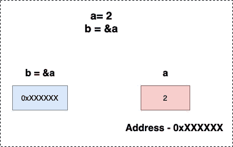

# Golang指针

> 原文：<https://golangbyexample.com//>pointer-golang

这是 golang 综合教程系列的第 15 章。本系列其他章节参考本链接–[格朗综合教程系列](https://golangbyexample.com/golang-comprehensive-tutorial/)

**下一个教程**–[结构](https://golangbyexample.com/struct-in-golang-complete-guide/)
T5】上一个教程–[延迟关键字](https://golangbyexample.com/defer-golang)

现在让我们来看看当前的教程。下面是当前教程的目录。

# **概述**

指针是保存另一个变量的内存地址的变量。

# **指针声明**

在下面的例子中， **ex** 是 **T** 类型的指针。

```go
var ex *T
```

在声明中，指针值被设置为默认的零值，即零。

# **指针初始化**

有两种方法可以初始化指针

*   使用**新的**运算符

*   使用 ambersand **' & '** 运算符

## **使用新操作符**

可以使用**新的**运算符初始化指针

```go
a := new(int)
*a = 10
fmt.Println(*a) //Output will be 10
```

***** 运算符可用于取消引用指针，这意味着获取指针中存储的地址值

```go
fmt.Println(*a) //Print the value stored at address a
```

## 使用 ambersand **' & '** 运算符

**&** 用来获取一个变量的地址

```go
a := 2
b := &a
fmt.Println(*b) //Output will be 2
```

<figure class="wp-block-image size-large"></figure>

让我们看看涵盖以上所有要点的工作代码

```go
package main

import "fmt"

func main() {
    //Declare
    var b *int
    a := 2
    b = &a

    //Will print a address. Output will be different everytime.
    fmt.Println(b)
    fmt.Println(*b)
    b = new(int)
    *b = 10
    fmt.Println(*b) 
}
```

**输出:**

```go
2
10
0xc0000b0018
```

# **关于*或取消引用指针**

***** 运算符可用于:

*   取消引用指针，这意味着获取指针中存储的地址值。

*   也更改指针位置的值

```go
package main

import "fmt"

func main() {
	a := 2
	b := &a
	fmt.Println(a)
	fmt.Println(*b)

	*b = 3
	fmt.Println(a)
	fmt.Println(*b)

	a = 4
	fmt.Println(a)
	fmt.Println(*b)
}
```

**输出**

```go
2
2
3
3
4
4
```

**a** 和 ***b** 内部都引用同一个变量。因此，一种价值的变化反映在另一种价值上。同样 ***** 和 **&** 也可以一起使用。但它们会相互抵消。

因此，下面两个是等效的，将打印 2

*   a
*   *&a

下面三个也是等价的，将打印存储在变量 b 中的变量 a 的地址

*   b
*   *&b
*   &*b

注意:*不是有效的操作，因为不是指针

# **指针指向一个指针**

也可以创建一个指向 go 中指针的指针

```go
a := 2
b := &a
c := &b
```

**c** 在这里是指针对指针。它存储了 **b** 的地址，该地址又存储了 **a** 的地址。使用 ***** 操作符的双重解引用可用于打印指针对指针的值。因此 ****c** 将打印数值 2

下图描述了指向指针的指针。

*   **b** 包含 **a** 的地址

*   **c** 包含 **b** 的地址

<figure class="wp-block-image size-large"></figure>

让我想想。描述指针对指针的程序

```go
package main

import "fmt"

func main() {
	a := 2
	b := &a
	c := &b

	fmt.Printf("a: %d\n", a)
	fmt.Printf("b: %x\n", b)
	fmt.Printf("c: %x\n", c)

	fmt.Println()
	fmt.Printf("a: %d\n", a)
	fmt.Printf("*&a: %d\n", *&a)
	fmt.Printf("*b: %d\n", *b)
	fmt.Printf("**c: %d\n", **c)

	fmt.Println()
	fmt.Printf("&a: %d\n", &a)
	fmt.Printf("b: %d\n", b)
	fmt.Printf("&*b: %d\n", &*b)
	fmt.Printf("*&b: %d\n", *&b)
	fmt.Printf("*c: %d\n", *c)

	fmt.Println()
	fmt.Printf("b: %d\n", &b)
	fmt.Printf("*c: %d\n", c)
}
```

**输出**

```go
a: 2
b: c000018078
c: c00000e028

a: 2
*&a: 2
*b: 2
**c: 2

&a: 824633819256
b: 824633819256
&*b: 824633819256
*&b: 824633819256
*c: 824633819256

b: 824633778216
*c: 824633778216
```

从输出可以清楚地看出

下面的值相当于变量 a 的值，即 2

*   a
*   *&a
*   *b
*   **c

**下面的值等同于变量 b 的值，变量 b 是 a 的地址**

 ***   &a
*   b
*   &*b
*   *&b
*   *c

****下面是等价的，等于变量 c 的值，也就是 b 的地址****

 *****   b
*   *c

# **指针算术**

指针运算在 golang 中是不可能的，不像 C 语言。它会引发编译错误。

```go
package main
func main() {
    a := 1
    b := &a
    b = b + 1
}
```

**输出**

上述程序引发编译错误

```go
invalid operation: b + 1 (mismatched types *int and int)
```

# **指针默认零值**

指针的默认零值是零..让我们为它看一个程序

```go
package main

import "fmt"

func main() {
    var a *int
    fmt.Print("Default Zero Value of a pointer: ")
    fmt.Println(a)
}
```

**输出:**

```go
Default value of pointer: 
```

# **结论**

这都是关于 golang 的指针。希望你喜欢这篇文章。请在评论中分享反馈/改进/错误

**下一个教程**–[结构](https://golangbyexample.com/struct-in-golang-complete-guide/)
T5】上一个教程–[延迟关键字](https://golangbyexample.com/defer-golang)******