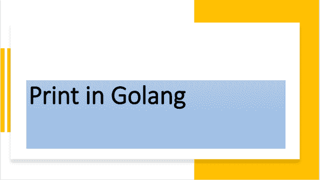

# 理解`Print()`函数

> 原文：<https://golangbyexample.com/print-function-golang/>



## **概述**

**打印**在 **fmt** 包中定义，用于格式化字符串并写入标准输出

```go
https://golang.org/pkg/fmt/#Print
```

以下是**打印**的功能原型

```go
func Print(a ...interface{}) (n int, err error)
```

**打印**使用默认格式说明符格式化字符串，但不在字符串后添加新行。**打印**接受可变数量的参数，其中每个参数都是一个空接口。它返回打印的字符数和任何错误(如果发生)。因为参数类型是一个空接口，所以我们可以向它传递任何数据类型。我们可以传递字符串、int、float、struct 或任何其他数据类型。**打印**函数的每个参数都是根据该参数类型的默认格式说明符格式化的。例如，该结构将根据下面的说明符进行格式化

```go
%v
```

此格式说明符仅打印结构中的值部分。还有一个由 **fmt** 包提供的功能，它附加了一个新行–**Println**。**打印**功能与**打印**功能完全相同，除了两个不同之处

*   它不会在末尾追加换行符。我们需要使用新的行标识符来添加新的行“\n”。

*   如果两个操作数都不是字符串，则仅在参数之间添加空格

让我们看一个例子

## **程序**

让我们看一个同样的例子

```go
package main

import "fmt"

type employee struct {
	Name string
	Age  int
}

func main() {
	name := "John"
	age := 21
	fmt.Print("Name is:", name, "\n")
	fmt.Print("Age is:", age, "\n")

	e := employee{
		Name: name,
		Age:  age,
	}

	fmt.Print(e, "\n")

	fmt.Print("a", 12, "b", 12.0, "\n")

	fmt.Print(12, 12.0, "\n")

        bytesPrinted, err := fmt.Print("Name is: ", name, "\n")
	if err != nil {
		log.Fatalln("Error occured", err)
	}
	fmt.Print(bytesPrinted)
}
```

**输出**

```go
Name is:John
Age is:21
{John 21}
a12b12
12 12
Name is: John
14
```

关于**打印**功能需要注意的一些要点

*   它不会在末尾添加新行。这就是为什么需要使用**“\ n”**来添加新行的原因。

*   如果两个参数都是非字符串，它只会在两个参数之间添加空格。这就是原因

```go
fmt.Print(12, 12.0, "\n")
```

印刷品

```go
12 12
```

正在…

```go
fmt.Print("a", 12, "b", 12.0, "\n")
```

印刷品

```go
a12b12
```

*   它还返回打印的字符数和任何错误(如果发生)

```go
bytesPrinted, err := fmt.Print("Name is: ", name, "\n")
if err != nil {
    log.Fatalln("Error occured", err)
}
fmt.Print(bytesPrinted)
```

将在下面输出

```go
Name is: John
14
```

输出 14 个字符时，打印的字节数为 14

另外，请查看我们的 Golang 进阶教程系列–[Golang 进阶教程](https://golangbyexample.com/golang-comprehensive-tutorial/)