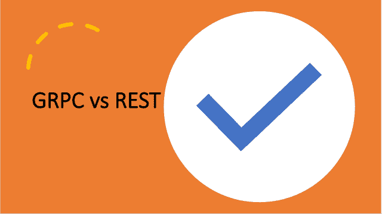

# GRPC 和雷斯特的区别

> 原文：<https://golangbyexample.com/grp-vs-rest/>

<figure class="wp-block-image size-large"></figure>

## **概述**

REST 是建立在 HTTP/1 之上的一种架构风格。GRPC 不是一种风格，而是一个建立在 HTTP/2 之上的 RPC 框架，它在幕后使用协议缓冲区。所以基本上 GRPC 是一个实际的实现，或者你可以说它是一个库，而 REST 只是一套规则和原则。

虽然我们正在比较 GRPC(实现的框架)和 REST(架构风格和原则)，这听起来可能很奇怪。尽管如此，理解高级架构方面的差异还是很重要的，如果您遵循一种方法而不是另一种方法，您将会得到高级架构

以下是两者的主要区别。还要提到的是，本文假设您已经对 GRPC、HTTP2、REST 有所了解

## 链接

### **GRPC**

这是到 GRPC 的链接，进一步阅读[https://grpc.io/](https://grpc.io/)

### **REST**

以下是 REST 的链接供进一步阅读–[https://en . Wikipedia . org/wiki/presentative _ state _ transfer](https://en.wikipedia.org/wiki/Representational_state_transfer)

## **协议**

*   GRPC 是一个 RPC 框架，建立在 HTTP/2 之上

*   REST 架构风格是在 HTTP/1 之上指定的。HTTP/1.1 的所有语义都保留在 HTTP/2 中。所以 REST APIs 应该继续工作，即使是使用 HTTP/2 的

## **自然**

*   GRPC 的思维方式是面向应用编程接口或面向行动的。

*   REST 是面向资源的。

## **数据传输模式**

*   GRPC 只支持协议缓冲区在服务器和客户端之间传输数据。

*   REST 支持 JSON、XML 和其他数据格式。REST 也可以很容易地用于协议缓冲区。

## **车型**

*   GRPC 提供了客户端和服务器之间四种不同的通信方式。四种不同的方式是一元流、服务器流、客户端流和双向流。因此，在 GRPC，客户端和服务器都可以有效地相互通信。
    *   一元–这是最简单的一个。客户端发送请求，服务器发送响应
    *   客户端流–客户端可以发送多个消息流，而服务器只需对所有客户端请求返回一个响应。
    *   服务器流-客户端将只发送一条消息，而服务器可以将消息流发送回客户端。
    *   双向流式传输–客户端和服务器都可以流式传输多条消息。流式传输将是并行的，没有顺序。此外，它是非阻塞的。在发送下一条消息之前，客户端和服务器都不需要等待响应。

*   REST 在请求-响应模型上工作。基本上，你发送请求，然后得到响应。所以 REST 只提供了一种一元的交流方式。在 REST 中，只有客户端与服务器对话。

## **性能**

*   由于 GRPC 本来就使用 HTTP/2，所以应用于 HTTP/2 的所有性能优化在 GRPC 自动可用。HTTP/2 比 HTTP/1 引入了几个性能优化，例如
    *   双工流
    *   多路技术
    *   标题压缩
    *   等等

此外，GRPC 在内部使用协议缓冲区，由于协议缓冲区是二进制数据，大小较小，因此可以通过网络快速传输。GRPC 可以非常有效地利用每个 TCP 连接。由于这两个原因，GRPC 的速度非常快。

*   HTTP/1 上的 REST 会比 GRPC 慢。它使用 JSON，这种表示相同数据的 XML 比协议缓冲区占用更多的空间。

## **代码生成**

*   由于 GRPC 是建立在协议缓冲区之上的，它提供了自动代码生成。事实上，使用协议缓冲区，代码生成是使用 GRPC 必须做的事情。

*   REST 还通过 Swagger、OPEN API 提供代码生成，但这只是额外提供的东西，不如通过协议缓冲区生成代码有效

## **型安全**

*   因为在 GRPC 的情况下，协议缓冲器用于代码生成。从而在某种程度上为 GRPC 提供了类型安全。GRPC 不允许您为需要字符串的字段发送 int。API 契约由 proto 文件定义，非常严格。

*   REST 没有任何这样的限制。应用编程接口合同大部分只是一个使用开放应用编程接口或招摇撞骗的文档，因此是松散的。

## **设置**

*   GRPC 会要求你在当地建立一个客户，以便能打 GRPC 的电话。

*   REST 调用不需要设置客户端。您可以使用浏览器、邮递员、curl 等拨打电话

## **何时使用**

*   GRPC 最适合可能需要低延迟和高吞吐量的内部微服务。目前不适合将您的服务公开为 GRPC，因为没有可供外部服务集成的 API。在不久的将来，当 GRPC 完全进化的时候，这是可能的。

*   REST 更适合将您的 API 暴露给外部服务。

## **结论**

这些是 GRPC 和 REST 之间的一些主要区别。希望你喜欢这篇文章。请在评论中分享反馈。

注意:如果你有兴趣学习 golang，那么我们有一个 Golang 综合教程系列。一定要看看–[格朗综合教程系列](https://golangbyexample.com/golang-comprehensive-tutorial/)