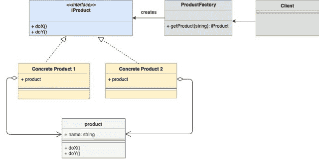
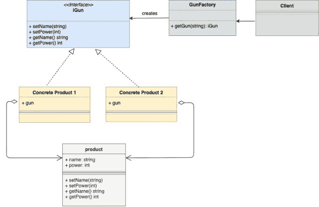

# 工厂设计模式

> 原文：<https://golangbyexample.com/golang-factory-design-pattern>

注意:有兴趣了解如何在 GO 中实现所有其他设计模式。请参阅此完整参考资料–[Golang](https://golangbyexample.com/all-design-patterns-golang/)中的所有设计模式

## **简介:**

工厂设计模式是一种创造性的设计模式，也是最常用的模式之一。这种模式提供了一种隐藏正在创建的实例的创建逻辑的方法。
客户端只与工厂结构交互，并告知需要创建的实例种类。工厂类与相应的具体结构交互，并返回正确的实例。
在下面的例子中

*   我们有`iGun`接口，它定义了一把枪应该有的所有方法
*   有**枪**结构实现**伊关**接口。
*   两支混凝土枪`ak47`和**特立独行**。两者都嵌入了**枪**结构，因此也间接实现了`iGun`的所有方法，因此属于`iGun`类型
*   我们有一个**炮厂**结构，制造出`ak47`或**特立独行**类型的火炮。
*   `main.go`充当客户端，它不直接与`ak47`或`maverick`交互，而是依赖`gunFactory`创建`ak47`和`maverick`的实例

## **UML 图:**



下面是上面给出的例子对应的映射 UML 图



## **映射:**

下表显示了在下面的**“示例”**中从 UML 图参与者到实际实现参与者的映射


| ProductFactory | gunFactory.go |
| product(产品) | 走吧 |
| 产品 | 枪，走 |
| 混凝土管道 1 | ak47go |
| 混凝土管道 1 | 马华力，走 |
| 客户 | main.go |


## **例:**

相同。go

```go
package main

type iGun interface {
    setName(name string)
    setPower(power int)
    getName() string
    getPower() int
}
```

`gun.go`

```go
package main

type gun struct {
    name  string
    power int
}

func (g *gun) setName(name string) {
    g.name = name
}

func (g *gun) getName() string {
    return g.name
}

func (g *gun) setPower(power int) {
    g.power = power
}

func (g *gun) getPower() int {
    return g.power
}
```

`ak47.go`

```go
package main

type ak47 struct {
    gun
}

func newAk47() iGun {
    return &ak47{
        gun: gun{
            name:  "AK47 gun",
            power: 4,
        },
    }
}
```

**特立独行**

```go
package main

type maverick struct {
    gun
}

func newMaverick() iGun {
    return &maverick{
        gun: gun{
            name:  "Maverick gun",
            power: 5,
        },
    }
}
```

`gunFactory.go`

```go
package main

import "fmt"

func getGun(gunType string) (iGun, error) {
    if gunType == "ak47" {
        return newAk47(), nil
    }
    if gunType == "maverick" {
        return newMaverick(), nil
    }
    return nil, fmt.Errorf("Wrong gun type passed")
}
```

`main.go`

```go
package main

import "fmt"

func main() {
    ak47, _ := getGun("ak47")
    maverick, _ := getGun("maverick")
    printDetails(ak47)
    printDetails(maverick)
}

func printDetails(g iGun) {
    fmt.Printf("Gun: %s", g.getName())
    fmt.Println()
    fmt.Printf("Power: %d", g.getPower())
    fmt.Println()
}
```

**输出:**

```go
Gun: AK47 gun
Power: 4
Gun: Maverick gun
Power: 5
```

## **完整工作代码:**

```go
package main

import "fmt"

type iGun interface {
    setName(name string)
    setPower(power int)
    getName() string
    getPower() int
}

type gun struct {
    name  string
    power int
}

func (g *gun) setName(name string) {
    g.name = name
}

func (g *gun) getName() string {
    return g.name
}

func (g *gun) setPower(power int) {
    g.power = power
}

func (g *gun) getPower() int {
    return g.power
}

type ak47 struct {
    gun
}

func newAk47() iGun {
    return &ak47{
        gun: gun{
            name:  "AK47 gun",
            power: 4,
        },
    }
}

type maverick struct {
    gun
}

func newMaverick() iGun {
    return &maverick{
        gun: gun{
            name:  "Maverick gun",
            power: 5,
        },
    }
}

func getGun(gunType string) (iGun, error) {
    if gunType == "ak47" {
        return newAk47(), nil
    }
    if gunType == "maverick" {
        return newMaverick(), nil
    }
    return nil, fmt.Errorf("Wrong gun type passed")
}

func main() {
    ak47, _ := getGun("ak47")
    maverick, _ := getGun("maverick")
    printDetails(ak47)
    printDetails(maverick)
}

func printDetails(g iGun) {
    fmt.Printf("Gun: %s", g.getName())
    fmt.Println()
    fmt.Printf("Power: %d", g.getPower())
    fmt.Println()
}
```

**输出:**

```go
Gun: AK47 gun
Power: 4
Gun: Maverick gun
Power: 5
```