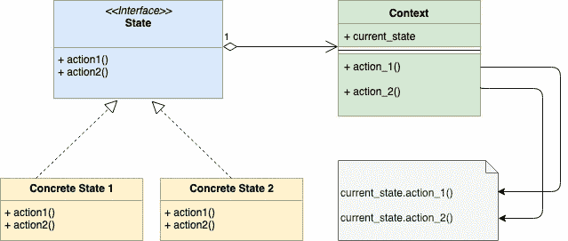

# Golang中的状态设计模式

> 原文：<https://golangbyexample.com/state-design-pattern-go/>

注意:有兴趣了解如何在 GO 中实现所有其他设计模式。请参阅此完整参考资料–[Golang](https://golangbyexample.com/all-design-patterns-golang/)中的所有设计模式

## **定义:**

状态设计模式是一种基于有限状态机的行为设计模式。我们将以自动售货机为例解释状态设计模式。为了简单起见，让我们假设自动售货机只有一种类型的物品或产品。同样为了简单起见，让我们假设自动售货机可以处于 4 种不同的状态

1.  **我的天**
2.  夜
3.  **项目请求**
4.  **hasMoney**

自动售货机也会有不同的动作。为了简单起见，我们假设只有四个动作:

1.  **选择项目**
2.  **增加项目**
3.  **插入货币**
4.  **豁免物品**

## **何时使用**

*   **当对象可以处于多种不同状态时，使用 State 设计模式。根据当前请求，对象需要改变其当前状态**
    *   在上面的例子中，自动售货机可以处于许多不同的状态。自动售货机会从一个州移动到另一个州。假设自动售货机处于**项目请求的**状态，那么一旦“插入货币”动作完成，它将移动到**有货币**状态
*   根据当前状态，当对象对同一请求有不同的响应时使用。在这里使用状态设计模式将防止大量的条件语句
    *   例如，在自动售货机的情况下，如果用户想要购买一件物品，那么如果该物品处于**状态**，则该机器将继续，或者如果该物品处于**状态**，则该机器将拒绝。如果您在此注意到自动售货机在购买商品时会给出两种不同的响应，这取决于它是处于 **hasItemState** 还是 **noItemState。**请注意下面的 vendingMachine.go 文件，它没有任何类型的条件语句。所有的逻辑都由具体的状态实现来处理。

## **UML 图**

<figure class="wp-block-image"></figure>

## **映射**

下表表示从 UML 图参与者到代码中实际实现参与者的映射。

<figure class="wp-block-table is-style-stripes">

| 语境 | 回转仪，走 |
| 状态接口 | 开始 |
| 混凝土状态 1 | 晚安，走吧 |
| 混凝土状态 2 | hasItemState.go |
| 混凝土状态 3 | itemRequestedState.go(请求数据类型.执行) |
| 混凝土状态 4 | hasMoneyState.go |

</figure>

## **解说:**

*   我们有一个接口“状态”，它定义了代表自动售货机上下文中动作的函数签名。下面是动作函数签名
    1.  addItem(int)错误
    2.  requestItem()错误
    3.  插入货币(货币整数)错误
    4.  调度()错误
*   每一个具体的状态实现都实现了上面的 4 个功能，并且要么在这些动作上移动到另一个状态，要么给出一些响应。
*   每个具体的状态还嵌入一个指向当前自动售货机对象的指针，这样状态转换就可以在该对象上发生。

现在让我们看看代码

## **实例:**

**转印机.走**

```go
package main

import "fmt"

type vendingMachine struct {
    hasItem       state
    itemRequested state
    hasMoney      state
    noItem        state

    currentState state

    itemCount int
    itemPrice int
}

func newVendingMachine(itemCount, itemPrice int) *vendingMachine {
    v := &vendingMachine{
        itemCount: itemCount,
        itemPrice: itemPrice,
    }
    hasItemState := &hasItemState{
        vendingMachine: v,
    }
    itemRequestedState := &itemRequestedState{
        vendingMachine: v,
    }
    hasMoneyState := &hasMoneyState{
        vendingMachine: v,
    }
    noItemState := &noItemState{
        vendingMachine: v,
    }

    v.setState(hasItemState)
    v.hasItem = hasItemState
    v.itemRequested = itemRequestedState
    v.hasMoney = hasMoneyState
    v.noItem = noItemState
    return v
}

func (v *vendingMachine) requestItem() error {
    return v.currentState.requestItem()
}

func (v *vendingMachine) addItem(count int) error {
    return v.currentState.addItem(count)
}

func (v *vendingMachine) insertMoney(money int) error {
    return v.currentState.insertMoney(money)
}

func (v *vendingMachine) dispenseItem() error {
    return v.currentState.dispenseItem()
}

func (v *vendingMachine) setState(s state) {
    v.currentState = s
}

func (v *vendingMachine) incrementItemCount(count int) {
    fmt.Printf("Adding %d items\n", count)
    v.itemCount = v.itemCount + count
}
```

**状态转到**

```go
package main

type state interface {
    addItem(int) error
    requestItem() error
    insertMoney(money int) error
    dispenseItem() error
}
```

夜生活状态。去

```go
package main

import "fmt"

type noItemState struct {
    vendingMachine *vendingMachine
}

func (i *noItemState) requestItem() error {
    return fmt.Errorf("Item out of stock")
}

func (i *noItemState) addItem(count int) error {
    i.vendingMachine.incrementItemCount(count)
    i.vendingMachine.setState(i.vendingMachine.hasItem)
    return nil
}

func (i *noItemState) insertMoney(money int) error {
    return fmt.Errorf("Item out of stock")
}
func (i *noItemState) dispenseItem() error {
    return fmt.Errorf("Item out of stock")
}
```

**hasItemState.go**

```go
package main

import "fmt"

type hasItemState struct {
    vendingMachine *vendingMachine
}

func (i *hasItemState) requestItem() error {
    if i.vendingMachine.itemCount == 0 {
        i.vendingMachine.setState(i.vendingMachine.noItem)
        return fmt.Errorf("No item present")
    }
    fmt.Printf("Item requestd\n")
    i.vendingMachine.setState(i.vendingMachine.itemRequested)
    return nil
}

func (i *hasItemState) addItem(count int) error {
    fmt.Printf("%d items added\n", count)
    i.vendingMachine.incrementItemCount(count)
    return nil
}

func (i *hasItemState) insertMoney(money int) error {
    return fmt.Errorf("Please select item first")
}
func (i *hasItemState) dispenseItem() error {
    return fmt.Errorf("Please select item first")
}
```

**itemRequestedState.go**

```go
package main

import "fmt"

type itemRequestedState struct {
    vendingMachine *vendingMachine
}

func (i *itemRequestedState) requestItem() error {
    return fmt.Errorf("Item already requested")
}

func (i *itemRequestedState) addItem(count int) error {
    return fmt.Errorf("Item Dispense in progress")
}

func (i *itemRequestedState) insertMoney(money int) error {
    if money < i.vendingMachine.itemPrice {
        fmt.Errorf("Inserted money is less. Please insert %d", i.vendingMachine.itemPrice)
    }
    fmt.Println("Money entered is ok")
    i.vendingMachine.setState(i.vendingMachine.hasMoney)
    return nil
}

func (i *itemRequestedState) dispenseItem() error {
    return fmt.Errorf("Please insert money first")
}
```

**有货币状态**

```go
package main

import "fmt"

type hasMoneyState struct {
    vendingMachine *vendingMachine
}

func (i *hasMoneyState) requestItem() error {
    return fmt.Errorf("Item dispense in progress")
}

func (i *hasMoneyState) addItem(count int) error {
    return fmt.Errorf("Item dispense in progress")
}

func (i *hasMoneyState) insertMoney(money int) error {
    return fmt.Errorf("Item out of stock")
}

func (i *hasMoneyState) dispenseItem() error {
    fmt.Println("Dispensing Item")
    i.vendingMachine.itemCount = i.vendingMachine.itemCount - 1
    if i.vendingMachine.itemCount == 0 {
        i.vendingMachine.setState(i.vendingMachine.noItem)
    } else {
        i.vendingMachine.setState(i.vendingMachine.hasItem)
    }
    return nil
}
```

**main.go**

```go
package main

import (
    "fmt"
    "log"
)

func main() {
    vendingMachine := newVendingMachine(1, 10)
    err := vendingMachine.requestItem()
    if err != nil {
        log.Fatalf(err.Error())
    }
    err = vendingMachine.insertMoney(10)
    if err != nil {
        log.Fatalf(err.Error())
    }
    err = vendingMachine.dispenseItem()
    if err != nil {
        log.Fatalf(err.Error())
    }

    fmt.Println()
    err = vendingMachine.addItem(2)
    if err != nil {
        log.Fatalf(err.Error())
    }

    fmt.Println()

    err = vendingMachine.requestItem()
    if err != nil {
        log.Fatalf(err.Error())
    }

    err = vendingMachine.insertMoney(10)
    if err != nil {
        log.Fatalf(err.Error())
    }

    err = vendingMachine.dispenseItem()
    if err != nil {
        log.Fatalf(err.Error())
    }
}
```

**输出:**

```go
Item requestd
Money entered is ok
Dispensing Item

Adding 2 items

Item requestd
Money entered is ok
Dispensing Item
```