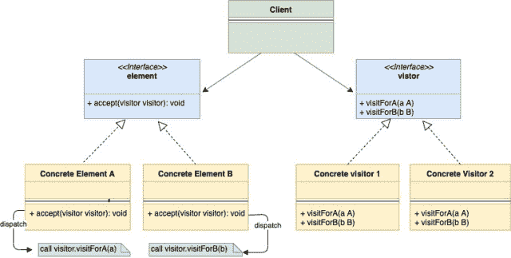
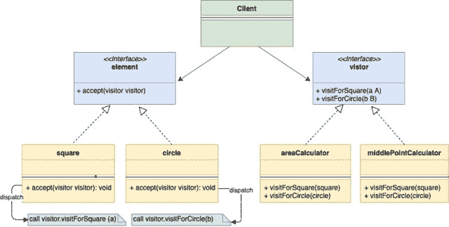

# 访客设计模式

> 原文：<https://golangbyexample.com/visitor-design-pattern-go>

注意:有兴趣了解如何在 GO 中实现所有其他设计模式。请参阅此完整参考资料–[Golang](https://golangbyexample.com/all-design-patterns-golang/)中的所有设计模式

# **简介**：

访问者设计模式是一种行为设计模式，它允许您在不实际修改结构的情况下向结构添加行为。
我们用一个例子来理解访客模式。假设你是一个 lib 的维护者，它有不同的形状结构，比如

1.  平方
2.  圆
3.  三角

上述每个形状结构都实现了一个公共接口**形状。**你们公司有很多团队在使用你的 lib。现在，假设团队中的一个人希望您在形状结构中再添加一个行为( **getArea()** )。

解决这个问题有很多选择

**第一选项**

想到的第一个选项是在**形状**接口中添加 **getArea()** 方法，然后每个形状结构都可以实现 getArea()方法。这看似微不足道，但存在一些问题:

*   作为库的维护者，您不想通过添加额外的行为来改变库的高度测试的代码。
*   使用你的库的团队可能会有更多的请求，比如 **getNumSides()** 、**getmiddlecoords()**。然后，在这种情况下，您不想继续修改您的库。但是您确实希望其他团队扩展您的库，而不需要对代码进行太多的实际修改。

**第二种选择**

第二种选择是请求特性的团队可以自己编写行为逻辑。所以根据他们喜欢的形状结构类型，下面的代码

```go
if shape.type == square {
   //Calculate area for squre
} elseif shape.type == circle {
    //Calculate area of triangle 
} elseif shape.type == "triangle" {
    //Calculate area of triangle
} else {
   //Raise error
} 
```

上面的代码也是有问题的，因为你不能充分利用接口，而是做显式的类型检查，这是脆弱的。其次，在运行时获取类型可能会影响性能，甚至在某些语言中是不可能的。

**第三种选择**

第三种选择是使用访问者模式解决上述问题。我们定义了如下的访问者接口

```go
type visitor interface {
   visitForSquare(square)
   visitForCircle(circle)
   visitForTriangle(triangle)
}
```

函数 **visitforSquare(正方形)、visitForCircle(圆形)、visitForTriangle** ( **三角形**)允许我们分别为正方形、圆形和三角形添加功能。

现在想到的问题是，为什么我们不能在访问者接口中有一个单一的方法访问 **(shape)** 。我们没有它的原因是因为 GO 和其他一些语言支持方法重载。所以每个结构都有不同的方法。

我们添加一个`accept`方法到下面签名的形状接口，每个形状结构都需要定义这个方法。

```go
func accept(v visitor)
```

但是等一下，我们刚刚提到我们不想修改现有的形状结构。但是当使用访问者模式时，我们确实需要修改我们的形状结构，但是这种修改只会进行一次。如果添加任何附加行为，如 **getNumSides()** ，**getmiddlecoords()**将使用上面相同的 **accept(v visitor)** 函数，而不会对形状结构做任何进一步的更改。基本上，形状结构只需要修改一次，所有未来的附加行为请求都将使用相同的 accept 函数来处理。让我们看看如何。

square 结构将实现如下接受方法:

```go
func (obj *squre) accept(v visitor){
    v.visitForSquare(obj)
}
```

类似地，圆和三角形也将如上定义接受函数。

现在请求 **getArea()** 行为的团队可以简单地定义访问者接口的具体实现，并在该具体实现中编写区域计算逻辑。

**区域计算器. go**

```go
type areaCalculator struct{
    area int
}

func (a *areaCalculator) visitForSquare(s *square){
    //Calculate are for square
}
func (a *areaCalculator) visitForCircle(s *square){
    //Calculate are for circle
}
func (a *areaCalculator) visitForTriangle(s *square){
    //Calculate are for triangle
}
```

为了计算正方形的面积，我们首先创建一个他们可以简单调用的正方形实例。

```go
sq := &square{}
ac := &areaCalculator{}
sq.accept(ac)
```

类似地，请求**getmiddlecoords()**行为的其他团队可以定义类似于上面的访问者接口的另一个具体实现。

**中间坐标. go**

```go
type middleCoordinates struct {
    x int
    y int
}

func (a *middleCoordinates) visitForSquare(s *square) {
    //Calculate middle point coordinates for square. After calculating the area assign in to the x and y instance variable.
}

func (a *middleCoordinates) visitForCircle(c *circle) {
    //Calculate middle point coordinates for square. After calculating the area assign in to the x and y instance variable.
}

func (a *middleCoordinates) visitForTriangle(t *triangle) {
    //Calculate middle point coordinates for square. After calculating the area assign in to the x and y instance variable.
}
```

# **UML 图:**



下面是相应的映射 UML 图，上面给出了形状结构和面积计算器的实例



# **映射**

下表显示了在下面的**示例**中从 UML 图参与者到实际实现参与者的映射


| 元素 | 形状。开始 |
| 混凝土元素 | 去广场 |
| 混凝土元素 B | 圆圈，走 |
| 混凝土元素 C | 矩形。开始 |
| 访问者 | 访客，走 |
| 混凝土访客 1 | 区域计算器。开始 |
| 混凝土访客 2 | 中间坐标，走 |
| 客户 | main.go |


# **例**

**形状. go**

```go
package main

type shape interface {
    getType() string
    accept(visitor)
}
```

`square.go`

```go
package main

type square struct {
    side int
}

func (s *square) accept(v visitor) {
    v.visitForSquare(s)
}

func (s *square) getType() string {
    return "Square"
}
```

**圈走**

```go
package main

type circle struct {
    radius int
}

func (c *circle) accept(v visitor) {
    v.visitForCircle(c)
}

func (c *circle) getType() string {
    return "Circle"
}
```

**矩形 go**

```go
package main

type rectangle struct {
    l int
    b int
}

func (t *rectangle) accept(v visitor) {
    v.visitForrectangle(t)
}

func (t *rectangle) getType() string {
    return "rectangle"
}
```

**访客. go**

```go
package main

type visitor interface {
    visitForSquare(*square)
    visitForCircle(*circle)
    visitForrectangle(*rectangle)
}
```

**区域计算器. go**

```go
package main

import (
    "fmt"
)

type areaCalculator struct {
    area int
}

func (a *areaCalculator) visitForSquare(s *square) {
    //Calculate area for square. After calculating the area assign in to the area instance variable
    fmt.Println("Calculating area for square")
}

func (a *areaCalculator) visitForCircle(s *circle) {
    //Calculate are for circle. After calculating the area assign in to the area instance variable
    fmt.Println("Calculating area for circle")
}

func (a *areaCalculator) visitForrectangle(s *rectangle) {
    //Calculate are for rectangle. After calculating the area assign in to the area instance variable
    fmt.Println("Calculating area for rectangle")
}
```

**中间坐标. go**

```go
package main

import "fmt"

type middleCoordinates struct {
    x int
    y int
}

func (a *middleCoordinates) visitForSquare(s *square) {
    //Calculate middle point coordinates for square. After calculating the area assign in to the x and y instance variable.
    fmt.Println("Calculating middle point coordinates for square")
}

func (a *middleCoordinates) visitForCircle(c *circle) {
    //Calculate middle point coordinates for square. After calculating the area assign in to the x and y instance variable.
    fmt.Println("Calculating middle point coordinates for circle")
}

func (a *middleCoordinates) visitForrectangle(t *rectangle) {
    //Calculate middle point coordinates for square. After calculating the area assign in to the x and y instance variable.
    fmt.Println("Calculating middle point coordinates for rectangle")
}
```

`main.go`

```go
package main

import "fmt"

func main() {
    square := &square{side: 2}
    circle := &circle{radius: 3}
    rectangle := &rectangle{l: 2, b: 3}

    areaCalculator := &areaCalculator{}
    square.accept(areaCalculator)
    circle.accept(areaCalculator)
    rectangle.accept(areaCalculator)

    fmt.Println()
    middleCoordinates := &middleCoordinates{}
    square.accept(middleCoordinates)
    circle.accept(middleCoordinates)
    rectangle.accept(middleCoordinates)
}
```

**输出**：

```go
Calculating area for square
Calculating area for circle
Calculating area for rectangle

Calculating middle point coordinates for square
Calculating middle point coordinates for circle
Calculating middle point coordinates for rectangle
```

# **完整工作代码**：

```go
package main

import "fmt"

type shape interface {
    getType() string
    accept(visitor)
}

type square struct {
    side int
}

func (s *square) accept(v visitor) {
    v.visitForSquare(s)
}

func (s *square) getType() string {
    return "Square"
}

type circle struct {
    radius int
}

func (c *circle) accept(v visitor) {
    v.visitForCircle(c)
}

func (c *circle) getType() string {
    return "Circle"
}

type rectangle struct {
    l int
    b int
}

func (t *rectangle) accept(v visitor) {
    v.visitForrectangle(t)
}

func (t *rectangle) getType() string {
    return "rectangle"
}

type visitor interface {
    visitForSquare(*square)
    visitForCircle(*circle)
    visitForrectangle(*rectangle)
}

type areaCalculator struct {
    area int
}

func (a *areaCalculator) visitForSquare(s *square) {
    //Calculate area for square. After calculating the area assign in to the area instance variable
    fmt.Println("Calculating area for square")
}

func (a *areaCalculator) visitForCircle(s *circle) {
    //Calculate are for circle. After calculating the area assign in to the area instance variable
    fmt.Println("Calculating area for circle")
}

func (a *areaCalculator) visitForrectangle(s *rectangle) {
    //Calculate are for rectangle. After calculating the area assign in to the area instance variable
    fmt.Println("Calculating area for rectangle")
}

type middleCoordinates struct {
    x int
    y int
}

func (a *middleCoordinates) visitForSquare(s *square) {
    //Calculate middle point coordinates for square. After calculating the area assign in to the x and y instance variable.
    fmt.Println("Calculating middle point coordinates for square")
}

func (a *middleCoordinates) visitForCircle(c *circle) {
    //Calculate middle point coordinates for square. After calculating the area assign in to the x and y instance variable.
    fmt.Println("Calculating middle point coordinates for circle")
}

func (a *middleCoordinates) visitForrectangle(t *rectangle) {
    //Calculate middle point coordinates for square. After calculating the area assign in to the x and y instance variable.
    fmt.Println("Calculating middle point coordinates for rectangle")
}

func main() {
    square := &square{side: 2}
    circle := &circle{radius: 3}
    rectangle := &rectangle{l: 2, b: 3}
    areaCalculator := &areaCalculator{}
    square.accept(areaCalculator)
    circle.accept(areaCalculator)
    rectangle.accept(areaCalculator)

    fmt.Println()
    middleCoordinates := &middleCoordinates{}
    square.accept(middleCoordinates)
    circle.accept(middleCoordinates)
    rectangle.accept(middleCoordinates)
}
```

**输出**：

```go
Calculating area for square
Calculating area for circle
Calculating area for rectangle

Calculating middle point coordinates for square
Calculating middle point coordinates for circle
Calculating middle point coordinates for rectangle
```