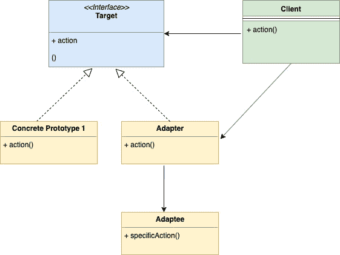
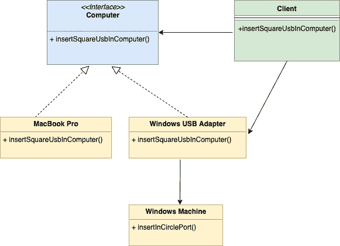

# 适配器设计模式

> 原文：<https://golangbyexample.com/adapter-design-pattern-go/>

注意:有兴趣了解如何在 GO 中实现所有其他设计模式。请参阅此完整参考资料–[Golang](https://golangbyexample.com/all-design-patterns-golang/)中的所有设计模式

# **简介:**

这种设计模式是结构设计模式。通过一个例子可以最好地理解这个模式。假设你有两台笔记本电脑

1.  MacBook Pro
2.  Windows 笔记本电脑

MacBook Pro 有一个形状为**方形**的 USB 口，Windows 有一个形状为**圆形**的 USB 口。作为客户端，您有一根方形的 USB 电缆，因此只能插入 mac 笔记本电脑。所以你看到这里的问题了

**问题:**

*   我们有一个类(客户端)，它需要一个对象的一些特性(这里是方形 USB 端口)，但是我们有另一个对象，叫做 adaptee(这里是 Windows 笔记本电脑)，它提供相同的功能，但是通过不同的接口(圆形端口)

这就是适配器模式出现的地方。我们创建了一个名为适配器的类，它将

*   遵循客户期望的相同接口(此处为方形 USB 端口)
*   将客户端的请求以 adaptee 期望的形式翻译给 adaptee。基本上，在我们的例子中，充当一个适配器，在方形端口中接受 USB，然后插入到 windows 笔记本电脑的圆形端口中。

# **何时使用**

*   当对象按照客户端的要求实现不同的接口时，使用这种设计模式。

# **UML 图**

<figure class="wp-block-image"></figure>

下面是上面给出的例子对应的映射 UML 图

<figure class="wp-block-image"></figure>

# **映射**

下表表示从 UML 图参与者到代码中实际实现参与者的映射。

<figure class="wp-block-table is-style-stripes">

| 目标 | 电脑。开始 |
| 混凝土原型 1 | 麦克，快走 |
| 混凝土原型 2(适配器) | windows 适配器. go |
| 介面卡 | windows.go |
| 客户 | 客户端。开始 |

</figure>

# **例** :

**电脑Golang**

```go
package main

type computer interface {
    insertInSquarePort()
}
```

MAC . go

```go
package main

import "fmt"

type mac struct {
}

func (m *mac) insertInSquarePort() {
    fmt.Println("Insert square port into mac machine")
}
```

**windows 适配器。go**

```go
package main

type windowsAdapter struct {
	windowMachine *windows
}

func (w *windowsAdapter) insertInSquarePort() {
	w.windowMachine.insertInCirclePort()
} 
```

**windows.go**

```go
package main

import "fmt"

type windows struct{}

func (w *windows) insertInCirclePort() {
    fmt.Println("Insert circle port into windows machine")
}
```

**客户端转到**

```go
package main

type client struct {
}

func (c *client) insertSquareUsbInComputer(com computer) {
    com.insertInSquarePort()
}
```

**main.go**

```go
package main

func main() {
    client := &client{}
    mac := &mac{}
    client.insertSquareUsbInComputer(mac)
    windowsMachine := &windows{}
    windowsMachineAdapter := &windowsAdapter{
        windowMachine: windowsMachine,
    }
    client.insertSquareUsbInComputer(windowsMachineAdapter)
}
```

**输出:**

```go
Insert square port into mac machine
Insert circle port into windows machine
```