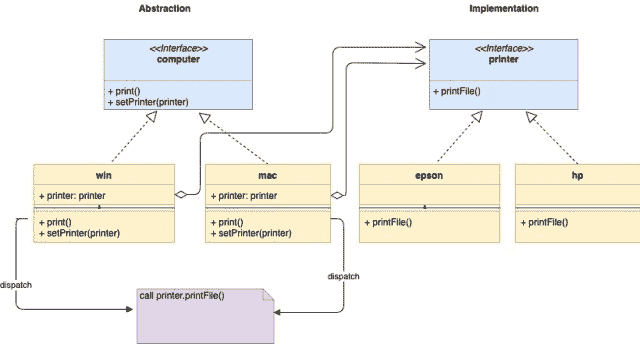
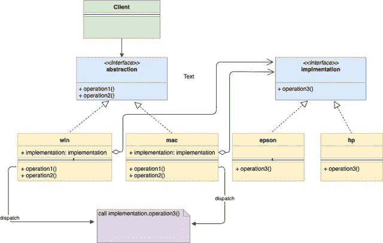

# 桥接设计模式

> 原文：<https://golangbyexample.com/bridge-design-pattern-in-go/>

注意:有兴趣了解如何在 GO 中实现所有其他设计模式。请参阅此完整参考资料–[Golang](https://golangbyexample.com/all-design-patterns-golang/)中的所有设计模式

## **简介:**

桥接设计模式是一种结构设计模式，它允许抽象与其实现分离。听起来很困惑？别担心，随着我们的前进，情况会变得更清楚。

这种模式建议将一个大类分成两个独立的层次

*   抽象–它是一个接口，并且**抽象**的子级被称为**精炼抽象。**抽象包含对实现的引用。
*   实现–它也是一个接口，并且**实现**的子代被称为**具体实现**

客户端引用抽象层次结构，而不用担心实现。举个例子吧。假设你有两种类型的电脑 **mac** 和**窗口。**同样，假设两种打印机**爱普生**和**惠普**。计算机和打印机都需要以任何组合方式相互配合工作。客户端将只访问计算机，而不用担心打印是如何进行的。我们不是为 2*2 组合创建四个结构，而是创建两个层次结构

*   抽象层次
*   实施层次结构

见下图。这两个层次通过一个桥相互通信，其中**抽象**(这里是计算机)包含对**实现**(这里是打印机)的引用。抽象和实现都可以继续独立开发，而不会相互影响。注意**如何赢得**和 **mac** 嵌入对**打印机**的引用。我们可以在运行时改变**抽象的简单实现**(即计算机的打印机)，因为抽象指的是通过接口的实现。在调用 **mac.print()或 windows.print()** 时，它将请求分派给 **printer.printFile()** 。这起到了桥接的作用，并在两者之间提供了松散的耦合。


*   


## **UML 图:**


*   


## **映射**

下表显示了
下面**【实际示例】**中从 UML 图参与者到实际实现参与者的映射


| 抽象 | 电脑。开始 |
| 精细抽象 1 | 赢了，走吧 |
| 精细抽象 2 | 麦克，快走 |
| 履行 | 打印机。开始 |
| 具体实施 1 | 爱普生，去吧 |
| 具体实施 2 | hp.go |
| 客户 | main.go |


## **实例**

**电脑 Golang**

```go
package main

type computer interface {
    print()
    setPrinter(printer)
}
```

MAC . go

```go
package main

import "fmt"

type mac struct {
    printer printer
}

func (m *mac) print() {
    fmt.Println("Print request for mac")
    m.printer.printFile()
}

func (m *mac) setPrinter(p printer) {
    m.printer = p
}
```

**windows.go**

```go
package main

import "fmt"

type windows struct {
    printer printer
}

func (w *windows) print() {
    fmt.Println("Print request for windows")
    w.printer.printFile()
}

func (w *windows) setPrinter(p printer) {
    w.printer = p
}
```

**printer.go**

```go
package main

type printer interface {
    printFile()
}
```

**爱普生 go**

```go
package main

import "fmt"

type epson struct {
}

func (p *epson) printFile() {
    fmt.Println("Printing by a EPSON Printer")
}
```

**hp.go**

```go
package main

import "fmt"

type hp struct {
}

func (p *hp) printFile() {
    fmt.Println("Printing by a HP Printer")
}
```

**main.go**

```go
package main

import "fmt"

func main() {
    hpPrinter := &hp{}
    epsonPrinter := &epson{}
    macComputer := &mac{}
    macComputer.setPrinter(hpPrinter)
    macComputer.print()
    fmt.Println()
    macComputer.setPrinter(epsonPrinter)
    macComputer.print()
    fmt.Println()
    winComputer := &windows{}
    winComputer.setPrinter(hpPrinter)
    winComputer.print()
    fmt.Println()
    winComputer.setPrinter(epsonPrinter)
    winComputer.print()
    fmt.Println()
}
```

**输出:**

```go
Print request for mac
Printing by a HP Printer

Print request for mac
Printing by a EPSON Printer

Print request for windows
Printing by a HP Printer

Print request for windows
```

## **完整工作代码:**

```go
package main

import "fmt"

type computer interface {
    print()
    setPrinter(printer)
}

type mac struct {
    printer printer
}

func (m *mac) print() {
    fmt.Println("Print request for mac")
    m.printer.printFile()
}

func (m *mac) setPrinter(p printer) {
    m.printer = p
}

type windows struct {
    printer printer
}

func (w *windows) print() {
    fmt.Println("Print request for windows")
    w.printer.printFile()
}

func (w *windows) setPrinter(p printer) {
    w.printer = p
}

type printer interface {
    printFile()
}

type epson struct {
}

func (p *epson) printFile() {
    fmt.Println("Printing by a EPSON Printer")
}

type hp struct {
}

func (p *hp) printFile() {
    fmt.Println("Printing by a HP Printer")
}

func main() {
    hpPrinter := &hp{}
    epsonPrinter := &epson{}
    macComputer := &mac{}
    macComputer.setPrinter(hpPrinter)
    macComputer.print()
    fmt.Println()
    macComputer.setPrinter(epsonPrinter)
    macComputer.print()
    fmt.Println()
    winComputer := &windows{}
    winComputer.setPrinter(hpPrinter)
    winComputer.print()
    fmt.Println()
    winComputer.setPrinter(epsonPrinter)
    winComputer.print()
    fmt.Println()
}
```

**输出:**

```go
Print request for mac
Printing by a HP Printer

Print request for mac
Printing by a EPSON Printer

Print request for windows
Printing by a HP Printer

Print request for windows
```