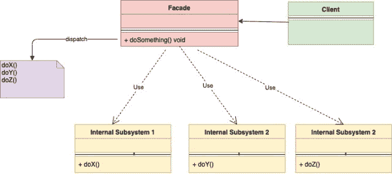
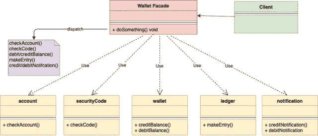

# Golang的立面设计模式

> 原文：<https://golangbyexample.com/facade-design-pattern-in-golang>

注意:有兴趣了解如何在 GO 中实现所有其他设计模式。请参阅此完整参考资料–[Golang](https://golangbyexample.com/all-design-patterns-golang/)中的所有设计模式

## **定义:**

立面模式被归类为结构设计模式。这种设计模式旨在隐藏底层系统的复杂性，并为客户端提供一个简单的接口。它为系统中的许多底层接口提供了统一的接口，因此从客户端的角度来看，它更易于使用。基本上，它为复杂的系统提供了更高层次的抽象。

术语**门面**本身的意思是

面向街道或空地的建筑物的主要正面

只显示建筑的正面，所有底层的复杂都隐藏在后面。

我们用一个简单的例子来了解一下立面设计模式。在这个数字钱包的时代，当有人实际进行钱包借记/贷记时，有很多事情正在后台发生，客户可能并不知道。下表说明了在贷记/借记过程中发生的一些活动

*   帐目核对
*   检查安全密码
*   贷方/借方余额
*   制作分类帐条目
*   发送通知

可以注意到，对于单个借贷操作，会发生很多事情。这就是 Facade 模式出现的地方。作为客户，只需输入钱包号码、安全密码、金额并指定操作类型。其余的事情在后台处理。这里我们创建了一个 **WalletFacade** ，它为客户端提供了一个简单的接口，并负责处理所有底层操作。

<figure class="wp-block-gallery columns-1 is-cropped">

*   <figure></figure>

</figure>

## **问题陈述:**

*   为了使用复杂的系统，客户必须知道底层的细节。需要为客户提供一个简单的接口，这样他们就可以使用一个复杂的系统，而不需要知道它的任何内部复杂细节。

## **何时使用:**

*   当你想以一种简化的方式展示一个复杂的系统时。

–就像上面的信用卡/借记卡钱包示例一样，他们只需要知道一个接口，其余的事情应该由该接口处理。

## **UML 图:**

<figure class="wp-block-gallery columns-1 is-cropped">

*   <figure></figure>

</figure>

下面是相应的映射 UML 图，下面给出了实际例子

<figure class="wp-block-gallery columns-1 is-cropped">

*   <figure></figure>

</figure>

## **映射**

下表显示了从 UML 图参与者到代码中实际实现参与者的映射。

<figure class="wp-block-table is-style-stripes">

| 钱包门面 | wallet FaceBook . go |
| 账户 | 帐户。开始 |
| 安全码 | securityCode.go(安全代码. go) |
| 钱包 | 钱包。走 |
| 分类帐 | 莱杰，走 |
| 通知 | notification.go |
| 客户 | main.go |

</figure>

## **实例:**

**walltfacademy . go**

```go
package main

import "fmt"

type walletFacade struct {
    account      *account
    wallet       *wallet
    securityCode *securityCode
    notification *notification
    ledger       *ledger
}

func newWalletFacade(accountID string, code int) *walletFacade {
    fmt.Println("Starting create account")
    walletFacacde := &walletFacade{
        account:      newAccount(accountID),
        securityCode: newSecurityCode(code),
        wallet:       newWallet(),
        notification: &notification{},
        ledger:       &ledger{},
    }
    fmt.Println("Account created")
    return walletFacacde
}

func (w *walletFacade) addMoneyToWallet(accountID string, securityCode int, amount int) error {
    fmt.Println("Starting add money to wallet")
    err := w.account.checkAccount(accountID)
    if err != nil {
        return err
    }
    err = w.securityCode.checkCode(securityCode)
    if err != nil {
        return err
    }
    w.wallet.creditBalance(amount)
    w.notification.sendWalletCreditNotification()
    w.ledger.makeEntry(accountID, "credit", amount)
    return nil
}

func (w *walletFacade) deductMoneyFromWallet(accountID string, securityCode int, amount int) error {
    fmt.Println("Starting debit money from wallet")
    err := w.account.checkAccount(accountID)
    if err != nil {
        return err
    }
    err = w.securityCode.checkCode(securityCode)
    if err != nil {
        return err
    }
    err = w.wallet.debitBalance(amount)
    if err != nil {
        return err
    }
    w.notification.sendWalletDebitNotification()
    w.ledger.makeEntry(accountID, "credit", amount)
    return nil
}
```

**账户转到**

```go
package main

import "fmt"

type account struct {
    name string
}

func newAccount(accountName string) *account {
    return &account{
        name: accountName,
    }
}

func (a *account) checkAccount(accountName string) error {
    if a.name != accountName {
        return fmt.Errorf("Account Name is incorrect")
    }
    fmt.Println("Account Verified")
    return nil
}
```

**securityCode.go**

```go
package main

import "fmt"

type securityCode struct {
    code int
}

func newSecurityCode(code int) *securityCode {
    return &securityCode{
        code: code,
    }
}

func (s *securityCode) checkCode(incomingCode int) error {
    if s.code != incomingCode {
        return fmt.Errorf("Security Code is incorrect")
    }
    fmt.Println("SecurityCode Verified")
    return nil
}
```

**钱包 go**

```go
package main

import "fmt"

type wallet struct {
    balance int
}

func newWallet() *wallet {
    return &wallet{
        balance: 0,
    }
}

func (w *wallet) creditBalance(amount int) {
    w.balance += amount
    fmt.Println("Wallet balance added successfully")
    return
}

func (w *wallet) debitBalance(amount int) error {
    if w.balance < amount {
        return fmt.Errorf("Balance is not sufficient")
    }
    fmt.Println("Wallet balance is Sufficient")
    w.balance = w.balance - amount
    return nil
}
```

**总账 go**

```go
package main

import "fmt"

type ledger struct {
}

func (s *ledger) makeEntry(accountID, txnType string, amount int) {
    fmt.Printf("Make ledger entry for accountId %s with txnType %s for amount %d", accountID, txnType, amount)
    return
}
```

**通知开始**

```go
package main

import "fmt"

type notification struct {
}

func (n *notification) sendWalletCreditNotification() {
    fmt.Println("Sending wallet credit notification")
}

func (n *notification) sendWalletDebitNotification() {
    fmt.Println("Sending wallet debit notification")
}
```

**main.go**

```go
package main

import (
    "fmt"
    "log"
)

func main() {
    fmt.Println()
    walletFacade := newWalletFacade("abc", 1234)
    fmt.Println()
    err := walletFacade.addMoneyToWallet("abc", 1234, 10)
    if err != nil {
        log.Fatalf("Error: %s\n", err.Error())
    }
    fmt.Println()
    err = walletFacade.deductMoneyFromWallet("ab", 1234, 5)
    if err != nil {
        log.Fatalf("Error: %s\n", err.Error())
    }
}
```

**输出:**

```go
Starting create account
Account created

Starting add money to wallet
Account Verified
SecurityCode Verified
Wallet balance added successfully
Sending wallet credit notification
Make ledger entry for accountId abc with txnType credit for amount 10

Starting debit money from wallet
Account Verified
SecurityCode Verified
Wallet balance is Sufficient
Sending wallet debit notification
Make ledger entry for accountId abc with txnType debit for amount 5 
```

## **完整工作代码:**

```go
package main

import (
    "fmt"
    "log"
)

type walletFacade struct {
    account      *account
    wallet       *wallet
    securityCode *securityCode
    notification *notification
    ledger       *ledger
}

func newWalletFacade(accountID string, code int) *walletFacade {
    fmt.Println("Starting create account")
    walletFacacde := &walletFacade{
        account:      newAccount(accountID),
        securityCode: newSecurityCode(code),
        wallet:       newWallet(),
        notification: &notification{},
        ledger:       &ledger{},
    }
    fmt.Println("Account created")
    return walletFacacde
}

func (w *walletFacade) addMoneyToWallet(accountID string, securityCode int, amount int) error {
    fmt.Println("Starting add money to wallet")
    err := w.account.checkAccount(accountID)
    if err != nil {
        return err
    }
    err = w.securityCode.checkCode(securityCode)
    if err != nil {
        return err
    }
    w.wallet.creditBalance(amount)
    w.notification.sendWalletCreditNotification()
    w.ledger.makeEntry(accountID, "credit", amount)
    return nil
}

func (w *walletFacade) deductMoneyFromWallet(accountID string, securityCode int, amount int) error {
    fmt.Println("Starting debit money from wallet")
    err := w.account.checkAccount(accountID)
    if err != nil {
        return err
    }
    err = w.securityCode.checkCode(securityCode)
    if err != nil {
        return err
    }
    err = w.wallet.debitBalance(amount)
    if err != nil {
        return err
    }
    w.notification.sendWalletDebitNotification()
    w.ledger.makeEntry(accountID, "credit", amount)
    return nil
}

type account struct {
    name string
}

func newAccount(accountName string) *account {
    return &account{
        name: accountName,
    }
}

func (a *account) checkAccount(accountName string) error {
    if a.name != accountName {
        return fmt.Errorf("Account Name is incorrect")
    }
    fmt.Println("Account Verified")
    return nil
}

type securityCode struct {
    code int
}

func newSecurityCode(code int) *securityCode {
    return &securityCode{
        code: code,
    }
}

func (s *securityCode) checkCode(incomingCode int) error {
    if s.code != incomingCode {
        return fmt.Errorf("Security Code is incorrect")
    }
    fmt.Println("SecurityCode Verified")
    return nil
}

type wallet struct {
    balance int
}

func newWallet() *wallet {
    return &wallet{
        balance: 0,
    }
}

func (w *wallet) creditBalance(amount int) {
    w.balance += amount
    fmt.Println("Wallet balance added successfully")
    return
}

func (w *wallet) debitBalance(amount int) error {
    if w.balance < amount {
        return fmt.Errorf("Balance is not sufficient")
    }
    fmt.Println("Wallet balance is Sufficient")
    w.balance = w.balance - amount
    return nil
}

type ledger struct {
}

func (s *ledger) makeEntry(accountID, txnType string, amount int) {
    fmt.Printf("Make ledger entry for accountId %s with txnType %s for amount %d\n", accountID, txnType, amount)
    return
}

type notification struct {
}

func (n *notification) sendWalletCreditNotification() {
    fmt.Println("Sending wallet credit notification")
}

func (n *notification) sendWalletDebitNotification() {
    fmt.Println("Sending wallet debit notification")
}

func main() {
    fmt.Println()
    walletFacade := newWalletFacade("abc", 1234)
    fmt.Println()
    err := walletFacade.addMoneyToWallet("abc", 1234, 10)
    if err != nil {
        log.Fatalf("Error: %s\n", err.Error())
    }
    fmt.Println()
    err = walletFacade.deductMoneyFromWallet("abc", 1234, 5)
    if err != nil {
        log.Fatalf("Error: %s\n", err.Error())
    }
} 
```

**输出:**

```go
Starting create account
Account created

Starting add money to wallet
Account Verified
SecurityCode Verified
Wallet balance added successfully
Sending wallet credit notification
Make ledger entry for accountId abc with txnType credit for amount 10

Starting debit money from wallet
Account Verified
SecurityCode Verified
Wallet balance is Sufficient
Sending wallet debit notification
Make ledger entry for accountId abc with txnType debit for amount 5 
```