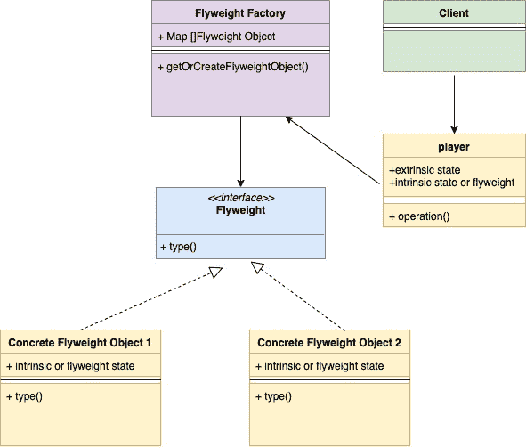
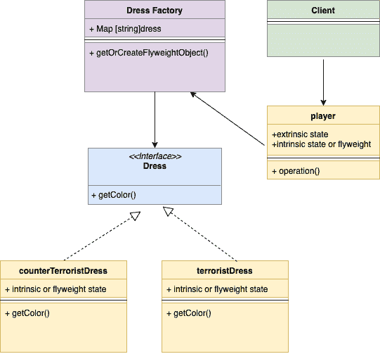

# 围棋中的飞盘设计模式

> 原文：<https://golangbyexample.com/flyweight-design-pattern-golang/>

注意:有兴趣了解如何在 GO 中实现所有其他设计模式。请参阅此完整参考资料–[Go(Golang)](https://golangbyexample.com/all-design-patterns-golang/)中的所有设计模式

## **定义:**

它是一种结构设计模式。当需要创建大量类似的对象时，使用这种模式。这些对象被称为 flyweight 对象，是不可变的。

我们先来看一个例子。在这个例子之后，飞行重量模式将变得清晰。

在《反恐精英》的游戏中，恐怖分子和反恐精英有不同类型的服装。为了简单起见，让我们假设恐怖分子和反恐怖分子都有一种服装类型。服装对象嵌入到播放器对象中，如下所示

下面是一个玩家的结构，我们可以看到服饰对象嵌入在玩家结构中

```go
type player struct {
    dress      dress
    playerType string //Can be T or CT
    lat        int
    long       int
}
```

假设有 5 个恐怖分子和 5 个反恐怖分子，那么总共有 10 个玩家。关于着装，现在有两种选择

1.  10 个玩家对象中的每一个都会创建一个不同的服饰对象并嵌入其中。总共将创建 10 个服装对象
2.  我们创建了两个着装对象
    *   单一恐怖分子服装对象:这将在 5 个恐怖分子之间共享
    *   单一反恐着装对象:这将在 5 名反恐人员中共享

可以看到，在方法 1 中，总共创建了 10 个服装对象，而在方法 2 中，只创建了 2 个服装对象。第二种方法是我们在 Flyweight 设计模式中遵循的方法。我们创造的两个服装物体被称为飞行重量物体。Flyweight 模式取出公共部分并创建 flyweight 对象。这些飞行重量对象(此处为服装)可以在多个对象(此处为玩家)之间共享。这大大减少了服饰对象的数量，好的一面是，即使你创造了更多的玩家，仍然只有两个服饰对象就足够了。

在 flyweight 模式中，我们将 flyweight 对象存储在地图中。每当创建共享 flyweight 对象的其他对象时，就会从地图中提取 flyweight 对象。

**内在和外在状态**

*   **内在状态–**穿上内在状态，因为它可以在多个恐怖分子和反恐对象之间共享
*   **外在状态–**玩家位置和玩家武器是外在状态，因为每个物体都不一样。

## **何时使用** :

*   当对象具有一些可以共享的内在属性时。
    *   就像上面的例子一样，服饰是被拿出来分享的内在属性。
*   当需要创建大量可能导致内存问题的对象时，请使用 flyweight。在这种情况下，找出所有的公共或内在状态，并为其创建 flyweight 对象。

## **UML 图** :

<figure class="wp-block-image"></figure>

下面是上面给出的例子对应的映射 UML 图

<figure class="wp-block-image"></figure>

## **映射:**

下表显示了从 UML 图参与者到代码中实际实现参与者的映射。

<figure class="wp-block-table is-style-stripes">

| 飞轮工厂 | 服装厂，去吧 |
| 飞轮接口 | 穿上衣服，走 |
| 混凝土飞轮物体 1 | 恐怖分子，快走 |
| 混凝土飞轮物体 1 | 反恐服，走 |
| 语境 | 玩家，开始 |
| 客户 | main.go |

</figure>

## **实例** :

**服装厂. go**

```go
package main

import "fmt"

const (
    //TerroristDressType terrorist dress type
    TerroristDressType = "tDress"
    //CounterTerrroristDressType terrorist dress type
    CounterTerrroristDressType = "ctDress"
)

var (
    dressFactorySingleInstance = &dressFactory{
        dressMap: make(map[string]dress),
    }
)

type dressFactory struct {
    dressMap map[string]dress
}

func (d *dressFactory) getDressByType(dressType string) (dress, error) {
    if d.dressMap[dressType] != nil {
        return d.dressMap[dressType], nil
    }
    if dressType == TerroristDressType {
        d.dressMap[dressType] = newTerroristDress()
        return d.dressMap[dressType], nil
    }
    if dressType == CounterTerrroristDressType {
        d.dressMap[dressType] = newCounterTerroristDress()
        return d.dressMap[dressType], nil
    }
    return nil, fmt.Errorf("Wrong dress type passed")
}

func getDressFactorySingleInstance() *dressFactory {
    return dressFactorySingleInstance
}
```

**穿衣打扮**

```go
package main

type dress interface {
    getColor() string
}
```

**恐怖分子大会。去**

```go
package main

type terroristDress struct {
	color string
}

func (t *terroristDress) getColor() string {
	return t.color
}

func newTerroristDress() *terroristDress {
	return &terroristDress{color: "red"}
} 
```

**反恐怖主义着装开始**

```go
package main

type counterTerroristDress struct {
    color string
}

func (c *counterTerroristDress) getColor() string {
    return c.color
}

func newCounterTerroristDress() *counterTerroristDress {
    return &counterTerroristDress{color: "green"}
}
```

**player.go**

```go
package main

type player struct {
    dress      dress
    playerType string
    lat        int
    long       int
}

func newPlayer(playerType, dressType string) *player {
    dress, _ := getDressFactorySingleInstance().getDressByType(dressType)
    return &player{
        playerType: playerType,
        dress:      dress,
    }
}

func (p *player) newLocation(lat, long int) {
    p.lat = lat
    p.long = long
}
```

**main.go**

```go
package main

import "fmt"

func main() {
    game := newGame()
    //Add Terrorist
    game.addTerrorist(TerroristDressType)
    game.addTerrorist(TerroristDressType)
    game.addTerrorist(TerroristDressType)
    game.addTerrorist(TerroristDressType)
    //Add CounterTerrorist
    game.addCounterTerrorist(CounterTerrroristDressType)
    game.addCounterTerrorist(CounterTerrroristDressType)
    game.addCounterTerrorist(CounterTerrroristDressType)
    dressFactoryInstance := getDressFactorySingleInstance()
    for dressType, dress := range dressFactoryInstance.dressMap {
        fmt.Printf("DressColorType: %s\nDressColor: %s\n", dressType, dress.getColor())
    }
}
```

**输出:**

```go
DressColorType: ctDress
DressColor: green
DressColorType: tDress
DressColor: red
```