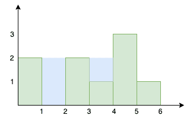

# 雨水收集问题

> 原文：<https://golangbyexample.com/?p=6285>

## **概述**

旁边有一组各有 1 个单位宽度但高度不同的杆。条形的高度用数组表示

```go
[2, 0 , 2, 1, 3, 1]
```

该数组表示

*   条形的总数是 5

*   第一个小节的高度为 2

*   第二个条形的高度为 0

*   第三根横杆的高度为 2

*   第四个小节的高度为 1

*   第五根横杆的高度为 3

*   第六个小节的高度为 1

目标是找到这些条块中能够截留的最大水量

<figure class="wp-block-image size-full"></figure>

从上图可以看出

*   在 1 巴和 3 巴之间可以截留 2 单位的水

*   1 单位的水可以截留在 3 巴和 6 巴之间

因此，总共可以截留 3 单位的水

让我们看看同样的程序。策略是使用栈。

*   遍历给定的数组

*   对于当前元素，继续从栈中弹出，直到栈为空或者顶部元素的高度大于当前元素的高度。

*   对于每个弹出的元素，计算可以在弹出的元素和当前元素之间捕获的水。

*   最后，将当前元素推入栈，循环重复，直到遍历完数组中的所有元素

## **程序**

```go
package main

import (
	"fmt"
	"sync"
)

func main() {
	output := trap([]int{2, 0, 2, 1, 3, 1})
	fmt.Println(output)

	output = trap([]int{0, 1, 0, 2, 1, 0, 1, 3, 2, 1, 2, 1})
	fmt.Println(output)

	output = trap([]int{4, 2, 0, 3, 2, 5})
	fmt.Println(output)
}

func trap(height []int) int {

	output := 0
	heightArrayLen := len(height)
	customStack := customStack{
		stack: make([]int, 0),
	}

	customStack.Push(0)

	for i := 1; i < heightArrayLen; i++ {

		for customStack.Size() != 0 {
			front, _ := customStack.Front()
			if height[front] <= height[i] {
				output = output + (i-front-1)*(height[front]-max(height, front+1, i-1))
				customStack.Pop()
			} else {
				output = output + (i-front-1)*(height[i]-max(height, front+1, i-1))
				break
			}
		}
		customStack.Push(i)
	}
	return output

}

func max(input []int, start, end int) int {

	if start > end {
		return 0
	}

	max := 0

	for i := start; i <= end; i++ {
		if input[i] > max {
			max = input[i]
		}
	}
	return max
}

type customStack struct {
	stack []int
	lock  sync.RWMutex
}

func (c *customStack) Push(name int) {
	c.lock.Lock()
	defer c.lock.Unlock()
	c.stack = append(c.stack, name)
}

func (c *customStack) Pop() error {
	len := len(c.stack)
	if len > 0 {
		c.lock.Lock()
		defer c.lock.Unlock()
		c.stack = c.stack[:len-1]
		return nil
	}
	return fmt.Errorf("Pop Error: Stack is empty")
}

func (c *customStack) Front() (int, error) {
	len := len(c.stack)
	if len > 0 {
		c.lock.Lock()
		defer c.lock.Unlock()
		return c.stack[len-1], nil
	}
	return 0, fmt.Errorf("Peep Error: Stack is empty")
}

func (c *customStack) Size() int {
	return len(c.stack)
}

func (c *customStack) Empty() bool {
	return len(c.stack) == 0
}
```

**输出**

```go
3
6
9
```

**注意:**查看我们的 Golang 高级教程。本系列中的教程是详尽的，我们试图用例子来涵盖所有的概念。本教程面向希望获得专业知识并对高朗有扎实了解的人–[高朗进阶教程](https://golangbyexample.com/golang-comprehensive-tutorial/)

如果你有兴趣了解如何在 Golang 中实现所有的设计模式。如果是，那么这个帖子是给你的–[所有设计模式 Golang](https://golangbyexample.com/all-design-patterns-golang/)