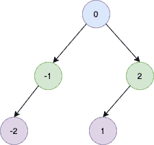

# 将排序的链表转换为平衡的 BST

> 原文：<https://golangbyexample.com/sorted-linked-list-to-balanced-bst/>

## **概述**

目标是将排序的链表转换为平衡的 BST。平衡树是每个节点的两个子树的深度相差不超过 1 的树

假设我们下面有一个排序的链表

```go
-2->-1->0->1->2
```

那么它应该会产生一个平衡的 BST。

<figure class="wp-block-image size-full"></figure>

## **程序**

下面是同样的程序

```go
package main

import "fmt"

type ListNode struct {
	Val  int
	Next *ListNode
}

type SingleList struct {
	Len  int
	Head *ListNode
}

func (s *SingleList) AddFront(num int) {
	ele := &ListNode{
		Val: num,
	}
	if s.Head == nil {
		s.Head = ele
	} else {
		ele.Next = s.Head
		s.Head = ele
	}
	s.Len++
}

type TreeNode struct {
	Val   int
	Left  *TreeNode
	Right *TreeNode
}

func sortedListToBST(head *ListNode) *TreeNode {

	len := lenOfList(head)
	return sortedListToBSTUtil(&head, len)
}

func sortedListToBSTUtil(head **ListNode, n int) *TreeNode {

	if *head == nil {
		return nil
	}

	if n <= 0 {
		return nil
	}

	left := sortedListToBSTUtil(head, n/2)

	root := &TreeNode{Val: (*head).Val}
	*head = (*head).Next

	root.Left = left

	root.Right = sortedListToBSTUtil(head, n-n/2-1)
	return root

}

func lenOfList(head *ListNode) int {
	length := 0
	for head != nil {
		length++
		head = head.Next
	}
	return length
}

func main() {
	singleList := &SingleList{}
	fmt.Printf("AddFront: 2\n")
	singleList.AddFront(2)
	fmt.Printf("AddFront: 1\n")
	singleList.AddFront(1)
	fmt.Printf("AddFront: 0\n")
	singleList.AddFront(0)
	fmt.Printf("AddFront: -1\n")
	singleList.AddFront(-1)
	fmt.Printf("AddFront: -2\n")
	singleList.AddFront(-2)

	fmt.Println()
	root := sortedListToBST(singleList.Head)
	fmt.Printf("root: %d\n", root.Val)
	fmt.Printf("root.Left: %d\n", root.Left.Val)
	fmt.Printf("root.Left.Left: %d\n", root.Left.Left.Val)
	fmt.Printf("root.Right: %d\n", root.Right.Val)
	fmt.Printf("root.Right.Left: %d\n", root.Right.Left.Val)
}
```

**输出**

```go
AddFront: 2
AddFront: 1
AddFront: 0
AddFront: -1
AddFront: -2

root: 0
root.Left: -1
root.Left.Left: -2
root.Right: 2
root.Right.Left: 1
```

**注意:**查看我们的 Golang 高级教程。本系列中的教程是详尽的，我们试图用例子来涵盖所有的概念。本教程是为那些希望获得专业知识并对 golang 有扎实了解的人准备的- [Golang 进阶教程](https://golangbyexample.com/golang-comprehensive-tutorial/)

如果你有兴趣了解如何在 Golang 中实现所有的设计模式。如果是，那么这个帖子是给你的- [所有设计模式 Golang](https://golangbyexample.com/all-design-patterns-golang/)