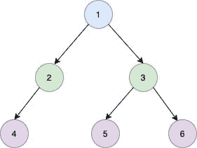

# 从 Golang中的前序和中序构造二叉树

> 原文：<https://golangbyexample.com/tree-preorder-inorder-golang/>

## **概述**

给出了两个数组，分别代表二叉树的前序和中序遍历。目标是从它们构建一个二叉树

示例:

考虑树下

<figure class="wp-block-image size-full"></figure>

树的前序遍历将

```go
[1,2,4,3,5,6]
```

为了遍历树

```go
[4,2,1,5,3,6]
```

将给出有序和无序数组，我们必须从有序和有序中再次构建树。以下是策略

*   我们将使用三个索引，即数组的开始、数组的结束和当前索引

*   预订单中的起始索引将是根。

*   我们将在一个有序数组中找到索引，其值与前序数组中起始索引处的值相匹配。让我们把这个索引叫做根索引

*   有序数组中根索引左侧的所有值都将在左子树中

*   有序数组中根索引右侧的所有值都将在右子树中

*   然后，我们可以对左子树和右子树使用相同的策略进行递归。

伪造

*   前序遍历中的第一个索引是根，即值 **1**

*   值 **1** 位于有序遍历中的**第二个**索引处。因此根索引是 **2**

*   在有序遍历中，根索引的左边部分是**【4，2】**，它是左边子树的一部分

*   在有序遍历中，根索引的右侧是**【5，3，6】**，它是右子树的一部分

*   我们可以先递归左边的子树，然后递归右边的子树

## **程序**

下面是同样的程序

```go
package main

import (
	"fmt"
)

type TreeNode struct {
	Val   int
	Left  *TreeNode
	Right *TreeNode
}

func buildTree(preorder []int, inorder []int) *TreeNode {

	lenOfTree := len(preorder)

	current := 0
	newRoot := buildTreeUtil(preorder, inorder, &current, 0, lenOfTree-1)

	return newRoot
}

func buildTreeUtil(preorder []int, inorder []int, current *int, low, high int) *TreeNode {
	if low > high {
		return nil
	}

	if low == high {
		rootNode := &TreeNode{Val: preorder[*current]}
		(*current)++
		return rootNode
	}

	rootNode := &TreeNode{Val: preorder[*current]}
	rootValue := preorder[*current]
	(*current)++

	var rootIndex int
	for i := low; i <= high; i++ {
		if inorder[i] == rootValue {
			rootIndex = i
		}
	}

	rootNode.Left = buildTreeUtil(preorder, inorder, current, low, rootIndex-1)
	rootNode.Right = buildTreeUtil(preorder, inorder, current, rootIndex+1, high)

	return rootNode
}

func main() {
	inorder := []int{4, 2, 1, 5, 3, 6}
	preorder := []int{1, 2, 4, 3, 5, 6}

	root := buildTree(preorder, inorder)
	fmt.Printf("root: %d\n", root.Val)
	fmt.Printf("root.Left: %d\n", root.Left.Val)
	fmt.Printf("root.Left.Left: %d\n", root.Left.Left.Val)
	fmt.Printf("root.Right: %d\n", root.Right.Val)
	fmt.Printf("root.Right.Left: %d\n", root.Right.Left.Val)
	fmt.Printf("root.Right.Right: %d\n", root.Right.Right.Val)
}
```

**输出**

```go
root: 1
root.Left: 2
root.Left.Left: 4
root.Right: 3
root.Right.Left: 5
root.Right.Right: 6
```

**注意:**查看我们的 Golang 高级教程。本系列中的教程是详尽的，我们试图用例子来涵盖所有的概念。本教程是为那些希望获得专业知识并对 golang 有扎实了解的人准备的- [Golang 进阶教程](https://golangbyexample.com/golang-comprehensive-tutorial/)

如果你有兴趣了解如何在 Golang 中实现所有的设计模式。如果是，那么这个帖子是给你的- [所有设计模式 Golang](https://golangbyexample.com/all-design-patterns-golang/)