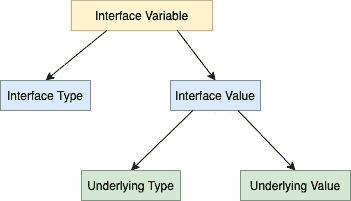

<!--yml

类别：未分类

日期：2024-10-13 06:23:01

-->

# 在 Go 语言（Golang）中访问接口的基础变量

> 来源：[`golangbyexample.com/access-underlying-type-interface-golang/`](https://golangbyexample.com/access-underlying-type-interface-golang/)

目录

+   概述

+   类型断言

+   类型切换

# **概述**

像其他任何变量一样，接口变量由类型和值表示。接口值在底层由两个元组组成。

+   基础类型

+   基础值

请查看下面的图示，说明我们上面提到的内容。



接口的基础变量可以通过两种方式访问。

+   类型断言

+   类型切换

# **类型断言**

类型断言提供了一种通过断言正确的基础值类型来访问接口值内部的基础变量的方法。下面是该语法，其中 i 是一个接口。

```go
val := i.({type})
```

上述语句正在断言接口中的基础值的类型为{type}。如果这是真的，那么基础值将被赋值给**val.**如果不是，则上述语句会导致恐慌。

假设我们有如下的接口**动物**：

```go
type animal interface {
    breathe()
    walk()
}
```

我们还有一个实现了**动物**接口的**狮子**结构体。

```go
type lion struct {
    age int
}
```

**代码**

```go
package main

import "fmt"

type animal interface {
	breathe()
	walk()
}

type lion struct {
	age int
}

func (l lion) breathe() {
	fmt.Println("Lion breathes")
}

func (l lion) walk() {
	fmt.Println("Lion walk")
}

type dog struct {
	age int
}

func (d dog) breathe() {
	fmt.Println("Dog breathes")
}

func (d dog) walk() {
	fmt.Println("Dog walk")
}

func main() {
	var a animal

	a = lion{age: 10}
	print(a)

}

func print(a animal) {
	l := a.(lion)
	fmt.Printf("Age: %d\n", l.age)

	//d := a.(dog)
	//fmt.Printf("Age: %d\n", d.age)
}
```

**输出**

```go
Age: 10
```

这就是我们如何将类型为**动物**的变量**a**断言为具有基础类型**狮子**。

```go
l := a.(lion)
```

下面的行将导致恐慌，因为基础类型是**狮子**而不是**狗**。取消注释该行以查看。

```go
//d := a.(dog)
```

类型断言提供了另一种获取基础值的方法，也能防止恐慌。其语法为：

```go
val, ok := i.(<type>)</type>
```

在这种情况下，类型断言返回两个值，第一个值与上面讨论的相同，另一个值是布尔值，表示类型断言是否正确。这个值是

+   如果类型断言正确，则为真，这意味着断言的类型与基础类型相同。

+   如果类型断言失败则为假。

所以第二种方法是进行类型断言的好方法，因为它可以防止恐慌。让我们来看一个例子。

```go
package main

import "fmt"

type animal interface {
	breathe()
	walk()
}

type lion struct {
	age int
}

func (l lion) breathe() {
	fmt.Println("Lion breathes")
}

func (l lion) walk() {
	fmt.Println("Lion walk")
}

type dog struct {
	age int
}

func (d dog) breathe() {
	fmt.Println("Dog breathes")
}

func (d dog) walk() {
	fmt.Println("Dog walk")
}

func main() {
	var a animal

	a = lion{age: 10}
	print(a)

}

func print(a animal) {
	l, ok := a.(lion)
	if ok {
		fmt.Println(l)
	} else {
		fmt.Println("a is not of type lion")
	}

	d, ok := a.(dog)
	if ok {
		fmt.Println(d)
	} else {
		fmt.Println("a is not of type lion")
	}
}
```

**输出：**

```go
{10}
a is not of type lion
```

让我们现在继续讨论类型切换。

# **类型切换**

类型切换使我们能够逐个进行上述类型断言。请查看下面的代码示例。

```go
package main

import "fmt"

type animal interface {
	breathe()
	walk()
}

type lion struct {
	age int
}

func (l lion) breathe() {
	fmt.Println("Lion breathes")
}

func (l lion) walk() {
	fmt.Println("Lion walk")
}

type dog struct {
	age int
}

func (d dog) breathe() {
	fmt.Println("Dog breathes")
}

func (d dog) walk() {
	fmt.Println("Dog walk")
}

func main() {
	var a animal

	a = lion{age: 10}
	print(a)

}

func print(a animal) {
	switch v := a.(type) {
	case lion:
		fmt.Println("Type: lion")
	case dog:
		fmt.Println("Type: dog")
	default:
		fmt.Printf("Unknown Type %T", v)
	}
}
```

**输出：**

```go
Type: lion
```

在上面的代码中，通过使用类型切换，我们确定接口变量**a**中包含的值的类型是**狮子**或**狗**或其他某种类型。如果需要，可以在案例语句中添加更多不同的类型。

+   [go](https://golangbyexample.com/tag/go/)*   [golang](https://golangbyexample.com/tag/golang/)*
