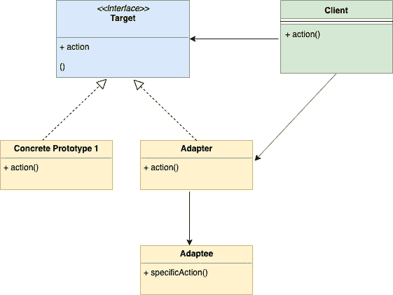
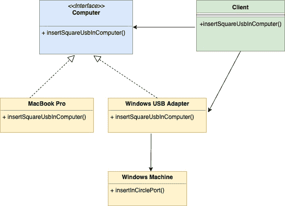

<!--yml

类别：未分类

日期：2024-10-13 06:02:10

-->

# Go (GoLang) 中的适配器设计模式

> 来源：[https://golangbyexample.com/adapter-design-pattern-go/](https://golangbyexample.com/adapter-design-pattern-go/)

注意：有兴趣了解所有其他设计模式如何在 GO 中实现。请参见此完整参考 – [Go 中的所有设计模式 (Golang)](https://golangbyexample.com/all-design-patterns-golang/)

目录

**   [介绍：](#Introduction "Introduction: ")

+   [何时使用](#When_to_Use "When to Use")

+   [UML 图](#UML_Diagram "UML Diagram")

+   [映射](#Mapping "Mapping ")

+   [示例：](#Example "Example:")*  *# **介绍：**

此设计模式是一种结构设计模式。该模式通过示例最佳理解。假设你有两台笔记本电脑

1.  MacBook Pro

1.  Windows 笔记本电脑

MacBook Pro 的 USB 端口是**方形**的，而 Windows 的 USB 端口是**圆形**的。作为客户端，你有一根方形的 USB 电缆，所以只能插入 Mac 笔记本电脑。因此，你看到了这里的问题。

**问题：**

+   我们有一个类（客户端）期望对象的某些特性（此处为方形 USB 端口），但我们还有另一个称为适配者的对象（此处为 Windows 笔记本电脑），它通过不同的接口（圆形端口）提供相同的功能。

这就是适配器模式派上用场的地方。我们创建一个称为适配器的类，它将

+   遵循客户端期望的相同接口（此处为方形 USB 端口）

+   将客户端的请求转换为适配者所期望的形式。基本上，在我们的示例中，充当一个接受方形 USB 端口并将其插入 Windows 笔记本电脑的圆形端口的适配器。

# **何时使用**

+   当对象实现与客户端要求不同的接口时，请使用此设计模式。

# **UML 图**



下面是与上述示例对应的映射 UML 图



# **映射**

下面的表格表示 UML 图中的参与者与代码中实际实现的参与者之间的映射。

| 目标 | computer.go |
| --- | --- |
| 具体原型 1 | mac.go |
| 具体原型 2 (适配器) | windowsAdapter.go |
| 适配者 | windows.go |
| 客户端 | client.go |

# **示例**：

**computer.go**

```
package main

type computer interface {
    insertInSquarePort()
}
```

**mac.go**

```
package main

import "fmt"

type mac struct {
}

func (m *mac) insertInSquarePort() {
    fmt.Println("Insert square port into mac machine")
}
```

**windowsAdapter.go**

```
package main

type windowsAdapter struct {
	windowMachine *windows
}

func (w *windowsAdapter) insertInSquarePort() {
	w.windowMachine.insertInCirclePort()
} 
```

**windows.go**

```
package main

import "fmt"

type windows struct{}

func (w *windows) insertInCirclePort() {
    fmt.Println("Insert circle port into windows machine")
}
```

**client.go**

```
package main

type client struct {
}

func (c *client) insertSquareUsbInComputer(com computer) {
    com.insertInSquarePort()
}
```

**main.go**

```
package main

func main() {
    client := &client{}
    mac := &mac{}
    client.insertSquareUsbInComputer(mac)
    windowsMachine := &windows{}
    windowsMachineAdapter := &windowsAdapter{
        windowMachine: windowsMachine,
    }
    client.insertSquareUsbInComputer(windowsMachineAdapter)
}
```

**输出：**

```
Insert square port into mac machine
Insert circle port into windows machine
```

+   [适配器](https://golangbyexample.com/tag/adapter/)*   [适配器设计模式](https://golangbyexample.com/tag/adapter-design-pattern/)*   [设计](https://golangbyexample.com/tag/design/)*   [设计模式](https://golangbyexample.com/tag/design-pattern/)*
