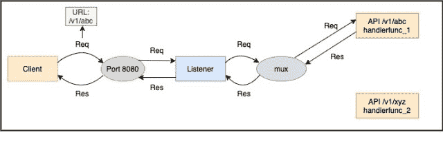
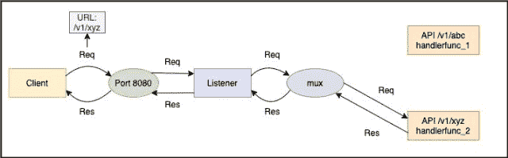

<!--yml

类别：未分类

日期：2024-10-13 06:21:52

-->

# 基于Go（Golang）的基本HTTP服务器实现

> 来源：[https://golangbyexample.com/basic-http-server-go/](https://golangbyexample.com/basic-http-server-go/)

目录

**   [概述](#Overview "概述")

    +   [请求](#Request "请求")

    +   [响应](#Response "响应")

    +   [API签名及其处理程序的配对](#Pair_of_API_signature_and_its_handler "API签名及其处理程序的配对")

    +   [路由器](#Mux "路由器")

    +   [监听器](#Listener "监听器")

+   [使用服务器的ListenAndServe函数](#Using_servers_ListenAndServe_function "使用服务器的ListenAndServe函数")

+   [使用http的ListenAndServe函数](#Using_https_ListenAndServe_function "使用http的ListenAndServe函数")

+   [结论](#Conclusion "结论")*  *# **概述**

HTTP（超文本传输协议）是应用层协议，以客户端-服务器模式工作。HTTP服务器基本上是运行在机器上的程序。它监听并响应其IP地址上的HTTP请求，指定端口。由于HTTP是万维网的基础，并用于加载任何网页，因此每个软件开发人员都面临需要实现HTTP服务器以响应HTTP请求的情况。

本文涵盖Go编程语言中的HTTP服务器实现。Go包**net**包含处理网络功能的实用程序包。

**net**包包含http包，提供HTTP客户端（用于发送http请求）和HTTP服务器（监听http请求）实现。本文将讨论HTTP服务器。下面是导入http包的语句：

```go
import "net/http"
```

理解HTTP服务器实现的关键在于理解以下内容

+   **请求** – 它定义请求参数，即方法、API签名、请求头、主体、查询参数等。

+   **响应** – 定义响应参数，即状态码、响应体、头部

+   **API签名及其处理程序的配对** – 每个API签名对应一个处理程序。你可以把处理程序想象成一个在请求该特定API签名时被调用的函数。**mux**注册这些API签名及其处理程序的配对。

+   **路由器**– 它充当路由器。根据请求的API签名，它将请求路由到该API签名的注册处理程序。处理程序将处理该传入请求并提供响应。例如，API调用**“/v2/teachers”**可能由不同的函数处理，而API调用**“/v2/students”**可能由另一个函数处理。因此，基本上根据API签名（有时也考虑请求方法），它决定调用哪个处理程序。

+   **监听器** – 它在机器上运行，监听特定端口。每当它在该端口接收到请求时，就会将请求转发给**mux**。它还处理其他功能，但我们在本文中不会讨论这些。

在 HTTP 方面还有更多内容，但为了简单起见，我们只讨论了以上五个要点。下面的图示展示了来自客户端的 API 请求的交互。

让我们看一个例子。下面两个 API 签名和处理程序对在 **mux** 中注册。

+   **“/v1/abc”** 和 **handlerfunc_1**。

+   **“/v1/xyz”** 和 **handlerfunc_2**。

客户端调用 **“/v1/abc”** API。监听器将其转发到 **mux**，而 **mux** 将其路由到适当的处理程序 **handlerfunc_1**。



客户端调用 **“/v1/xyz”** API。监听器将其转发到 **mux**，而 **mux** 将其路由到适当的处理程序 **handlerfunc_2**。



现在我们已经理解了以上部分，所以让我们继续看看以上每一部分在 Go 中是如何实现的，最后我们将看到一个完整的程序及整个端到端流程。

## **请求**

在 Go 中，请求由 **Request** 结构表示。这里是结构的链接 – [https://golang.org/pkg/net/http/#Request](https://golang.org/pkg/net/http/#Request)。

它包含请求方法、API 签名、请求头、主体、查询参数等。

## **响应**

在 Go 中，响应由 **ResponseWriter** 接口表示。这里是接口的链接 – [https://golang.org/pkg/net/http/#ResponseWriter](https://golang.org/pkg/net/http/#ResponseWriter)。ResponseWriter 接口由 HTTP 处理程序用于构造 HTTP 响应。它提供三个函数来设置响应参数。

+   头部 – 用于编写响应头。

+   Write([]byte) – 用于写入响应主体。

+   WriteHeader(statusCode int) – 用于写入 HTTP 状态码。

## **API 签名及其处理程序的对。**

API 签名和它的处理程序是成对的。当接收到与 API 签名匹配的 API 调用时，mux 会调用处理程序。一个 Go 处理程序可以是一个 **函数** 或一个 **类型**。

+   **函数** – 函数应具有以下签名。

```go
func(ResponseWriter, *Request)
```

+   **类型** – 该类型应实现 **Handler** 接口。

```go
type Handler interface {
   ServeHTTP(ResponseWriter, *Request)
}
```

让我们逐一查看每个。

+   **函数 –** 处理程序可以只是具有以下签名的简单函数。

```go
func(ResponseWriter, *Request)
```

它接受两个参数作为输入。第一个是 ResponseWriter，第二个是指向 Request 结构的指针。我们之前也讨论过这两个。

如果 API 签名和具有上述签名的函数在 **mux** 中注册为一对，则当发出与 API 签名匹配的 API 调用时，将调用该函数。

+   **类型 –** 该类型应实现 **Handler** 接口 – [https://golang.org/pkg/net/http/#Handler](https://golang.org/pkg/net/http/#Handler)。

```go
type Handler interface {
   ServeHTTP(ResponseWriter, *Request)
}
```

**Handler** 接口定义了 **ServeHttp** 函数。如果 API 签名和实现了 **Handler** 接口的类型在 mux 中注册为一对，则在进行与 API 签名匹配的 API 调用时，该类型的 **ServeHTTP** 方法将被调用。

如果你注意到，作为处理程序的**function**的API签名和**ListenAndServe**函数是相同的。

```go
func(ResponseWriter, *Request)
```

这些函数将根据处理程序的类型由mux调用。还要注意的是，两种不同的API签名可以具有相同的处理程序。

## **Mux**

mux或多路复用器的工作是根据API签名（有时也根据请求方法）将请求路由到注册的处理程序。如果签名及其处理程序未在mux中注册，则会引发404错误。

Go提供了一个内置的默认mux – [https://golang.org/pkg/net/http/#ServeMux](https://golang.org/pkg/net/http/#ServeMux)。市场上还有其他可用于golang的mux。不同的Web框架，如gin，提供自己的mux。

这就是我们创建mux的方式。

```go
mux := http.NewServeMux()
```

让我们看看如何将一对API签名及其处理程序与mux注册。这里有两种情况。

+   当处理程序是一个**function**时，它注册的是API签名的模式和作为处理程序的函数。

```go
mux.HandleFunc(pattern, handlerFunc)
```

+   当处理程序是实现了**Handler**接口的**type**时。

```go
mux.Handle(pattern, handler)
```

## **Listener**

监听器监听一个端口，并将请求转发到**mux**，然后等待响应。一旦接收到响应，它会将其发送回客户端。在golang中，可以使用服务器结构实现监听器 – [https://golang.org/pkg/net/http/#Server](https://golang.org/pkg/net/http/#Server)。

这就是我们创建服务器的方式。创建服务器时，我们还可以指定一些其他参数，例如ReadTimeout、WriteTimeout等，但这超出了本教程的范围。所有未提供的参数都取默认零值。

```go
s := &http.Server{
  Addr:    ":8080",
  Handler: mux,
}
```

**Addr**属性的类型为字符串，是将在其上启动HTTP服务器的机器的地址。

该地址的形式为。

```go
{ip_address}:{port}
```

如果仅使用:{port}作为**addr**参数，那么这意味着HTTP服务器可以从机器的所有IP地址（回环地址、公共IP、内部IP）访问。

还可以将**“:http”**作为**addr**参数值，用于地址端口**“:80”**，将**“:https”**用于地址端口**“:443”**。

这里需要注意的一件非常重要的事情是，**ServerMux**是语言中内置的默认mux，它也有一个**ServeHttp**方法 [https://golang.org/pkg/net/http/#ServeMux.ServeHTTP](https://golang.org/pkg/net/http/#ServeMux.ServeHTTP)。因此，**ServerMux**也实现了**Handler**接口，因为它定义了**ServeHttp**方法。在创建服务器时，你可能注意到我们必须提供一个类型为**Handler**接口的处理程序。这就是**ServerMux**实现**Handler**接口的便利之处，因为我们可以在创建服务器时传递**ServerMux**的实例。理解**ServerMux**是**Handler**接口的一种类型这一点很重要，此外它还注册了不同的API签名及其处理程序。

在服务器创建后，我们调用 **server** 的 **ListenAndServe** 方法。然后，服务器开始监听提供的端口，并在该端口收到任何 API 调用时调用 **mux** 的 **ServeHttp**，进而将请求路由到注册的处理程序。希望以上五个内容现在清晰了。让我们看看一个演示上述要点的工作程序。

# **使用服务器的 ListenAndServe 函数**

**main.go**

```go
package main

import (
	"net/http"
)

func main() {

	//Create the default mux
	mux := http.NewServeMux()

	//Handling the /v1/teachers. The handler is a function here
	mux.HandleFunc("/v1/teachers", teacherHandler)

	//Handling the /v1/students. The handler is a type implementing the Handler interface here
	sHandler := studentHandler{}
	mux.Handle("/v1/students", sHandler)

	//Create the server. 
	s := &http.Server{
		Addr:    ":8080",
		Handler: mux,
	}
	s.ListenAndServe()

}

func teacherHandler(res http.ResponseWriter, req *http.Request) {
	data := []byte("V1 of teacher's called")
	res.WriteHeader(200)
	res.Write(data)
}

type studentHandler struct{}

func (h studentHandler) ServeHTTP(res http.ResponseWriter, req *http.Request) {
	data := []byte("V1 of student's called")
	res.WriteHeader(200)
	res.Write(data)
}
```

在运行程序之前，我们先了解一下它。

+   我们定义了一个名为 **teacherHandler** 的函数，该函数的签名接受 **http.ResponseWriter** 和指向 **http.Request** 的指针。

```go
func teacherHandler(res http.ResponseWriter, req *http.Request) {
	data := []byte("V1 of teacher's called")
	res.Header().Set("Content-Type", "application/text")
	res.WriteHeader(200)
	res.Write(data)
}
```

+   我们定义了一个名为 **studentHandler** 的结构体，该结构体定义了 **ServeHTTP** 方法。因此，**studentHandler** 是一个实现了 **Handler** 接口的类型。

```go
type studentHandler struct{}

func (h studentHandler) ServeHTTP(res http.ResponseWriter, req *http.Request) {
	data := []byte("V1 of student's called")
	res.Header().Set("Content-Type", "application/text")
	res.WriteHeader(200)
	res.Write(data)
}
```

+   我们创建了一个 **ServerMux** 的实例。

```go
mux := http.NewServeMux()
```

+   我们注册了 API 签名“/v1/teachers”及其处理程序 **teacherHandler**。

```go
mux.HandleFunc("/v1/teachers", teacherHandler)
```

+   我们注册了 API 签名“/v1/students”及其处理程序 **studentHandler**，它是一个实现了 **Handler** 接口的类型。

```go
sHandler := studentHandler{}
mux.Handle("/v1/students", sHandler)
```

+   我们创建了服务器，并提供了 **ServerMux** 的实例和要监听的端口，即 8080。然后调用了服务器实例上的 **ListenAndServe** 方法。

```go
s := &http.Server{
		Addr:    ":8080",
		Handler: mux,
	}
s.ListenAndServe()
```

现在让我们运行服务器。

```go
go run main.go
```

它将开始监听 8080 端口。这个程序不会退出，进程会保持锁定状态，直到被强制终止，这是推荐的，因为任何 HTTP 服务器都应始终处于运行状态。现在进行 API 调用。

调用 **“v1/teachers”** API – 它返回正确的响应 – ‘**V1 of teacher’s called’**，以及正确的状态码 200。

```go
curl -v -X GET http://localhost:8080/v1/teachers
Note: Unnecessary use of -X or --request, GET is already inferred.
*   Trying ::1...
* TCP_NODELAY set
* Connected to localhost (::1) port 8080 (#0)
> GET /v1/teachers HTTP/1.1
> Host: localhost:8080
> User-Agent: curl/7.54.0
> Accept: */*
> 
< HTTP/1.1 200 OK
< Content-Type: application/text
< Date: Sat, 11 Jul 2020 16:03:33 GMT
< Content-Length: 22
< 
* Connection #0 to host localhost left intact
V1 of teacher's called
```

调用 **"v1/students"** API - 它返回正确的响应 - '**V1 of student's called'**，以及正确的状态码 200。

```go
curl -v -X GET http://localhost:8080/v1/students
Note: Unnecessary use of -X or --request, GET is already inferred.
*   Trying ::1...
* TCP_NODELAY set
* Connected to localhost (::1) port 8080 (#0)
> GET /v1/students HTTP/1.1
> Host: localhost:8080
> User-Agent: curl/7.54.0
> Accept: */*
> 
< HTTP/1.1 200 OK
< Content-Type: application/text
< Date: Sat, 11 Jul 2020 16:04:27 GMT
< Content-Length: 22
< 
* Connection #0 to host localhost left intact
V1 of student's called
```

你也可以在浏览器上尝试这些 API。

对于 API **"/v1/teachers"**。


对于 API **"/v1/students"**。


# **使用 http 的 ListenAndServe 函数**。

所以我们查看了一个程序，在那里我们构建了一个 **mux**，然后添加了一对 API 签名及其处理程序。最后，我们创建了一个服务器并启动了它。**net/http** 包还提供了一个 **ListenAndServe** 函数，该函数创建一个默认服务器并使用默认的 **mux** 实现我们上面讨论的内容。这是一种启动 HTTP 服务器的简便方法。

**ListenAndServe** 函数有一个 **addr** 和 **handler** 作为输入参数，并启动一个 HTTP 服务器。它开始监听传入的 HTTP 请求，并在收到请求时进行服务。下面是 **ListenAndServe** 函数的签名。

```go
func ListenAndServe(addr string, handler Handler) error
```

以下是调用此函数的方法。

```go
http.ListenAndServe(:8080, nil)
```

如果你注意到上面，我们以 nil 值调用了 **ListenAndServe** 函数。

```go
http.ListenAndServe(:8080, nil)
```

在这种情况下，将创建一个默认实例的 **ServeMux** ([https://golang.org/pkg/net/http/#ServeMux](https://golang.org/pkg/net/http/#ServeMux) )。

```go
package main

import (
	"net/http"
)

func main() {

	//Handling the /v1/teachers
	http.HandleFunc("/v1/teachers", teacherHandler)

	//Handling the /v1/students
	sHandler := studentHandler{}
	http.Handle("/v1/students", sHandler)

	http.ListenAndServe(":8080", nil)
}

func teacherHandler(res http.ResponseWriter, req *http.Request) {
	data := []byte("V1 of teacher's called")
	res.WriteHeader(200)
	res.Write(data)
}

type studentHandler struct{}

func (h studentHandler) ServeHTTP(res http.ResponseWriter, req *http.Request) {
	data := []byte("V1 of student's called")
	res.WriteHeader(200)
	res.Write(data)
}
```

net/http 包提供了 **HandleFunc** 和 **Handle**。这两个函数的工作方式与 mux 的方法相同。

运行服务器。

```go
go run main.go
```

输出将与我们之前讨论的一样。这就是 golang 中基本 HTTP 服务器实现的全部内容。

# **结论**

我们了解到可以通过两种方式创建 HTTP 服务器。

+   使用 server.ListenAndServe - [https://golang.org/pkg/net/http/#Server.ListenAndServe](https://golang.org/pkg/net/http/#Server.ListenAndServe)

+   使用 http.ListenAndServe - [https://golang.org/pkg/net/http/#ListenAndServe](https://golang.org/pkg/net/http/#ListenAndServe)

从内部来看，它们执行的都是相同的操作。第二种使用默认设置，而第一种则明确允许你创建 mux 和服务器实例，从而可以指定更多选项，因此第一种选项更灵活。

+   [go](https://golangbyexample.com/tag/go/)*   [golang](https://golangbyexample.com/tag/golang/)*
