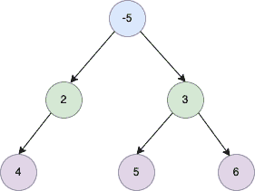

<!--yml

分类：未分类

日期：2024-10-13 06:51:28

-->

# Go (Golang) 中的二叉树最大路径和程序

> 来源：[`golangbyexample.com/binary-tree-maximum-path-sum-golang/`](https://golangbyexample.com/binary-tree-maximum-path-sum-golang/)

目录

+   概述

+   程序

# **概述**

给定一个二叉树。目标是找到该二叉树中的最大路径和。二叉树中的一条路径是相互连接的节点序列。每个节点在最大路径和中仅出现一次。

**示例 1**


```go
Output: 16
Maximum Sum Path is: 4->2->1->3->6
```

**示例 2**



```go
Output: 14
Maximum Sum Path is: 5->3->6
```

这个思路是跟踪每个节点下面的四个值

+   a = root.Val

+   b = root.Val + leftSubTreeMaxSum

+   c = root.Val + rightSubTreeMaxSum

+   d = root.Val + leftSubTreeMaxSum + rightSubTreeMaxSum

然后

+   给定节点的最大和是 **(a,b,c,d)** 的最大值

+   递归调用中的返回值将是 **(a,b,c)** 的最大值。为什么？这是因为只有 a、b 或 c 的路径代表可以在父节点中考虑的路径。d 不能被考虑，因为它成为一个无效路径。为了更好理解这一点，请考虑上面示例二中的二叉树。路径 **5->3->6** 不能包含父节点 **-5**，因为这会变成一个无效路径。

# **程序**

下面是相同的程序

```go
package main

import (
	"fmt"
	"math"
)

type TreeNode struct {
	Val   int
	Left  *TreeNode
	Right *TreeNode
}

func maxPathSum(root *TreeNode) int {
	res := math.MinInt64

	maxPathSumUtil(root, &res)
	return res
}

func maxPathSumUtil(root *TreeNode, res *int) int {
	if root == nil {
		return 0
	}

	l := maxPathSumUtil(root.Left, res)
	r := maxPathSumUtil(root.Right, res)

	a := root.Val
	b := root.Val + l
	c := root.Val + r
	d := root.Val + l + r

	maxReturnSum := maxOfThree(a, b, c)

	maxSumPath := maxOfTwo(maxReturnSum, d)
	if maxSumPath > *res {
		*res = maxSumPath
	}

	return maxReturnSum
}

func maxOfThree(a, b, c int) int {
	if a > b && a > c {
		return a
	}

	if b > c {
		return b
	}

	return c
}

func maxOfTwo(a, b int) int {
	if a > b {
		return a
	}
	return b
}

func main() {
	root := &TreeNode{Val: 1}
	root.Left = &TreeNode{Val: 2}
	root.Left.Left = &TreeNode{Val: 4}
	root.Right = &TreeNode{Val: 3}
	root.Right.Left = &TreeNode{Val: 5}
	root.Right.Right = &TreeNode{Val: 6}

	output := maxPathSum(root)
	fmt.Println(output)

	root = &TreeNode{Val: -10}
	root.Left = &TreeNode{Val: 2}
	root.Left.Left = &TreeNode{Val: 4}
	root.Right = &TreeNode{Val: 3}
	root.Right.Left = &TreeNode{Val: 5}
	root.Right.Right = &TreeNode{Val: 6}
	output = maxPathSum(root)
	fmt.Println(output)

}
```

**输出：**

```go
16
14
```

**注意：** 请查看我们的 Golang 高级教程。本系列教程详细而全面，我们努力用示例覆盖所有概念。本教程适合那些希望获得专业知识和对 golang 有深入理解的人 – [Golang 高级教程](https://golangbyexample.com/golang-comprehensive-tutorial/)

如果你对了解所有设计模式在 Golang 中如何实现感兴趣。如果是，那么这篇文章适合你 – [所有设计模式 Golang](https://golangbyexample.com/all-design-patterns-golang/)

此外，请查看我们的系统设计教程系列 – [系统设计教程系列](https://techbyexample.com/system-design-questions/)


