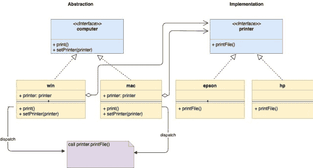
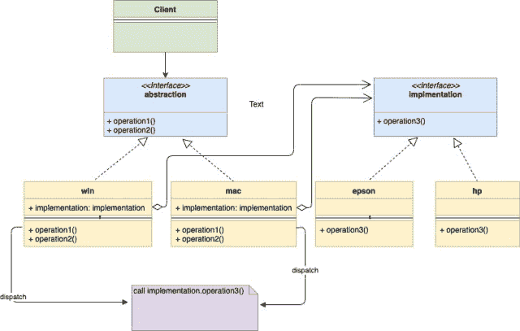

<!--yml

类别：未分类

日期：2024-10-13 06:03:16

-->

# Go（Golang）中的桥接设计模式

> 来源：[`golangbyexample.com/bridge-design-pattern-in-go/`](https://golangbyexample.com/bridge-design-pattern-in-go/)

注意：有兴趣了解其他设计模式如何在 GO 中实现吗？请查看这个完整参考 – **[Go 中的所有设计模式](https://golangbyexample.com/all-design-patterns-golang/)**

目录

**介绍：**

+   **UML 图：**

+   **映射**

+   **实际例子**

+   **完整工作代码：**## **介绍：**

桥接设计模式是一种结构性设计模式，允许将抽象与其实现分离。听起来很困惑？别担心，随着我们深入，它会更清晰。

这个模式建议将一个大类分成两个独立的层次结构。

+   抽象 – 它是一个接口，**抽象**的子类被称为**精炼抽象**。抽象包含对实现的引用。

+   实现 – 它也是一个接口，**实现**的子类被称为**具体实现**。

抽象层次结构被客户端引用，而不必担心实现。我们来举个例子。假设你有两种类型的计算机**mac**和**windows**。再假设有两种类型的打印机**epson**和**hp**。计算机和打印机需要以任意组合相互配合。客户端只会访问计算机，而不必担心打印是如何发生的。与其为 2*2 组合创建四个结构，不如创建两个层次结构。

+   抽象层次结构

+   实现层次结构

请查看下面的图。这两个层次通过一个桥接进行通信，其中**抽象**（这里是计算机）包含对**实现**（这里是打印机）的引用。抽象和实现可以独立发展，而不相互影响。注意**win**和**mac**如何嵌入对**printer**的引用。我们可以在运行时更改**抽象的实现**（即计算机的打印机），因为抽象通过接口引用实现。在调用**mac.print()或 windows.print()**时，它会将请求分派给**printer.printFile()**。这充当一个桥梁，并为两者提供了松耦合。

+   

## **UML 图：**

+   

## **映射**

下表表示从 UML 图中的参与者到下面**“实际例子”**中实际实现参与者的映射。

| 抽象 | computer.go |
| --- | --- |
| 精炼抽象 1 | win.go |
| 精炼抽象 2 | mac.go |
| 实现 | printer.go |
| 具体实现 1 | epson.go |
| 具体实现 2 | hp.go |
| 客户端 | main.go |

## **实际示例**

**computer.go**

```go
package main

type computer interface {
    print()
    setPrinter(printer)
}
```

**mac.go**

```go
package main

import "fmt"

type mac struct {
    printer printer
}

func (m *mac) print() {
    fmt.Println("Print request for mac")
    m.printer.printFile()
}

func (m *mac) setPrinter(p printer) {
    m.printer = p
}
```

**windows.go**

```go
package main

import "fmt"

type windows struct {
    printer printer
}

func (w *windows) print() {
    fmt.Println("Print request for windows")
    w.printer.printFile()
}

func (w *windows) setPrinter(p printer) {
    w.printer = p
}
```

**printer.go**

```go
package main

type printer interface {
    printFile()
}
```

**epson.go**

```go
package main

import "fmt"

type epson struct {
}

func (p *epson) printFile() {
    fmt.Println("Printing by a EPSON Printer")
}
```

**hp.go**

```go
package main

import "fmt"

type hp struct {
}

func (p *hp) printFile() {
    fmt.Println("Printing by a HP Printer")
}
```

**main.go**

```go
package main

import "fmt"

func main() {
    hpPrinter := &hp{}
    epsonPrinter := &epson{}
    macComputer := &mac{}
    macComputer.setPrinter(hpPrinter)
    macComputer.print()
    fmt.Println()
    macComputer.setPrinter(epsonPrinter)
    macComputer.print()
    fmt.Println()
    winComputer := &windows{}
    winComputer.setPrinter(hpPrinter)
    winComputer.print()
    fmt.Println()
    winComputer.setPrinter(epsonPrinter)
    winComputer.print()
    fmt.Println()
}
```

**输出：**

```go
Print request for mac
Printing by a HP Printer

Print request for mac
Printing by a EPSON Printer

Print request for windows
Printing by a HP Printer

Print request for windows
```

## **完整工作代码：**

```go
package main

import "fmt"

type computer interface {
    print()
    setPrinter(printer)
}

type mac struct {
    printer printer
}

func (m *mac) print() {
    fmt.Println("Print request for mac")
    m.printer.printFile()
}

func (m *mac) setPrinter(p printer) {
    m.printer = p
}

type windows struct {
    printer printer
}

func (w *windows) print() {
    fmt.Println("Print request for windows")
    w.printer.printFile()
}

func (w *windows) setPrinter(p printer) {
    w.printer = p
}

type printer interface {
    printFile()
}

type epson struct {
}

func (p *epson) printFile() {
    fmt.Println("Printing by a EPSON Printer")
}

type hp struct {
}

func (p *hp) printFile() {
    fmt.Println("Printing by a HP Printer")
}

func main() {
    hpPrinter := &hp{}
    epsonPrinter := &epson{}
    macComputer := &mac{}
    macComputer.setPrinter(hpPrinter)
    macComputer.print()
    fmt.Println()
    macComputer.setPrinter(epsonPrinter)
    macComputer.print()
    fmt.Println()
    winComputer := &windows{}
    winComputer.setPrinter(hpPrinter)
    winComputer.print()
    fmt.Println()
    winComputer.setPrinter(epsonPrinter)
    winComputer.print()
    fmt.Println()
}
```

**输出：**

```go
Print request for mac
Printing by a HP Printer

Print request for mac
Printing by a EPSON Printer

Print request for windows
Printing by a HP Printer

Print request for windows
```

+   [桥接设计模式](https://golangbyexample.com/tag/bridge-design-pattern/) *   [设计模式](https://golangbyexample.com/tag/design-pattern/) *   [go](https://golangbyexample.com/tag/go/) *   [golang](https://golangbyexample.com/tag/golang/) *
