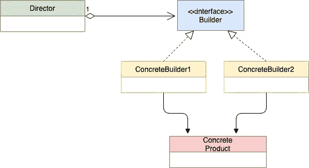

<!--yml

类别：未分类

日期：2024-10-13 06:01:10

-->

# GoLang 中的建造者模式

> 来源：[`golangbyexample.com/builder-pattern-golang/`](https://golangbyexample.com/builder-pattern-golang/)

目录

**   定义：

+   UML 图

+   映射（另请参见第 5 点 - 示例）

+   何时使用

+   示例：*  *# **定义：**

建造者模式是一种用于构建复杂对象的创建型设计模式。下面是 UML 图。

注意：想了解其他所有设计模式如何在 GO 中实现。请参见此完整参考 - [Go 中的所有设计模式（Golang）](https://golangbyexample.com/all-design-patterns-golang/)

# **UML 图**

+   

# **映射（另请参见第 5 点 - 示例）**

| 主管 | director.go |
| --- | --- |
| 建造者接口 | iBuilder.go |
| 具体建造者 1 | normalBuilder.go |
| 具体建造者 2 | iglooBuilder.go |
| 产品 | house.go |

# **何时使用**

+   当构造的对象较大且需要多个步骤时，使用建造者模式。这有助于减少构造函数的大小。房屋的构建变得简单，并且不需要大型构造函数。

+   当需要创建同一产品的不同版本时。例如，在下面的代码中，我们看到由**iglooBuilder**和**normalBuilder**构建的不同版本的房屋，即冰屋和普通房屋。

+   当半成品的最终对象不应存在时。再次引用下面的代码，创建的房屋要么完全创建，要么根本不创建。具体建造者结构体保持正在创建的房屋对象的临时状态。

# **示例：**

**iBuilder.go**

```go
package main

type iBuilder interface {
    setWindowType()
    setDoorType()
    setNumFloor()
    getHouse() house
}

func getBuilder(builderType string) iBuilder {
    if builderType == "normal" {
        return &normalBuilder{}
    }
    if builderType == "igloo" {
        return &iglooBuilder{}
    }
    return nil
}
```

**normalBuilder.go**

```go
package main

type normalBuilder struct {
    windowType string
    doorType   string
    floor      int
}

func newNormalBuilder() *normalBuilder {
    return &normalBuilder{}
}

func (b *normalBuilder) setWindowType() {
    b.windowType = "Wooden Window"
}

func (b *normalBuilder) setDoorType() {
    b.doorType = "Wooden Door"
}

func (b *normalBuilder) setNumFloor() {
    b.floor = 2
}

func (b *normalBuilder) getHouse() house {
    return house{
        doorType:   b.doorType,
        windowType: b.windowType,
        floor:      b.floor,
    }
}
```

**iglooBuilder.go**

```go
package main

type iglooBuilder struct {
    windowType string
    doorType   string
    floor      int
}

func newIglooBuilder() *iglooBuilder {
    return &iglooBuilder{}
}

func (b *iglooBuilder) setWindowType() {
    b.windowType = "Snow Window"
}

func (b *iglooBuilder) setDoorType() {
    b.doorType = "Snow Door"
}

func (b *iglooBuilder) setNumFloor() {
    b.floor = 1
}

func (b *iglooBuilder) getHouse() house {
    return house{
        doorType:   b.doorType,
        windowType: b.windowType,
        floor:      b.floor,
    }
}
```

**house.go**

```go
package main

type house struct {
    windowType string
    doorType   string
    floor      int
}
```

**director.go**

```go
package main

type director struct {
    builder iBuilder
}

func newDirector(b iBuilder) *director {
    return &director{
        builder: b,
    }
}

func (d *director) setBuilder(b iBuilder) {
    d.builder = b
}

func (d *director) buildHouse() house {
    d.builder.setDoorType()
    d.builder.setWindowType()
    d.builder.setNumFloor()
    return d.builder.getHouse()
}
```

**main.go**

```go
package main

import "fmt"

func main() {
    normalBuilder := getBuilder("normal")
    iglooBuilder := getBuilder("igloo")

    director := newDirector(normalBuilder)
    normalHouse := director.buildHouse()

    fmt.Printf("Normal House Door Type: %s\n", normalHouse.doorType)
    fmt.Printf("Normal House Window Type: %s\n", normalHouse.windowType)
    fmt.Printf("Normal House Num Floor: %d\n", normalHouse.floor)

    director.setBuilder(iglooBuilder)
    iglooHouse := director.buildHouse()

    fmt.Printf("\nIgloo House Door Type: %s\n", iglooHouse.doorType)
    fmt.Printf("Igloo House Window Type: %s\n", iglooHouse.windowType)
    fmt.Printf("Igloo House Num Floor: %d\n", iglooHouse.floor)
}
```

**输出：**

```go
Normal House Door Type: Wooden Door
Normal House Window Type: Wooden Window
Normal House Num Floor: 2

Igloo House Door Type: Snow Door
Igloo House Window Type: Snow Window
Igloo House Num Floor: 1
```

+   [builder](https://golangbyexample.com/tag/builder/)*   [creational](https://golangbyexample.com/tag/creational/)*   [design](https://golangbyexample.com/tag/design/)*   [design pattern](https://golangbyexample.com/tag/design-pattern/)*   [designpatter](https://golangbyexample.com/tag/designpatter/)*   [golang](https://golangbyexample.com/tag/golang/)*   [pattern](https://golangbyexample.com/tag/pattern/)*
