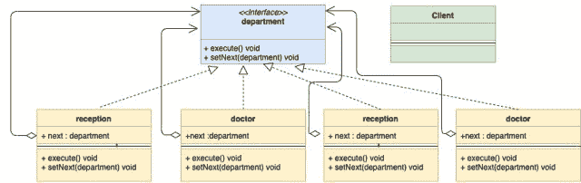

<!--yml

分类: 未分类

日期: 2024-10-13 06:02:54

-->

# 责任链设计模式在 Go (Golang) 中的应用

> 来源：[https://golangbyexample.com/chain-of-responsibility-design-pattern-in-golang/](https://golangbyexample.com/chain-of-responsibility-design-pattern-in-golang/)

注意：如果您想了解所有其他设计模式如何在 GO 中实现，请查看这个完整参考 – [Go (Golang) 中的所有设计模式](https://golangbyexample.com/all-design-patterns-golang/)

目录

**   [定义：](#Definition "定义： ")

+   [使用时机：](#When_to_Use "使用时机：")

+   [UML 图：](#UML_Diagram "UML 图：")

+   [映射 ](#Mapping "映射 ")

+   [实际例子：](#Practical_Example "实际例子：")

+   [完整工作代码：](#Full_Working_Code "完整工作代码：")*  *## **定义： **

责任链设计模式是一种行为设计模式。它允许您创建一条请求处理者链。对于每一个传入请求，它会在链中传递，每个处理者：

1.  处理请求或跳过处理。

1.  决定是否将请求传递给链中的下一个处理者。

责任链设计模式最好通过示例来理解。让我们以医院为例。医院有多个部门，例如：

1.  接待

1.  医生

1.  药品室

1.  收银员

每当有患者到达时，他首先去**接待处**，然后去**医生**，接着是**药品室**，然后是**收银员**，依此类推。患者以某种方式被送入一个部门链，在完成后，将患者发送到进一步的部门。这就是责任链模式发挥作用的地方。

## **使用时机：**

+   当有多个候选者处理相同请求时，该模式适用。

+   当您不希望客户端选择接收者时，因为多个对象可以处理请求。此外，您希望将客户端与接收者解耦。客户端只需知道链中的第一个元素。

在医院的例子中，患者首先去接待处，然后接待处根据患者的当前状态将其发送到链中的下一个处理者。

## **UML 图：**

+   

以下是与实际例子相对应的映射 UML 图。

+   

## **映射 **

| 处理者 | department.go |
| --- | --- |
| 具体处理者 1 | account.go |
| 具体处理者 2 | doctor.go |
| 具体处理者 3 | medical.go |
| 具体处理者 4 | cashier.go |
| 客户端 | main.go |

## **实际例子：**

**department.go**

```go
package main

type department interface {
    execute(*patient)
    setNext(department)
}
```

**reception.go**

```go
package main

import "fmt"

type reception struct {
    next department
}

func (r *reception) execute(p *patient) {
    if p.registrationDone {
        fmt.Println("Patient registration already done")
        r.next.execute(p)
        return
    }
    fmt.Println("Reception registering patient")
    p.registrationDone = true
    r.next.execute(p)
}

func (r *reception) setNext(next department) {
    r.next = next
}
```

**doctor.go**

```go
package main

import "fmt"

type doctor struct {
    next department
}

func (d *doctor) execute(p *patient) {
    if p.doctorCheckUpDone {
        fmt.Println("Doctor checkup already done")
        d.next.execute(p)
        return
    }
    fmt.Println("Doctor checking patient")
    p.doctorCheckUpDone = true
    d.next.execute(p)
}

func (d *doctor) setNext(next department) {
    d.next = next
}
```

**medical.go**

```go
package main

import "fmt"

type medical struct {
    next department
}

func (m *medical) execute(p *patient) {
    if p.medicineDone {
        fmt.Println("Medicine already given to patient")
        m.next.execute(p)
        return
    }
    fmt.Println("Medical giving medicine to patient")
    p.medicineDone = true
    m.next.execute(p)
}

func (m *medical) setNext(next department) {
    m.next = next
}
```

**cashier.go**

```go
package main

import "fmt"

type cashier struct {
	next department
}

func (c *cashier) execute(p *patient) {
	if p.paymentDone {
		fmt.Println("Payment Done")
	}
	fmt.Println("Cashier getting money from patient patient")
}

func (c *cashier) setNext(next department) {
	c.next = next
} 
```

**patient.go**

```go
package main

type patient struct {
    name              string
    registrationDone  bool
    doctorCheckUpDone bool
    medicineDone      bool
    paymentDone       bool
}
```

**main.go**

```go
package main

func main() {
    cashier := &cashier{}
    //Set next for medical department
    medical := &medical{}
    medical.setNext(cashier)
    //Set next for doctor department
    doctor := &doctor{}
    doctor.setNext(medical)
    //Set next for reception department
    reception := &reception{}
    reception.setNext(doctor)
    patient := &patient{name: "abc"}
    //Patient visiting
    reception.execute(patient)
}
```

**输出：**

```go
Reception registering patient
Doctor checking patient
Medical giving medicine to patient
Cashier getting money from patient patient
```

## **完整工作代码：**

```go
package main

import "fmt"

type department interface {
    execute(*patient)
    setNext(department)
}

type reception struct {
    next department
}

func (r *reception) execute(p *patient) {
    if p.registrationDone {
        fmt.Println("Patient registration already done")
        r.next.execute(p)
        return
    }
    fmt.Println("Reception registering patient")
    p.registrationDone = true
    r.next.execute(p)
}

func (r *reception) setNext(next department) {
    r.next = next
}

type doctor struct {
    next department
}

func (d *doctor) execute(p *patient) {
    if p.doctorCheckUpDone {
        fmt.Println("Doctor checkup already done")
        d.next.execute(p)
        return
    }
    fmt.Println("Doctor checking patient")
    p.doctorCheckUpDone = true
    d.next.execute(p)
}

func (d *doctor) setNext(next department) {
    d.next = next
}

type medical struct {
    next department
}

func (m *medical) execute(p *patient) {
    if p.medicineDone {
        fmt.Println("Medicine already given to patient")
        m.next.execute(p)
        return
    }
    fmt.Println("Medical giving medicine to patient")
    p.medicineDone = true
    m.next.execute(p)
}

func (m *medical) setNext(next department) {
    m.next = next
}

type cashier struct {
    next department
}

func (c *cashier) execute(p *patient) {
    if p.paymentDone {
        fmt.Println("Payment Done")
    }
    fmt.Println("Cashier getting money from patient patient")
}

func (c *cashier) setNext(next department) {
    c.next = next
}

type patient struct {
    name              string
    registrationDone  bool
    doctorCheckUpDone bool
    medicineDone      bool
    paymentDone       bool
}

func main() {
    cashier := &cashier{}

    //Set next for medical department
    medical := &medical{}
    medical.setNext(cashier)

    //Set next for doctor department
    doctor := &doctor{}
    doctor.setNext(medical)

    //Set next for reception department
    reception := &reception{}
    reception.setNext(doctor)

    patient := &patient{name: "abc"}
    //Patient visiting
    reception.execute(patient)
}
```

**输出：**

```go
Reception registering patient
Doctor checking patient
Medical giving medicine to patient
Cashier getting money from patient patient
```

+   [责任链设计模式在Golang中的应用](https://golangbyexample.com/tag/chain-of-responsibility-design-pattern-in-golang/) *   [责任链](https://golangbyexample.com/tag/chain-of-responsiblity/) *   [Go中的设计模式](https://golangbyexample.com/tag/design-pattern-in-go/) *   [Golang中的设计模式](https://golangbyexample.com/tag/design-pattern-in-golang/) *
