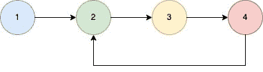

<!--yml

类别：未分类

日期：2024-10-13 06:46:34

-->

# 检查给定的链表在Go（Golang）中是否有循环。

> 来源：[https://golangbyexample.com/ilinked-list-cycle-golang/](https://golangbyexample.com/ilinked-list-cycle-golang/)

目录

**   [概述](#Overview "Overview")

+   [程序](#Program "Program")*  *## **概述**

目标是判断给定的链表是否有循环。如果链表中的最后一个节点指向前面的某个节点，则存在循环。

示例



上述链表有循环。以下是我们可以遵循的方法。

+   有两个指针，一个是慢指针，另一个是快指针。两者最初都指向头节点。

+   现在将慢指针移动1个节点，将快指针移动2个节点。

```go
slow := slow.Next
fast := fast.Next.Next
```

+   如果慢指针和快指针在任何时刻相同，则链表有循环。

## **程序**

这是相应的程序。

```go
package main

import "fmt"

func main() {
	first := initList()
	ele4 := first.AddFront(4)
	first.AddFront(3)
	ele2 := first.AddFront(2)
	first.AddFront(1)

	//Create cycle
	ele4.Next = ele2

	output := hasCycle(first.Head)
	fmt.Println(output)

}

type ListNode struct {
	Val  int
	Next *ListNode
}

type SingleList struct {
	Len  int
	Head *ListNode
}

func (s *SingleList) AddFront(num int) *ListNode {
	ele := &ListNode{
		Val: num,
	}
	if s.Head == nil {
		s.Head = ele
	} else {
		ele.Next = s.Head
		s.Head = ele
	}
	s.Len++
	return ele
}

func initList() *SingleList {
	return &SingleList{}
}
func hasCycle(head *ListNode) bool {

	if head == nil || head.Next == nil {
		return false
	}

	hasCycle := false
	slow := head
	fast := head

	for slow != nil && fast != nil && fast.Next != nil {
		slow = slow.Next
		fast = fast.Next.Next

		if slow == fast {
			hasCycle = true
			break
		}
	}

	return hasCycle

}
```

**输出**

```go
true
```

**注意：** 请查看我们的Golang高级教程。本系列教程详尽，我们尝试覆盖所有概念并提供示例。本教程适合希望获得专业知识和对Golang有深入理解的人 – [Golang高级教程](https://golangbyexample.com/golang-comprehensive-tutorial/)

如果你有兴趣了解所有设计模式如何在Golang中实现。如果是，那么这篇文章适合你 – [所有设计模式Golang](https://golangbyexample.com/all-design-patterns-golang/)

+   [go](https://golangbyexample.com/tag/go/)*   [golang](https://golangbyexample.com/tag/golang/)*
