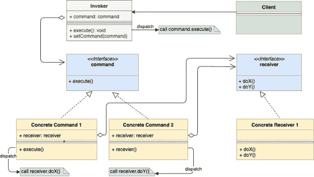

<!--yml

类别：未分类

日期：2024-10-13 06:03:04

-->

# Go（Golang）中的命令设计模式

> 来源：[https://golangbyexample.com/command-design-pattern-in-golang/](https://golangbyexample.com/command-design-pattern-in-golang/)

注意：如果你有兴趣了解如何在GO中实现所有其他设计模式，请查看这个完整的参考 – [https://golangbyexample.com/all-design-patterns-golang/](https://golangbyexample.com/all-design-patterns-golang/)

目录

**[介绍：](#Introduction "Introduction:")

+   [UML图：](#UML_Diagram "UML Diagram:")

+   [映射](#Mapping "Mapping")

+   [实际示例：](#Practical_Example "Practical Example:")

+   [完整工作代码：](#Full_Working_Code "Full Working Code:")**## **介绍：**

命令设计模式是一种行为设计模式。它建议将请求封装为一个独立的对象。创建的对象拥有关于请求的所有信息，因此可以独立执行。

命令设计模式中使用的基本组件有：

+   **接收者** – 它是包含业务逻辑的类。命令对象仅将请求延迟到接收者。

+   **命令** – 嵌入接收者并绑定接收者的特定操作。

+   **调用者** – 它将命令嵌入并通过调用命令的执行方法来激活该命令。

+   **客户端** – 它创建命令，并通过将接收者传递给命令的构造函数来关联适当的接收者。之后，它还将结果命令与调用者关联起来。

让我们理解一个情况，之后会清楚为什么命令模式是有用的。想象一下电视的情况。电视可以通过以下方式打开**ON**：

1.  遥控器的开启按钮

1.  电视上的开启按钮。

这两个触发点的功能相同，即打开电视。为了打开电视，我们可以将接收者实现为电视的开启命令对象。当对这个开启命令对象调用execute()方法时，它会调用TV.on()函数。所以在这种情况下：

+   **接收者**是**电视**

+   **命令**是嵌入**电视**的**开启命令对象**。

+   **调用者**是**遥控器的开启按钮**或**电视上的开启按钮**。两者都嵌入**开启命令对象**。

请注意，我们将打开**电视**的请求封装成一个**开启命令对象**，可以由多个调用者调用。这个开启命令对象嵌入了接收者（这里是电视），并可以独立执行。

另一个例子，想象一下**Adobe Photoshop**应用程序的情况。在Photoshop中，可以从3个地方触发保存操作。

1.  从菜单中。

1.  从上方工具栏上的按钮。

1.  使用快捷键Ctrl+S。

这三个触发点的功能相同，即保存当前应用中的图像。这个保存可以封装成一个带有当前打开图像的保存命令对象。

在上述示例中创建一个单独的命令对象有什么好处？

1.  它将 UI 逻辑与底层业务逻辑解耦。

1.  不需要为每个调用者创建不同的处理程序。

1.  命令对象包含执行所需的所有信息。因此，它也可以用于延迟执行。

现在让我们来看一下 UML 图。

## **UML 图：**

+   请注意，调用者嵌入了命令。请求发送给调用者，然后它将请求传递给封装的命令对象。

+   所有具体命令对象都嵌入接收者。

+   

## **映射**

下表展示了 UML 图中参与者与 **“实际示例”** 中实际实现参与者之间的映射。

| 调用者 | button.go |
| --- | --- |
| 命令接口 | command.go |
| 具体命令 1 | onCommand.go |
| 具体命令 2 | offCommand.go |
| 接收者接口 | device.go |
| 具体接收者 | tv.go |
| 客户端 | main.go |

## **实际示例：**

**button.go**

```
package main

type button struct {
    command command
}

func (b *button) press() {
    b.command.execute()
}
```

**command.go**

```
package main

type command interface {
    execute()
}
```

**onCommand.go**

```
package main

type onCommand struct {
    device device
}

func (c *onCommand) execute() {
    c.device.on()
}
```

**offCommand.go**

```
package main

type offCommand struct {
    device device
}

func (c *offCommand) execute() {
    c.device.off()
}
```

**device.go**

```
package main

type device interface {
    on()
    off()
}
```

**tv.go**

```
package main

import "fmt"

type tv struct {
    isRunning bool
}

func (t *tv) on() {
    t.isRunning = true
    fmt.Println("Turning tv on")
}

func (t *tv) off() {
    t.isRunning = false
    fmt.Println("Turning tv off")
}
```

**main.go**

```
package main

func main() {
    tv := &tv{}
    onCommand := &onCommand{
        device: tv,
    }
    offCommand := &offCommand{
        device: tv,
    }
    onButton := &button{
        command: onCommand,
    }
    onButton.press()
    offButton := &button{
        command: offCommand,
    }
    offButton.press()
}
```

**输出：**

```
Turning tv on
Turning tv off
```

## **完整工作代码：**

```
package main

import "fmt"

type button struct {
    command command
}

func (b *button) press() {
    b.command.execute()
}

type command interface {
    execute()
}

type offCommand struct {
    device device
}

func (c *offCommand) execute() {
    c.device.off()
}

type onCommand struct {
    device device
}

func (c *onCommand) execute() {
    c.device.on()
}

type device interface {
    on()
    off()
}

type tv struct {
    isRunning bool
}

func (t *tv) on() {
    t.isRunning = true
    fmt.Println("Turning tv on")
}

func (t *tv) off() {
    t.isRunning = false
    fmt.Println("Turning tv off")
}

func main() {
    tv := &tv{}
    onCommand := &onCommand{
        device: tv,
    }
    offCommand := &offCommand{
        device: tv,
    }
    onButton := &button{
        command: onCommand,
    }
    onButton.press()
    offButton := &button{
        command: offCommand,
    }
    offButton.press()
}
```

**输出：**

```
Turning tv on
Turning tv off
```

+   [Go 中的命令设计模式](https://golangbyexample.com/tag/command-design-pattern-in-go/)*   [设计模式](https://golangbyexample.com/tag/design-pattern/)*   [Go](https://golangbyexample.com/tag/go/)*   [Golang](https://golangbyexample.com/tag/golang/)*
