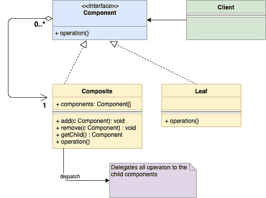
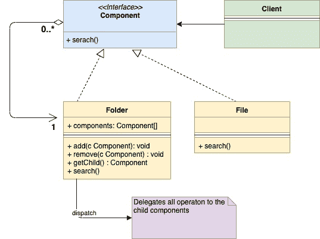

<!--yml

分类：未分类

日期：2024-10-13 06:02:22

-->

# Go 中的组合设计模式（GoLang）

> 来源：[`golangbyexample.com/composite-design-pattern-golang/`](https://golangbyexample.com/composite-design-pattern-golang/)

注意：对理解其他所有设计模式在 GO 中的实现感兴趣。请参阅这个完整参考 – [Go 语言中的所有设计模式](https://golangbyexample.com/all-design-patterns-golang/)

目录

**   定义：

+   何时使用

+   UML 图

+   映射

+   实际示例*  *## **定义：**

这是一种结构设计模式。当我们希望一组称为“组合”的对象以与单个对象相同的方式处理时，组合设计模式就会被使用。它属于结构设计模式，因为它允许您将对象组合成树结构。树结构中的每个个体对象可以以相同的方式处理，无论它们是复杂的还是原始的。

让我们通过操作系统的文件系统示例来理解它。在文件系统中，有两种类型的对象**文件**和**文件夹**。在某些情况下，文件和文件夹被视为相同的方式。随着我们深入，情况会更加清晰。

## **何时使用**

+   组合设计模式在组合对象和个体对象需要从客户端角度以相同方式处理的情况下使用是有意义的。

– 在我们上面的文件系统示例中，假设需要执行特定关键字的搜索操作。现在，这个搜索操作适用于**文件**和**文件夹**。对于**文件，**它只会查看文件的内容；而对于**文件夹，**它会遍历该文件夹层次结构中的所有文件以找到该关键字。

+   当组合对象和个体对象形成树状结构时使用此模式

– 在我们的示例中，**文件**和**文件夹**确实形成了一个树结构

## **UML 图**

+   **组件** – 它是定义**组合**和**叶子**对象的公共操作的接口

+   **组合 –** 它实现了**组件**接口，并嵌入了一组子**组件**。

+   **叶子 –** 它是树中的原始对象。它也实现了**组件**接口



下面是与上述示例对应的映射 UML 图



## **映射**

下表表示从 UML 图中的参与者到代码中实际实现的参与者的映射。

| 组件接口 | component.go |
| --- | --- |
| 组合 | folder.go |
| 叶子 | file.go |
| 客户端 | main.go |

## **实际示例**

在下面的示例中，**组件**是接口，而**文件**和**文件夹**实现了这个接口**。**

**component.go**

```go
package main

type component interface {
    search(string)
}
```

**folder.go**

```go
package main

import "fmt"

type folder struct {
    components []component
    name       string
}

func (f *folder) search(keyword string) {
    fmt.Printf("Serching recursively for keyword %s in folder %s\n", keyword, f.name)
    for _, composite := range f.components {
        composite.search(keyword)
    }
}

func (f *folder) add(c component) {
    f.components = append(f.components, c)
}
```

**file.go**

```go
package main

import "fmt"

type file struct {
    name string
}

func (f *file) search(keyword string) {
    fmt.Printf("Searching for keyword %s in file %s\n", keyword, f.name)
}

func (f *file) getName() string {
    return f.name
}
```

**main.go**

```go
package main

func main() {
    file1 := &file{name: "File1"}
    file2 := &file{name: "File2"}
    file3 := &file{name: "File3"}
    folder1 := &folder{
        name: "Folder1",
    }
    folder1.add(file1)
    folder2 := &folder{
        name: "Folder2",
    }
    folder2.add(file2)
    folder2.add(file3)
    folder2.add(folder1)
    folder2.search("rose")
}
```

**输出：**

```go
Serching recursively for keyword rose in folder Folder2
Searching for keyword rose in file File2
Searching for keyword rose in file File3
Serching recursively for keyword rose in folder Folder1
Searching for keyword rose in file File1
```

+   [组合设计模式](https://golangbyexample.com/tag/composite-design-pattern/)*   [Go 中的组合设计模式](https://golangbyexample.com/tag/composite-design-pattern-in-go/)*   [Golang 中的组合设计模式](https://golangbyexample.com/tag/composite-design-pattern-in-golang/)*   [设计模式](https://golangbyexample.com/tag/design-pattern/)*   [Go](https://golangbyexample.com/tag/go/)*   [Golang](https://golangbyexample.com/tag/golang/)*
