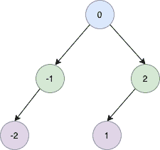

<!--yml

分类：未分类

日期：2024-10-13 06:45:25

-->

# 将已排序的链表转换为平衡的二叉搜索树

> 来源：[https://golangbyexample.com/sorted-linked-list-to-balanced-bst/](https://golangbyexample.com/sorted-linked-list-to-balanced-bst/)

目录

**   [概述](#Overview "Overview")

+   [程序](#Program "Program")*  *## **概述**

目标是将已排序的链表转换为平衡的二叉搜索树。平衡的二叉搜索树是指每个节点的两个子树深度差不超过1的二叉搜索树。

假设我们有以下已排序的链表

```go
-2->-1->0->1->2
```

然后它应该生成一个平衡的二叉搜索树。



## **程序**

以下是相应程序

```go
package main

import "fmt"

type ListNode struct {
	Val  int
	Next *ListNode
}

type SingleList struct {
	Len  int
	Head *ListNode
}

func (s *SingleList) AddFront(num int) {
	ele := &ListNode{
		Val: num,
	}
	if s.Head == nil {
		s.Head = ele
	} else {
		ele.Next = s.Head
		s.Head = ele
	}
	s.Len++
}

type TreeNode struct {
	Val   int
	Left  *TreeNode
	Right *TreeNode
}

func sortedListToBST(head *ListNode) *TreeNode {

	len := lenOfList(head)
	return sortedListToBSTUtil(&head, len)
}

func sortedListToBSTUtil(head **ListNode, n int) *TreeNode {

	if *head == nil {
		return nil
	}

	if n <= 0 {
		return nil
	}

	left := sortedListToBSTUtil(head, n/2)

	root := &TreeNode{Val: (*head).Val}
	*head = (*head).Next

	root.Left = left

	root.Right = sortedListToBSTUtil(head, n-n/2-1)
	return root

}

func lenOfList(head *ListNode) int {
	length := 0
	for head != nil {
		length++
		head = head.Next
	}
	return length
}

func main() {
	singleList := &SingleList{}
	fmt.Printf("AddFront: 2\n")
	singleList.AddFront(2)
	fmt.Printf("AddFront: 1\n")
	singleList.AddFront(1)
	fmt.Printf("AddFront: 0\n")
	singleList.AddFront(0)
	fmt.Printf("AddFront: -1\n")
	singleList.AddFront(-1)
	fmt.Printf("AddFront: -2\n")
	singleList.AddFront(-2)

	fmt.Println()
	root := sortedListToBST(singleList.Head)
	fmt.Printf("root: %d\n", root.Val)
	fmt.Printf("root.Left: %d\n", root.Left.Val)
	fmt.Printf("root.Left.Left: %d\n", root.Left.Left.Val)
	fmt.Printf("root.Right: %d\n", root.Right.Val)
	fmt.Printf("root.Right.Left: %d\n", root.Right.Left.Val)
}
```

**输出**

```go
AddFront: 2
AddFront: 1
AddFront: 0
AddFront: -1
AddFront: -2

root: 0
root.Left: -1
root.Left.Left: -2
root.Right: 2
root.Right.Left: 1
```

**注意：** 查看我们的Golang高级教程。本系列教程详尽，我们试图用示例覆盖所有概念。本教程适合那些希望获得专业知识并深入理解Golang的人 - [Golang高级教程](https://golangbyexample.com/golang-comprehensive-tutorial/)

如果你对如何在Golang中实现所有设计模式感兴趣，这篇文章就是为你准备的 - [所有设计模式Golang](https://golangbyexample.com/all-design-patterns-golang/)

+   [go](https://golangbyexample.com/tag/go/)*   [golang](https://golangbyexample.com/tag/golang/)*
