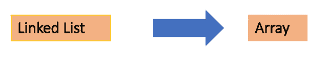

<!--yml

类别：未分类

日期：2024-10-13 06:36:11

-->

# 使用Go (Golang)将单链表转换为数组

> 来源：[https://golangbyexample.com/linked-list-array-go/](https://golangbyexample.com/linked-list-array-go/)



目录

**   [概述](#Overview "Overview")

+   [程序](#Program "Program")*  *## **概述**

使用Golang将单链表转换为数组

**输入单链表：**

```
 "A" -> "B" -> "C" -> "D"
```

**输出数组：**

```
["A", "B", "C", "D"]
```

## **程序**

```
package main

import "fmt"

type node struct {
	data string
	next *node
}

type singlyLinkedList struct {
	len  int
	head *node
}

func initList() *singlyLinkedList {
	return &singlyLinkedList{}
}

func (s *singlyLinkedList) AddFront(data string) {
	node := &node{
		data: data,
	}

	if s.head == nil {
		s.head = node
	} else {
		node.next = s.head
		s.head = node
	}
	s.len++
	return
}

func (s *singlyLinkedList) Size() int {
	return s.len
}

func (s *singlyLinkedList) Traverse() error {
	if s.head == nil {
		return fmt.Errorf("TraverseError: List is empty")
	}
	current := s.head
	for current != nil {
		fmt.Println(current.data)
		current = current.next
	}
	return nil
}

//Function to convert singly linked list to an array
func (s *singlyLinkedList) ToArray() []string {
	var myarr []string
	current := s.head
	for current.next != nil {
		fmt.Printf("\nAdding Element to array: %s", current.data)
		myarr = append(myarr, current.data)
		current = current.next
	}
	fmt.Printf("\nAdding Element to array: %s", current.data)
	myarr = append(myarr, current.data)
	return myarr
}

func main() {
	singleList := initList()
	fmt.Printf("AddFront: D\n")
	singleList.AddFront("D")
	fmt.Printf("AddFront: C\n")
	singleList.AddFront("C")
	fmt.Printf("AddFront: B\n")
	singleList.AddFront("B")
	fmt.Printf("AddFront: A\n")
	singleList.AddFront("A")

	fmt.Printf("Size: %d\n", singleList.Size())

	err := singleList.Traverse()
	if err != nil {
		fmt.Println(err.Error())
	}

	myarr := singleList.ToArray()
	fmt.Println()
	fmt.Println(myarr)
}
```

**输出：**

```
AddFront: D
AddFront: C
AddFront: B
AddFront: A
Size: 4
A
B
C
D

Adding Element to array: A
Adding Element to array: B
Adding Element to array: C
Adding Element to array: D
[A B C D]
```

+   [数组](https://golangbyexample.com/tag/array/)*   [go](https://golangbyexample.com/tag/go/)*   [golang](https://golangbyexample.com/tag/golang/)*   [单链表](https://golangbyexample.com/tag/single-linked-list/)*
