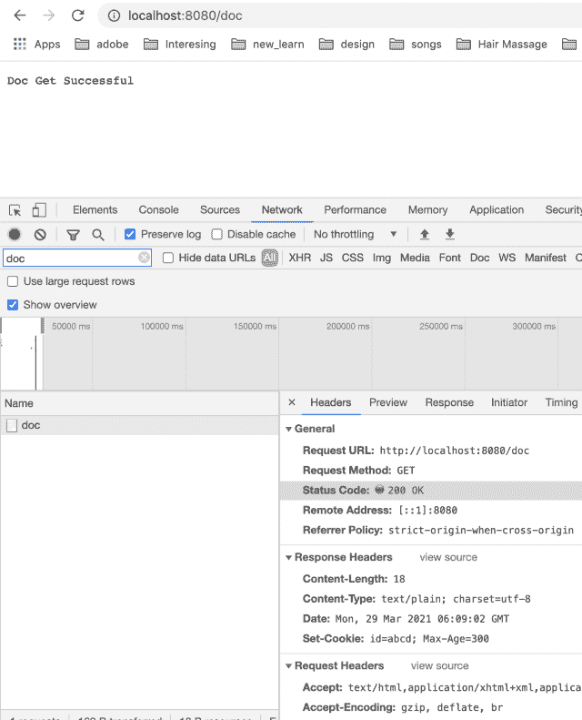

<!--yml

category: 未分类

日期：2024-10-13 06:35:34

-->

# Go (Golang) 中的 Cookies

> 来源：[https://golangbyexample.com/cookies-golang/](https://golangbyexample.com/cookies-golang/)

目录

**   [什么是 cookie](#What_is_cookie "什么是 cookie")

+   [在 golang 中设置 cookie](#Set_a_cookie_in_golang "在 golang 中设置 cookie")

    +   [在发起请求时设置 cookie。](#Set_a_cookie_while_making_a_request "在发起请求时设置 cookie。")

    +   [在响应传入请求时设置 cookie](#Set_a_cookie_while_responding_to_an_incoming_request "在响应传入请求时设置 cookie")

+   [在 golang 中读取 cookie](#Read_a_cookie_in_golang "在 golang 中读取 cookie")*  *## **什么是 cookie**

Cookies 是一种在客户端存储信息的方式。客户端可以是浏览器、移动应用程序或任何发起 HTTP 请求的事物。Cookies 基本上是存储在浏览器缓存内存中的一些文件。当您浏览任何支持 cookies 的网站时，会在 cookie 中记录与您活动相关的某种信息。这些信息可以是任何内容。简而言之，cookies 存储用户活动的历史信息。这些信息存储在客户端的计算机上。由于 cookie 存储在文件中，因此即使用户关闭浏览器窗口或重启计算机，这些信息也不会丢失。cookie 还可以存储登录信息。实际上，诸如令牌等登录信息通常仅存储在 cookies 中。cookies 是按域存储的。属于特定域的本地存储 cookies 在每个请求中发送到该域。它们在每个请求中作为头的一部分发送。因此，cookie 本质上只是一种头。

您可以在这里阅读关于 HTTP cookie 的一般信息 – [https://en.wikipedia.org/wiki/HTTP_cookie](https://en.wikipedia.org/wiki/HTTP_cookie)

Cookies 可以发送

+   作为 HTTP 客户端的 Cookie 头

+   作为 HTTP 服务器响应中的 Set-cookie 头

golang 中的 cookie 如下所示

[https://golang.org/src/net/http/cookie.go](https://golang.org/src/net/http/cookie.go)

```
type Cookie struct {
	Name  string
	Value string

	Path       string    // optional
	Domain     string    // optional
	Expires    time.Time // optional
	RawExpires string    // for reading cookies only

	// MaxAge=0 means no 'Max-Age' attribute specified.
	// MaxAge<0 means delete cookie now, equivalently 'Max-Age: 0'
	// MaxAge>0 means Max-Age attribute present and given in seconds
	MaxAge   int
	Secure   bool
	HttpOnly bool
	SameSite SameSite
	Raw      string
	Unparsed []string // Raw text of unparsed attribute-value pairs
}
```

详细信息请参见 [https://tools.ietf.org/html/rfc6265](https://tools.ietf.org/html/rfc6265) 中上述 cookie 的每个字段。

让我们详细了解与 cookies 相关的两个方面

+   在 golang 中设置 cookie

+   读取 cookie

## **在 golang 中设置 cookie**

我们已经提到 cookie 只是一个头。因此，要设置特定的 cookie，我们只需设置该头。

有两种情况

+   在发起请求时设置 cookie。

+   在响应传入请求时设置 cookie

让我们详细了解每一个

### **在发起请求时设置 cookie。**

这是 golang 作为 HTTP 客户端的情况。**AddCookie** 方法可用于添加 cookie。如果我们对两个不同的名称和值调用此方法，那么这两个名称和值都将添加到结果 cookie 中

```
package main
import (
    "fmt"
    "log"
    "net/http"
    "net/http/cookiejar"
)
var client http.Client
func init() {
    jar, err := cookiejar.New(nil)
    if err != nil {
        log.Fatalf("Got error while creating cookie jar %s", err.Error())
    }
    client = http.Client{
        Jar: jar,
    }
}
func main() {
    cookie := &http.Cookie{
        Name:   "token",
        Value:  "some_token",
        MaxAge: 300,
    }
    cookie2 := &http.Cookie{
        Name:   "clicked",
        Value:  "true",
        MaxAge: 300,
    }
    req, err := http.NewRequest("GET", "http://google.com", nil)
    if err != nil {
        log.Fatalf("Got error %s", err.Error())
    }
    req.AddCookie(cookie)
    req.AddCookie(cookie2)
    for _, c := range req.Cookies() {
        fmt.Println(c)
    }
    resp, err := client.Do(req)
    if err != nil {
        log.Fatalf("Error occured. Error is: %s", err.Error())
    }
    defer resp.Body.Close()
    fmt.Printf("StatusCode: %d\n", resp.StatusCode)
}
```

**输出**

```
token=some_token
clicked=true
StatusCode: 200
```

在上述程序中，HTTP 客户端添加了两个 cookies。这两个 cookies 将在调用 google.com 时发送。

golang 中的 HTTP 客户端还允许您指定一个 **CookieJar**，该 jar 管理在进行外部 HTTP 请求时存储和发送 cookies。顾名思义，可以把它看作一个装有 cookies 的 jar。

HTTP 客户端以两种方式使用此 jar。

+   在此 Jar 中添加 cookies。您可以显式地将 cookies 添加到此 jar。如果服务器在响应头中发送 Set-Cookies 头，cookies 也将被添加到 jar 中。所有在 Set-Cookie 头中指定的 cookies 将被添加。

+   在进行任何外部 HTTP 请求时咨询此 jar。它检查此 jar 以了解特定域需要发送哪些 cookies。

有关 golang 中 CookieJar 的更多信息，可以参考此链接 [https://golangbyexample.com/cookiejar-golang/](https://golangbyexample.com/cookiejar-golang/)。

### **在响应传入请求时设置 cookie**。

这是 golang 作为 HTTP 服务器的情况。**http.ResponseWriter** 结构提供了一个方便的方法来设置 cookie。下面是该方法的签名。

```
func SetCookie(w ResponseWriter, cookie *Cookie)
```

此方法用于在 ResponseWriter 上设置 cookies。它向响应头添加一个 Set-Cookie 头。此 Set-Cookie 头用于发送在客户端或浏览器端设置的 cookie。然后，当客户端向服务器发出后续调用时，该 cookie 将被发送回服务器。

以下是相应的程序。

```
package main
import (
    "net/http"
)
func main() {
    docHandler := http.HandlerFunc(docHandler)
    http.Handle("/doc", docHandler)
    http.ListenAndServe(":8080", nil)
}
func docHandler(w http.ResponseWriter, r *http.Request) {
    cookie := &http.Cookie{
        Name:   "id",
        Value:  "abcd",
        MaxAge: 300,
    }
    http.SetCookie(w, cookie)
    w.WriteHeader(200)
    w.Write([]byte("Doc Get Successful"))
    return
}
```

使用以下命令运行上述程序。

```
go run main.go
```

服务器将在 8080 端口启动。

现在从浏览器发起 API 调用 **localhost:8080/doc**。服务器在响应中发送了以下 **Set-Cookie**。

```
Set-Cookie: id=abcd; Max-Age=300
```

这在 API 调用的响应头中也可见。见下图。



有关 Set-Cookie 头的更多详细信息，请参阅此 [link](https://golangbyexample.com/set-cookie-response-header/)。该链接包含了解 Set-Cookie 头在 golang 中的所有细节。

## **在 golang 中读取 cookie**。

net/http Request 结构提供了一个方便的方法来读取特定名称的 cookie。下面是该方法的签名。[https://golang.org/pkg/net/http/#Request.Cookie](https://golang.org/pkg/net/http/#Request.Cookie)

```
func (r *Request) Cookie(name string) (*Cookie, error)
```

要打印所有 cookies，我们可以遍历 **http.Request** 结构的 **Cookies** 方法。我们可以为此使用 range 关键字。

```
for _, c := range r.Cookies() {
     fmt.Println(c)
}
```

以下是相应的程序，演示 **http.Request** 结构的 **Cookie** 和 **Cookies** 方法。

```
package main

import (
	"fmt"
	"log"
	"net/http"
)

func main() {
	docHandler := http.HandlerFunc(docHandler)
	http.Handle("/doc", docHandler)

	http.ListenAndServe(":8080", nil)
}

func docHandler(w http.ResponseWriter, r *http.Request) {
	fmt.Println("Cookies in API Call:")

	tokenCookie, err := r.Cookie("token")
	if err != nil {
		log.Fatalf("Error occured while reading cookie")
	}
	fmt.Println("\nPrinting cookie with name as token")
	fmt.Println(tokenCookie)

	fmt.Println("\nPrinting all cookies")
	for _, c := range r.Cookies() {
		fmt.Println(c)
	}
	fmt.Println()
	w.WriteHeader(200)
	w.Write([]byte("Doc Get Successful"))
	return
}
```

运行上述程序并进行以下 curl 调用。

```
curl -X GET localhost:8080/doc --cookie "id=abcd; token=some_token"
```

curl 调用传递了两个 cookie 名称-值对。

+   id=abcd。

+   token=some_token。

它将产生以下输出。

```
Cookies in API Call:

Printing cookie with name as token
token=some_token

Printing all cookies
id=abcd
token=some_token
```

这就是我们如何打印给定名称 **“token”** 的特定 cookie。

```
tokenCookie, err := r.Cookie("token")
```

它的输出如所示。

```
token=some_token
```

这就是我们如何打印所有 cookies。

```
for _, c := range r.Cookies() {
     fmt.Println(c)
}
```

它输出我们在 curl 调用中发送的 cookie 名称-值对。

```
id=abcd
token=some_token
```

这就是关于golang中的cookie的所有内容。希望你喜欢这个教程。请在评论中分享反馈。

另外，查看我们的Golang高级教程系列 – [Golang高级教程](https://golangbyexample.com/golang-comprehensive-tutorial/)

+   [go](https://golangbyexample.com/tag/go/)*   [golang](https://golangbyexample.com/tag/golang/)*
