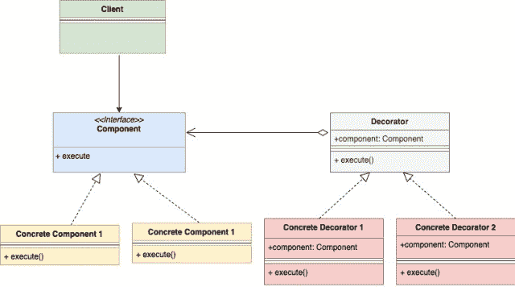

<!--yml

分类：未分类。

日期：2024-10-13 06:31:46。

-->

# Go（Golang）中的装饰器设计模式。

> 来源：[`golangbyexample.com/decorator-pattern-golang/`](https://golangbyexample.com/decorator-pattern-golang/)。

目录。

**概述**。

+   UML 图。

+   代码。

+   完整工作代码 

# **概述**。

装饰器设计模式是一种结构型设计模式。它允许你提供额外功能或装饰一个对象，而不改变该对象。

用一个例子会更好理解。假设你要开一家比萨连锁店，你开始时有两种比萨。

+   素食狂热比萨。

+   **活力豆腐比萨**。

上述每种比萨都有其价格。因此你将创建如下比萨接口。

```go
package main

type pizza interface {
	getPrice() int
}
```

你还需要创建两个比萨结构体，具有一个**getPrice**函数，返回价格。这两个比萨结构体实现比萨接口，因为它们定义了 getPrice()方法。

之后，你开始提供配料，并为每种配料额外收费。因此，原始基础比萨现在需要添加配料。想象一下你在菜单中增加了下面两种配料。

+   番茄配料。

+   奶酪配料。

此外，请记住，带配料的比萨仍然是一种比萨。顾客可以以不同的方式选择他们的比萨。例如。

+   带番茄配料的素食狂热。

+   带番茄和奶酪配料的素食主菜。

+   不带任何配料的活力印度奶酪比萨。

+   带奶酪配料的活力印度奶酪比萨。

+   …

那么现在考虑到你也有配料，你会如何设计呢？装饰器模式将会发挥作用。它可以在不实际修改任何现有结构体的情况下提供额外功能。装饰器模式建议在这种情况下为每种可用配料创建单独的结构体。每个配料结构体将实现上述比萨接口，并嵌入一个比萨实例。

现在我们有不同类型比萨的单独结构体和可用配料的单独结构体。每种比萨和配料都有自己的价格。每当你给比萨添加任何配料时，该配料的价格就会加到基础比萨的价格上，这样你就得到了最终价格。

因此，装饰器模式允许你在不改变原始基础比萨对象的情况下装饰该比萨对象。比萨对象对配料一无所知，只知道其价格，别无他物。

# **UML 图**。

以下是装饰器设计模式的 UML 图。



具体组件（这里的**素食狂热**和**活力豆腐**）和具体装饰器（这里的**配料**）实现组件接口（这里的**比萨**）。此外，具体装饰器还会嵌入一个组件实例。

如下面的例子所示。

+   该组件由比萨接口表示。

+   具体组件由**veggieMania**和**peppyPanner** **结构**表示。它们都实现了披萨接口。

+   具体装饰器由 cheeseTopping 和 tomatoTopping 结构表示。它们都实现了披萨接口。此外，它们还嵌入了一个**pizza**类型的实例。

# **代码**

**pizza.go**

```go
package main

type pizza interface {
	getPrice() int
}
```

**peppyPaneer.go**

```go
package main

type peppyPaneer struct {
}

func (p *peppyPaneer) getPrice() int {
	return 20
}
```

**veggeMania.go**

```go
package main

type veggeMania struct {
}

func (p *veggeMania) getPrice() int {
	return 15
}
```

**cheeseTopping.go**

```go
package main

type cheeseTopping struct {
	pizza pizza
}

func (c *cheeseTopping) getPrice() int {
	pizzaPrice := c.pizza.getPrice()
	return pizzaPrice + 10
}
```

**tomatoTopping.go**

```go
package main
type tomatoTopping struct {
    pizza pizza
}
func (c *tomatoTopping) getPrice() int {
    pizzaPrice := c.pizza.getPrice()
    return pizzaPrice + 7
}
```

**main.go**

```go
package main

import "fmt"

func main() {

	veggiePizza := &veggeMania{}

	//Add cheese topping
	veggiePizzaWithCheese := &cheeseTopping{
		pizza: veggiePizza,
	}

	//Add tomato topping
	veggiePizzaWithCheeseAndTomato := &tomatoTopping{
		pizza: veggiePizzaWithCheese,
	}

	fmt.Printf("Price of veggieMania pizza with tomato and cheese topping is %d\n", veggiePizzaWithCheeseAndTomato.getPrice())

	peppyPaneerPizza := &peppyPaneer{}

	//Add cheese topping
	peppyPaneerPizzaWithCheese := &cheeseTopping{
		pizza: peppyPaneerPizza,
	}

	fmt.Printf("Price of peppyPaneer with tomato and cheese topping is %d\n", peppyPaneerPizzaWithCheese.getPrice())
}
```

**输出**

```go
Price of veggieMania pizza with tomato and cheese topping is 32
Price of peppyPaneer with tomato and cheese topping is 30
```

# **完整工作代码**

```go
package main

import "fmt"

type pizza interface {
	getPrice() int
}

type peppyPaneer struct {
}

func (p *peppyPaneer) getPrice() int {
	return 20
}

type veggeMania struct {
}

func (p *veggeMania) getPrice() int {
	return 15
}

type tomatoTopping struct {
	pizza pizza
}

func (c *tomatoTopping) getPrice() int {
	pizzaPrice := c.pizza.getPrice()
	return pizzaPrice + 7
}

type cheeseTopping struct {
	pizza pizza
}

func (c *cheeseTopping) getPrice() int {
	pizzaPrice := c.pizza.getPrice()
	return pizzaPrice + 10
}

func main() {

	veggiePizza := &veggeMania{}

	//Add cheese topping
	veggiePizzaWithCheese := &cheeseTopping{
		pizza: veggiePizza,
	}

	//Add tomato topping
	veggiePizzaWithCheeseAndTomato := &tomatoTopping{
		pizza: veggiePizzaWithCheese,
	}

	fmt.Printf("Price of veggieMania pizza with tomato and cheese topping is %d\n", veggiePizzaWithCheeseAndTomato.getPrice())

	peppyPaneerPizza := &peppyPaneer{}

	//Add cheese topping
	peppyPaneerPizzaWithCheese := &cheeseTopping{
		pizza: peppyPaneerPizza,
	}

	fmt.Printf("Price of peppyPaneer with tomato and cheese topping is %d\n", peppyPaneerPizzaWithCheese.getPrice())
}
```

**输出**

```go
Price of veggieMania pizza with tomato and cheese topping is 32
Price of peppyPaneer with tomato and cheese topping is 30
```

+   [装饰器](https://golangbyexample.com/tag/decorator/)*   [go](https://golangbyexample.com/tag/go/)*   [golang](https://golangbyexample.com/tag/golang/)*
