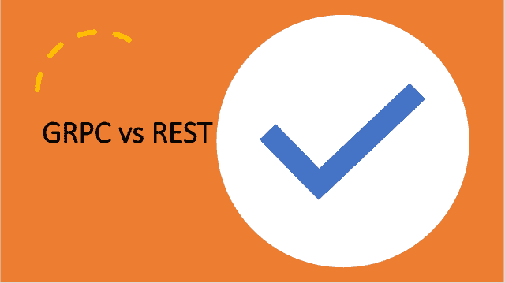

<!--yml

分类：未分类

日期：2024-10-13 06:34:28

-->

# GRPC与REST的区别

> 来源：[https://golangbyexample.com/grpc-vs-rest/](https://golangbyexample.com/grpc-vs-rest/)

目录

**   [概述](#Overview "Overview")

+   [链接](#Links "Links")

    +   [GRPC](#GRPC "GRPC")

    +   [REST](#REST "REST")

+   [协议](#Protocol "Protocol")

+   [性质](#Nature "Nature")

+   [数据传输模式](#Mode_of_Data_Transfer "Mode of Data Transfer")

+   [模型](#Model "Model")

+   [性能](#Performance "Performance")

+   [代码生成](#Code_Generation "Code Generation")

+   [类型安全](#Type_Safety "Type Safety")

+   [设置](#SetUP "SetUP")

+   [何时使用](#When_To_Use "When To Use")

+   [结论](#Conclusion "Conclusion")*  *## **概述**

REST是一种建立在HTTP/1上的架构风格。GRPC不是一种风格，而是一个建立在HTTP/2之上的RPC框架，并在后台使用协议缓冲区。因此，GRPC实际上是一个实现，或者可以说是一个库，而REST只是一组规则和原则。

虽然我们在比较一个实现的GRPC框架与REST（架构风格和原则），这听起来可能有些奇怪，但理解高层架构的区别仍然很重要，这一点如果你遵循某种方法而非另一种方法会更加明显。

这里是两者之间的主要区别。此外，值得一提的是，本文假设你已经对GRPC、HTTP2和REST有一定了解。

## 链接

### **GRPC**

这里是关于GRPC的进一步阅读链接 [https://grpc.io/](https://grpc.io/)

### **REST**

这里是关于REST的进一步阅读链接 – [https://en.wikipedia.org/wiki/Representational_state_transfer](https://en.wikipedia.org/wiki/Representational_state_transfer)

## **协议**

+   GRPC是一个RPC框架，构建在HTTP/2之上。

+   REST架构风格是在HTTP/1之上指定的。HTTP/2保留了HTTP/1.1的所有语义。因此，即使使用HTTP/2，REST API仍应继续正常工作。

## **性质**

+   GRPC的思维方式是面向API或面向动作的。

+   REST是面向资源的。

## **数据传输模式**

+   GRPC仅支持使用协议缓冲区在服务器和客户端之间传输数据。

+   REST支持JSON、XML和其他数据格式。REST也可以很容易地与协议缓冲区一起使用。

## **模型**

+   GRPC提供四种不同的客户端和服务器之间的通信方式。这四种方式是单一请求、服务器流、客户端流和双向流。因此，在GRPC中，客户端和服务器可以相互交谈。

    +   单一请求 – 这是最简单的一种。客户端发送请求，服务器发送响应。

    +   客户端流 – 客户端可以发送多个消息的流，而服务器只需对所有客户端请求返回单个响应。

    +   服务器流 – 客户端将只发送一条消息，而服务器可以向其发送消息流。

    +   双向流——客户端和服务器都可以流式传输多个消息。流式传输将并行进行且无顺序。此外，它是非阻塞的。客户端和服务器在发送下一个消息之前无需等待响应。

+   REST工作基于请求-响应模型。基本上，你发送请求，然后收到响应。因此，REST仅提供单向通信。在REST中，只有客户端与服务器进行交谈。

## **性能**

+   由于GRPC固有地使用HTTP/2，因此所有应用于HTTP/2的性能优化自动适用于GRPC。HTTP/2引入了多项相较于HTTP/1的性能优化，例如

    +   双向流

    +   多路复用

    +   头部压缩

    +   等等

此外，GRPC在内部使用协议缓冲区，由于协议缓冲区是二进制数据且体积较小，它们在网络上快速传输。GRPC可以有效利用每个TCP连接。基于这两个原因，GRPC非常快。

+   REST在HTTP/1上的速度会比GRPC慢。它使用JSON、XML来表示相同的数据，所需大小超过协议缓冲区。

## **代码生成**

+   由于GRPC建立在协议缓冲区之上，因此提供了自动代码生成。事实上，使用协议缓冲区时，代码生成是使用GRPC的必备条件。

+   REST也通过Swagger、OPEN API提供代码生成，但这只是提供的额外功能，并不如协议缓冲区的代码生成有效。

## **类型安全**

+   由于在GRPC的情况下使用协议缓冲区进行代码生成，因此在某种程度上为GRPC提供了类型安全。GRPC不允许你为期望字符串的字段发送int。API契约由proto文件定义，并且是严格的。

+   REST没有任何此类限制。API契约大多数情况下只是使用OPEN API或Swagger的文档，因此比较松散。

## **设置**

+   GRPC需要你在本地设置一个客户端，以能够进行GRPC调用。

+   REST调用不需要客户端设置。你可以通过浏览器、Postman、curl等进行调用。

## **何时使用**

+   GRPC主要适用于需要低延迟和高吞吐量的内部微服务。目前不适合将你的服务暴露为GRPC，因为没有可供外部服务集成的API。未来当GRPC完全发展时，这可能会变得可行。

+   REST更适合将你的API暴露给外部服务。

## **结论**

这些是GRPC和REST之间的一些主要区别。希望你喜欢这篇文章。请在评论中分享反馈。

注意：如果你有兴趣学习Golang，我们有一个全面的Golang教程系列。请查看——[Golang全面教程系列](https://golangbyexample.com/golang-comprehensive-tutorial/)。

+   [去](https://golangbyexample.com/tag/go/)*   [golang](https://golangbyexample.com/tag/golang/)*   [grpc](https://golangbyexample.com/tag/grpc/)*   [rest](https://golangbyexample.com/tag/rest/)*
