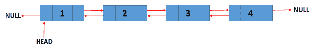

<!--yml

类别：未分类

日期：2024-10-13 06:37:56

-->

# Go (Golang) 中的双向链表

> 来源：[`golangbyexample.com/doubly-linked-list-golang/`](https://golangbyexample.com/doubly-linked-list-golang/)

目录

**   概述

+   程序*  *## **概述**

一个双向链表的节点包含三个字段。

+   数据字段

+   一个下一个指针指向列表中的下一个节点。

+   一个前一个指针指向列表中的上一个节点。

这里**“数据”**和**“下一个”**字段与单向链表相同。**“前一个”**指针字段是新的，这使得链表成为双向链表。

参考这篇文章了解单向链表。

[`golangbyexample.com/singly-linked-list-in-golang/`](https://golangbyexample.com/singly-linked-list-in-golang/)

以下是一个双向链表的示例。头节点的前指针指向空。类似地，最后一个节点的**下一个**指针指向空。



## **程序**

在 Go 语言中实现双向链表，创建一个包含**数据**、**前**指针和**下一个**指针的节点结构，添加节点的方法（从前端和后端），以及向前和向后遍历的方法。

```go
package main

import "fmt"

type node struct {
	data string
	prev *node
	next *node
}

type doublyLinkedList struct {
	len  int
	tail *node
	head *node
}

func initDoublyList() *doublyLinkedList {
	return &doublyLinkedList{}
}

func (d *doublyLinkedList) AddFrontNodeDLL(data string) {
	newNode := &node{
		data: data,
	}
	if d.head == nil {
		d.head = newNode
		d.tail = newNode
	} else {
		newNode.next = d.head
		d.head.prev = newNode
		d.head = newNode
	}
	d.len++
	return
}

func (d *doublyLinkedList) AddEndNodeDLL(data string) {
	newNode := &node{
		data: data,
	}
	if d.head == nil {
		d.head = newNode
		d.tail = newNode
	} else {
		currentNode := d.head
		for currentNode.next != nil {
			currentNode = currentNode.next
		}
		newNode.prev = currentNode
		currentNode.next = newNode
		d.tail = newNode
	}
	d.len++
	return
}
func (d *doublyLinkedList) TraverseForward() error {
	if d.head == nil {
		return fmt.Errorf("TraverseError: List is empty")
	}
	temp := d.head
	for temp != nil {
		fmt.Printf("value = %v, prev = %v, next = %v\n", temp.data, temp.prev, temp.next)
		temp = temp.next
	}
	fmt.Println()
	return nil
}

func (d *doublyLinkedList) TraverseReverse() error {
	if d.head == nil {
		return fmt.Errorf("TraverseError: List is empty")
	}
	temp := d.tail
	for temp != nil {
		fmt.Printf("value = %v, prev = %v, next = %v\n", temp.data, temp.prev, temp.next)
		temp = temp.prev
	}
	fmt.Println()
	return nil
}

func (d *doublyLinkedList) Size() int {
	return d.len
}
func main() {
	doublyList := initDoublyList()
	fmt.Printf("Add Front Node: C\n")
	doublyList.AddFrontNodeDLL("C")
	fmt.Printf("Add Front Node: B\n")
	doublyList.AddFrontNodeDLL("B")
	fmt.Printf("Add Front Node: A\n")
	doublyList.AddFrontNodeDLL("A")
	fmt.Printf("Add End Node: D\n")
	doublyList.AddEndNodeDLL("D")
	fmt.Printf("Add End Node: E\n")
	doublyList.AddEndNodeDLL("E")

	fmt.Printf("Size of doubly linked ist: %d\n", doublyList.Size())

	err := doublyList.TraverseForward()
	if err != nil {
		fmt.Println(err.Error())
	}

	err = doublyList.TraverseReverse()
	if err != nil {
		fmt.Println(err.Error())
	}
}
```

**输出：**

```go
Add Front Node: C
Add Front Node: B
Add Front Node: A
Add End Node: D
Add End Node: E
Size of doubly linked ist: 5
value = A, prev = <nil>, next = &{B 0xc000070060 0xc000070020}
value = B, prev = &{A <nil> 0xc000070040}, next = &{C 0xc000070040 0xc000070080}
value = C, prev = &{B 0xc000070060 0xc000070020}, next = &{D 0xc000070020 0xc0000700a0}
value = D, prev = &{C 0xc000070040 0xc000070080}, next = &{E 0xc000070080 <nil>}
value = E, prev = &{D 0xc000070020 0xc0000700a0}, next = <nil>

value = E, prev = &{D 0xc000070020 0xc0000700a0}, next = <nil>
value = D, prev = &{C 0xc000070040 0xc000070080}, next = &{E 0xc000070080 <nil>}
value = C, prev = &{B 0xc000070060 0xc000070020}, next = &{D 0xc000070020 0xc0000700a0}
value = B, prev = &{A <nil> 0xc000070040}, next = &{C 0xc000070040 0xc000070080}
value = A, prev = <nil>, next = &{B 0xc000070060 0xc000070020}</nil></nil></nil></nil></nil></nil></nil></nil>
```*
