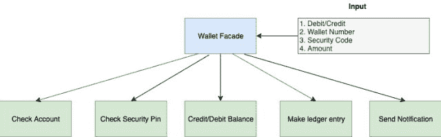
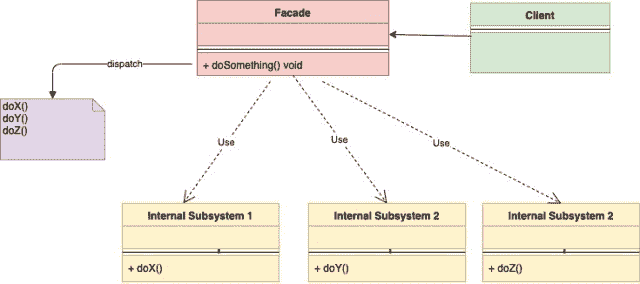
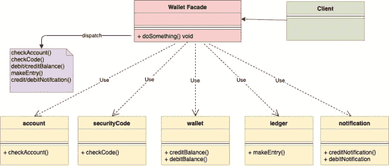

<!--yml

类别：未分类

日期：2024-10-13 06:02:59

-->

# Go (Golang)中的外观设计模式

> 来源：[`golangbyexample.com/facade-design-pattern-in-golang/`](https://golangbyexample.com/facade-design-pattern-in-golang/)

注意：如果想了解如何在 GO 中实现其他设计模式，请参阅此完整参考 – [Go (Golang) 中的所有设计模式](https://golangbyexample.com/all-design-patterns-golang/)

目录

**   定义：

+   问题陈述：

+   使用时机：

+   UML 图：

+   映射

+   实践示例：

+   完整工作代码：

## **定义：**

外观模式被归类为结构设计模式。该设计模式旨在隐藏底层系统的复杂性，并为客户端提供一个简单的接口。它为系统中许多接口提供统一的接口，从客户端的角度来看，使用起来更为简单。基本上，它为复杂系统提供了更高级别的抽象。

**外观**一词本身的意思是

**建筑物的主要正面，面向街道或开放空间**

仅显示建筑物的正面，所有潜在的复杂性隐藏在后面。

让我们通过一个简单的示例理解外观设计模式。在这个数字钱包的时代，当有人实际进行钱包借记/贷记时，后台发生了很多事情，客户端可能并不知情。以下列表展示了一些在贷记/借记过程中发生的活动。

+   检查账户

+   检查安全密码

+   贷方/借方余额

+   记录分类账条目

+   发送通知

如可以注意到，单个借方/贷方操作涉及许多事情。这就是外观模式发挥作用的地方。作为客户端，只需输入钱包号码、安全密码、金额并指定操作类型。其余的事情都在后台处理。在这里，我们创建一个**WalletFacade**，它为客户端提供了一个简单的接口，并负责处理所有潜在的操作。

+   

## **问题陈述：**

+   为了使用复杂系统，客户端必须了解潜在的细节。需要向客户端提供一个简单的接口，使其能够在不知道任何内部复杂细节的情况下使用复杂系统。

## **使用时机：**

+   当你想以简化的方式展示一个复杂系统时。

– 就像在上面的贷记/借记钱包示例中，他们只需要知道一个接口，其他事情应由该接口处理。

## **UML 图：**

+   

以下是与下面给出的实践示例相对应的映射 UML 图

+   

## **映射**

下表表示 UML 图中演员与代码中实际实现演员之间的映射。

| 钱包外观 | walletFacade.go |
| --- | --- |
| 账户 | account.go |
| securityCode | securityCode.go |
| 钱包 | wallet.go |
| 账本 | ledger.go |
| 通知 | notification.go |
| 客户 | main.go |

## **实际示例：**

**walletFacade.go**

```go
package main

import "fmt"

type walletFacade struct {
    account      *account
    wallet       *wallet
    securityCode *securityCode
    notification *notification
    ledger       *ledger
}

func newWalletFacade(accountID string, code int) *walletFacade {
    fmt.Println("Starting create account")
    walletFacacde := &walletFacade{
        account:      newAccount(accountID),
        securityCode: newSecurityCode(code),
        wallet:       newWallet(),
        notification: &notification{},
        ledger:       &ledger{},
    }
    fmt.Println("Account created")
    return walletFacacde
}

func (w *walletFacade) addMoneyToWallet(accountID string, securityCode int, amount int) error {
    fmt.Println("Starting add money to wallet")
    err := w.account.checkAccount(accountID)
    if err != nil {
        return err
    }
    err = w.securityCode.checkCode(securityCode)
    if err != nil {
        return err
    }
    w.wallet.creditBalance(amount)
    w.notification.sendWalletCreditNotification()
    w.ledger.makeEntry(accountID, "credit", amount)
    return nil
}

func (w *walletFacade) deductMoneyFromWallet(accountID string, securityCode int, amount int) error {
    fmt.Println("Starting debit money from wallet")
    err := w.account.checkAccount(accountID)
    if err != nil {
        return err
    }
    err = w.securityCode.checkCode(securityCode)
    if err != nil {
        return err
    }
    err = w.wallet.debitBalance(amount)
    if err != nil {
        return err
    }
    w.notification.sendWalletDebitNotification()
    w.ledger.makeEntry(accountID, "credit", amount)
    return nil
}
```

**account.go**

```go
package main

import "fmt"

type account struct {
    name string
}

func newAccount(accountName string) *account {
    return &account{
        name: accountName,
    }
}

func (a *account) checkAccount(accountName string) error {
    if a.name != accountName {
        return fmt.Errorf("Account Name is incorrect")
    }
    fmt.Println("Account Verified")
    return nil
}
```

**securityCode.go**

```go
package main

import "fmt"

type securityCode struct {
    code int
}

func newSecurityCode(code int) *securityCode {
    return &securityCode{
        code: code,
    }
}

func (s *securityCode) checkCode(incomingCode int) error {
    if s.code != incomingCode {
        return fmt.Errorf("Security Code is incorrect")
    }
    fmt.Println("SecurityCode Verified")
    return nil
}
```

**wallet.go**

```go
package main

import "fmt"

type wallet struct {
    balance int
}

func newWallet() *wallet {
    return &wallet{
        balance: 0,
    }
}

func (w *wallet) creditBalance(amount int) {
    w.balance += amount
    fmt.Println("Wallet balance added successfully")
    return
}

func (w *wallet) debitBalance(amount int) error {
    if w.balance < amount {
        return fmt.Errorf("Balance is not sufficient")
    }
    fmt.Println("Wallet balance is Sufficient")
    w.balance = w.balance - amount
    return nil
}
```

**ledger.go**

```go
package main

import "fmt"

type ledger struct {
}

func (s *ledger) makeEntry(accountID, txnType string, amount int) {
    fmt.Printf("Make ledger entry for accountId %s with txnType %s for amount %d", accountID, txnType, amount)
    return
}
```

**notification.go**

```go
package main

import "fmt"

type notification struct {
}

func (n *notification) sendWalletCreditNotification() {
    fmt.Println("Sending wallet credit notification")
}

func (n *notification) sendWalletDebitNotification() {
    fmt.Println("Sending wallet debit notification")
}
```

**main.go**

```go
package main

import (
    "fmt"
    "log"
)

func main() {
    fmt.Println()
    walletFacade := newWalletFacade("abc", 1234)
    fmt.Println()
    err := walletFacade.addMoneyToWallet("abc", 1234, 10)
    if err != nil {
        log.Fatalf("Error: %s\n", err.Error())
    }
    fmt.Println()
    err = walletFacade.deductMoneyFromWallet("ab", 1234, 5)
    if err != nil {
        log.Fatalf("Error: %s\n", err.Error())
    }
}
```

**输出：**

```go
Starting create account
Account created

Starting add money to wallet
Account Verified
SecurityCode Verified
Wallet balance added successfully
Sending wallet credit notification
Make ledger entry for accountId abc with txnType credit for amount 10

Starting debit money from wallet
Account Verified
SecurityCode Verified
Wallet balance is Sufficient
Sending wallet debit notification
Make ledger entry for accountId abc with txnType debit for amount 5 
```

## **完整工作代码：**

```go
package main

import (
    "fmt"
    "log"
)

type walletFacade struct {
    account      *account
    wallet       *wallet
    securityCode *securityCode
    notification *notification
    ledger       *ledger
}

func newWalletFacade(accountID string, code int) *walletFacade {
    fmt.Println("Starting create account")
    walletFacacde := &walletFacade{
        account:      newAccount(accountID),
        securityCode: newSecurityCode(code),
        wallet:       newWallet(),
        notification: &notification{},
        ledger:       &ledger{},
    }
    fmt.Println("Account created")
    return walletFacacde
}

func (w *walletFacade) addMoneyToWallet(accountID string, securityCode int, amount int) error {
    fmt.Println("Starting add money to wallet")
    err := w.account.checkAccount(accountID)
    if err != nil {
        return err
    }
    err = w.securityCode.checkCode(securityCode)
    if err != nil {
        return err
    }
    w.wallet.creditBalance(amount)
    w.notification.sendWalletCreditNotification()
    w.ledger.makeEntry(accountID, "credit", amount)
    return nil
}

func (w *walletFacade) deductMoneyFromWallet(accountID string, securityCode int, amount int) error {
    fmt.Println("Starting debit money from wallet")
    err := w.account.checkAccount(accountID)
    if err != nil {
        return err
    }
    err = w.securityCode.checkCode(securityCode)
    if err != nil {
        return err
    }
    err = w.wallet.debitBalance(amount)
    if err != nil {
        return err
    }
    w.notification.sendWalletDebitNotification()
    w.ledger.makeEntry(accountID, "credit", amount)
    return nil
}

type account struct {
    name string
}

func newAccount(accountName string) *account {
    return &account{
        name: accountName,
    }
}

func (a *account) checkAccount(accountName string) error {
    if a.name != accountName {
        return fmt.Errorf("Account Name is incorrect")
    }
    fmt.Println("Account Verified")
    return nil
}

type securityCode struct {
    code int
}

func newSecurityCode(code int) *securityCode {
    return &securityCode{
        code: code,
    }
}

func (s *securityCode) checkCode(incomingCode int) error {
    if s.code != incomingCode {
        return fmt.Errorf("Security Code is incorrect")
    }
    fmt.Println("SecurityCode Verified")
    return nil
}

type wallet struct {
    balance int
}

func newWallet() *wallet {
    return &wallet{
        balance: 0,
    }
}

func (w *wallet) creditBalance(amount int) {
    w.balance += amount
    fmt.Println("Wallet balance added successfully")
    return
}

func (w *wallet) debitBalance(amount int) error {
    if w.balance < amount {
        return fmt.Errorf("Balance is not sufficient")
    }
    fmt.Println("Wallet balance is Sufficient")
    w.balance = w.balance - amount
    return nil
}

type ledger struct {
}

func (s *ledger) makeEntry(accountID, txnType string, amount int) {
    fmt.Printf("Make ledger entry for accountId %s with txnType %s for amount %d\n", accountID, txnType, amount)
    return
}

type notification struct {
}

func (n *notification) sendWalletCreditNotification() {
    fmt.Println("Sending wallet credit notification")
}

func (n *notification) sendWalletDebitNotification() {
    fmt.Println("Sending wallet debit notification")
}

func main() {
    fmt.Println()
    walletFacade := newWalletFacade("abc", 1234)
    fmt.Println()
    err := walletFacade.addMoneyToWallet("abc", 1234, 10)
    if err != nil {
        log.Fatalf("Error: %s\n", err.Error())
    }
    fmt.Println()
    err = walletFacade.deductMoneyFromWallet("abc", 1234, 5)
    if err != nil {
        log.Fatalf("Error: %s\n", err.Error())
    }
} 
```

**输出：**

```go
Starting create account
Account created

Starting add money to wallet
Account Verified
SecurityCode Verified
Wallet balance added successfully
Sending wallet credit notification
Make ledger entry for accountId abc with txnType credit for amount 10

Starting debit money from wallet
Account Verified
SecurityCode Verified
Wallet balance is Sufficient
Sending wallet debit notification
Make ledger entry for accountId abc with txnType debit for amount 5 
```

+   [Go 中的设计模式](https://golangbyexample.com/tag/design-pattern-in-go/) *   [Golang 中的设计模式](https://golangbyexample.com/tag/design-pattern-in-golang/) *   [外观](https://golangbyexample.com/tag/facade/) *   [外观设计模式](https://golangbyexample.com/tag/facade-design-pattern/) *   [Go 中的外观设计模式](https://golangbyexample.com/tag/facade-design-pattern-in-go/) *
