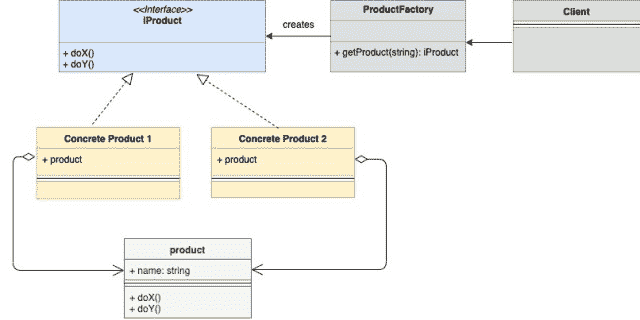
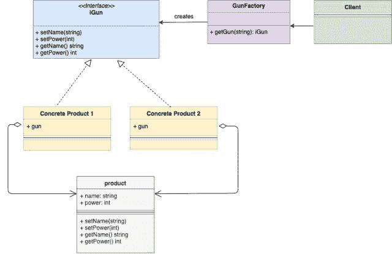

<!--yml

分类：未分类

日期：2024-10-13 06:04:16

-->

# Go（Golang）中的工厂设计模式

> 来源：[`golangbyexample.com/golang-factory-design-pattern/`](https://golangbyexample.com/golang-factory-design-pattern/)

注意：如果有兴趣了解其他所有设计模式在 GO 中的实现，请查看这个完整参考——[Go（Golang）中的所有设计模式](https://golangbyexample.com/all-design-patterns-golang/)

目录

**   介绍：

+   UML 图：

+   映射：

+   示例：

+   完整工作代码：

## **介绍：**

工厂设计模式是一种创建型设计模式，也是最常用的模式之一。该模式提供了一种隐藏创建实例逻辑的方法。

客户端只与工厂结构体交互，并告知需要创建的实例类型。工厂类与相应的具体结构体交互，并返回正确的实例。

在下面的示例中

+   我们有**iGun**接口，定义了枪应具备的所有方法。

+   存在实现**iGun**接口的**gun**结构体。

+   两种具体的枪**ak47**和**maverick**。两者都嵌入**gun**结构，因此也间接实现了**iGun**的所有方法，因此都是**iGun**类型。

+   我们有一个**gunFactory**结构体，它可以创建**ak47**或**maverick**类型的枪。

+   **main.go**作为客户端，而不是直接与**ak47**或**maverick**交互，它依赖于**gunFactory**来创建**ak47**和**maverick**的实例。

## **UML 图：**



下面是与上述示例对应的映射 UML 图。



## **映射：**

下面的表格表示 UML 图中的参与者与“示例”中实际实现参与者的映射。

| ProductFactory | gunFactory.go |
| --- | --- |
| iProduct | iGun.go |
| 产品 | gun.go |
| 具体 iProduct 1 | ak47go |
| 具体 iProduct 1 | maverick.go |
| 客户端 | main.go |

## **示例：**

**iGun.go**

```go
package main

type iGun interface {
    setName(name string)
    setPower(power int)
    getName() string
    getPower() int
}
```

**gun.go**

```go
package main

type gun struct {
    name  string
    power int
}

func (g *gun) setName(name string) {
    g.name = name
}

func (g *gun) getName() string {
    return g.name
}

func (g *gun) setPower(power int) {
    g.power = power
}

func (g *gun) getPower() int {
    return g.power
}
```

**ak47.go**

```go
package main

type ak47 struct {
    gun
}

func newAk47() iGun {
    return &ak47{
        gun: gun{
            name:  "AK47 gun",
            power: 4,
        },
    }
}
```

**maverick.go**

```go
package main

type maverick struct {
    gun
}

func newMaverick() iGun {
    return &maverick{
        gun: gun{
            name:  "Maverick gun",
            power: 5,
        },
    }
}
```

**gunFactory.go**

```go
package main

import "fmt"

func getGun(gunType string) (iGun, error) {
    if gunType == "ak47" {
        return newAk47(), nil
    }
    if gunType == "maverick" {
        return newMaverick(), nil
    }
    return nil, fmt.Errorf("Wrong gun type passed")
}
```

**main.go**

```go
package main

import "fmt"

func main() {
    ak47, _ := getGun("ak47")
    maverick, _ := getGun("maverick")
    printDetails(ak47)
    printDetails(maverick)
}

func printDetails(g iGun) {
    fmt.Printf("Gun: %s", g.getName())
    fmt.Println()
    fmt.Printf("Power: %d", g.getPower())
    fmt.Println()
}
```

**输出：**

```go
Gun: AK47 gun
Power: 4
Gun: Maverick gun
Power: 5
```

## **完整工作代码：**

```go
package main

import "fmt"

type iGun interface {
    setName(name string)
    setPower(power int)
    getName() string
    getPower() int
}

type gun struct {
    name  string
    power int
}

func (g *gun) setName(name string) {
    g.name = name
}

func (g *gun) getName() string {
    return g.name
}

func (g *gun) setPower(power int) {
    g.power = power
}

func (g *gun) getPower() int {
    return g.power
}

type ak47 struct {
    gun
}

func newAk47() iGun {
    return &ak47{
        gun: gun{
            name:  "AK47 gun",
            power: 4,
        },
    }
}

type maverick struct {
    gun
}

func newMaverick() iGun {
    return &maverick{
        gun: gun{
            name:  "Maverick gun",
            power: 5,
        },
    }
}

func getGun(gunType string) (iGun, error) {
    if gunType == "ak47" {
        return newAk47(), nil
    }
    if gunType == "maverick" {
        return newMaverick(), nil
    }
    return nil, fmt.Errorf("Wrong gun type passed")
}

func main() {
    ak47, _ := getGun("ak47")
    maverick, _ := getGun("maverick")
    printDetails(ak47)
    printDetails(maverick)
}

func printDetails(g iGun) {
    fmt.Printf("Gun: %s", g.getName())
    fmt.Println()
    fmt.Printf("Power: %d", g.getPower())
    fmt.Println()
}
```

**输出：**

```go
Gun: AK47 gun
Power: 4
Gun: Maverick gun
Power: 5
```

+   [factory](https://golangbyexample.com/tag/factory/)*   [go](https://golangbyexample.com/tag/go/)*   [pattern](https://golangbyexample.com/tag/pattern/)*
