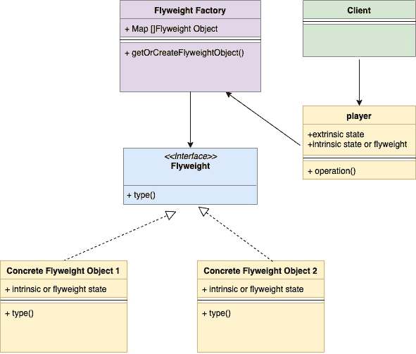
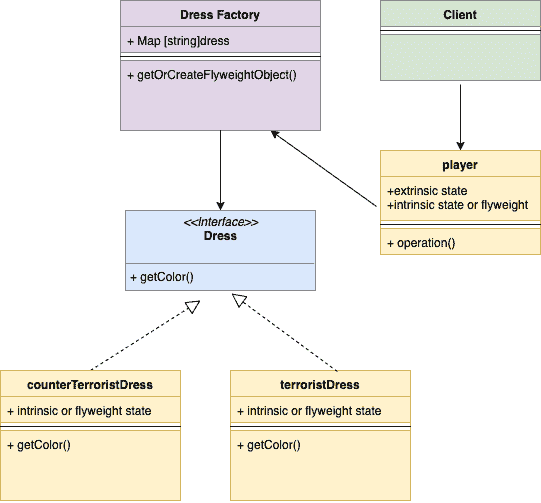

<!--yml

类别：未分类

日期：2024-10-13 06:02:30

-->

# Go（Golang）中的享元设计模式

> 来源：[https://golangbyexample.com/flyweight-design-pattern-golang/](https://golangbyexample.com/flyweight-design-pattern-golang/)

注意：如果您想了解如何在GO中实现所有其他设计模式，请查看此完整参考 – [Go中的所有设计模式（Golang）](https://golangbyexample.com/all-design-patterns-golang/)

目录

**   [定义：](#Definition "定义：")

+   [使用时机：](#When_to_Use "使用时机：")

+   [UML图：](#UML_Diagram "UML图：")

+   [映射：](#Mapping "映射：")

+   [实用示例：](#Practical_Example "实用示例：")*  *## **定义：**

这是一种结构设计模式。当需要创建大量相似对象时，使用此模式。这些对象称为享元对象且是不可变的。

让我们先看一个例子。享元模式将在此示例之后变得清晰。

在反恐精英游戏中，恐怖分子和反恐分子有不同类型的服装。为简化起见，我们假设恐怖分子和反恐分子各有一种服装类型。服装对象嵌入在玩家对象中，如下所示。

以下是玩家的结构，我们可以看到服装对象嵌入在玩家结构中。

```
type player struct {
    dress      dress
    playerType string //Can be T or CT
    lat        int
    long       int
}
```

假设有5个恐怖分子和5个反恐分子，总共10名玩家。现在有两个关于服装的选项。

1.  每个10个玩家对象都会创建不同的服装对象并嵌入它们。将创建总共10个服装对象。

1.  我们创建两个服装对象。

    +   单个恐怖分子服装对象：将共享给5个恐怖分子。

    +   单个反恐分子服装对象：将共享给5个反恐分子。

如您所见，在方法1中，总共创建了10个服装对象，而在方法2中仅创建了2个服装对象。第二种方法是我们在享元设计模式中遵循的方法。我们创建的两个服装对象称为享元对象。享元模式提取公共部分并创建享元对象。这些享元对象（这里是服装）可以在多个对象（这里是玩家）之间共享。这大大减少了服装对象的数量，并且即使您创建更多玩家，仍然只需两个服装对象即可。

在享元模式中，我们将享元对象存储在映射中。每当创建共享享元对象的其他对象时，享元对象将从映射中获取。

**内在和外在状态**

+   **内在状态 –**服装是内在状态，因为它可以在多个恐怖分子和反恐分子对象之间共享。

+   **外部状态 –** 玩家位置和玩家武器是外部状态，因为它对于每个对象都是不同的。

## **使用时机**：

+   当对象具有可以共享的某些内在属性时。

    +   如上述示例，服装是被提取并共享的内在属性。

+   当需要创建大量对象时使用享元，这可能会导致内存问题。要确定所有共同或内在状态，并为其创建享元对象。

## **UML图**:



以下是与上面示例相对应的映射UML图



## **映射:**

下表表示UML图中的参与者与代码中实际实现参与者之间的映射。

| 享元工厂 | dressFactory.go |
| --- | --- |
| 享元接口 | dress.go |
| 具体享元对象 1 | terroristDress.go |
| 具体享元对象 1 | counterTerroristDress.go |
| 上下文 | player.go |
| 客户端 | main.go |

## **实际示例**:

**dressFactory.go**

```
package main

import "fmt"

const (
    //TerroristDressType terrorist dress type
    TerroristDressType = "tDress"
    //CounterTerrroristDressType terrorist dress type
    CounterTerrroristDressType = "ctDress"
)

var (
    dressFactorySingleInstance = &dressFactory{
        dressMap: make(map[string]dress),
    }
)

type dressFactory struct {
    dressMap map[string]dress
}

func (d *dressFactory) getDressByType(dressType string) (dress, error) {
    if d.dressMap[dressType] != nil {
        return d.dressMap[dressType], nil
    }
    if dressType == TerroristDressType {
        d.dressMap[dressType] = newTerroristDress()
        return d.dressMap[dressType], nil
    }
    if dressType == CounterTerrroristDressType {
        d.dressMap[dressType] = newCounterTerroristDress()
        return d.dressMap[dressType], nil
    }
    return nil, fmt.Errorf("Wrong dress type passed")
}

func getDressFactorySingleInstance() *dressFactory {
    return dressFactorySingleInstance
}
```

**dress.go**

```
package main

type dress interface {
    getColor() string
}
```

**terroristDress.go**

```
package main

type terroristDress struct {
	color string
}

func (t *terroristDress) getColor() string {
	return t.color
}

func newTerroristDress() *terroristDress {
	return &terroristDress{color: "red"}
} 
```

**counterTerroristDress.go**

```
package main

type counterTerroristDress struct {
    color string
}

func (c *counterTerroristDress) getColor() string {
    return c.color
}

func newCounterTerroristDress() *counterTerroristDress {
    return &counterTerroristDress{color: "green"}
}
```

**player.go**

```
package main

type player struct {
    dress      dress
    playerType string
    lat        int
    long       int
}

func newPlayer(playerType, dressType string) *player {
    dress, _ := getDressFactorySingleInstance().getDressByType(dressType)
    return &player{
        playerType: playerType,
        dress:      dress,
    }
}

func (p *player) newLocation(lat, long int) {
    p.lat = lat
    p.long = long
}
```

**main.go**

```
package main

import "fmt"

func main() {
    game := newGame()
    //Add Terrorist
    game.addTerrorist(TerroristDressType)
    game.addTerrorist(TerroristDressType)
    game.addTerrorist(TerroristDressType)
    game.addTerrorist(TerroristDressType)
    //Add CounterTerrorist
    game.addCounterTerrorist(CounterTerrroristDressType)
    game.addCounterTerrorist(CounterTerrroristDressType)
    game.addCounterTerrorist(CounterTerrroristDressType)
    dressFactoryInstance := getDressFactorySingleInstance()
    for dressType, dress := range dressFactoryInstance.dressMap {
        fmt.Printf("DressColorType: %s\nDressColor: %s\n", dressType, dress.getColor())
    }
}
```

**输出:**

```
DressColorType: ctDress
DressColor: green
DressColorType: tDress
DressColor: red
```

+   [设计模式](https://golangbyexample.com/tag/design-pattern/) *   [享元设计模式](https://golangbyexample.com/tag/flyweight-design-pattern/) *   [go](https://golangbyexample.com/tag/go/) *
