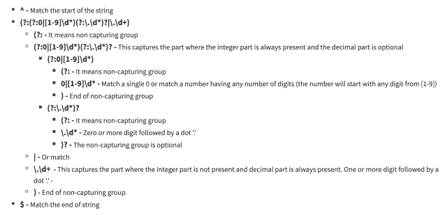

<!--yml

类别：未分类

日期：2024-10-13 06:38:19

-->

# Golang 正则表达式：在正则表达式中匹配浮点数

> 来源：[https://golangbyexample.com/golang-regex-floating-point-number/](https://golangbyexample.com/golang-regex-floating-point-number/)

目录

**[概述](#Overview "Overview")**

+   [程序](#Program "Program")*  *## **概述**

浮点数可能具有以下属性

+   它可以有负号和正号

+   当小数部分存在时，整数部分可以是可选的

+   如果整数部分存在，点和小数部分可以是可选的

+   它可以有指数，也可以没有

所以下面是有效的浮点数

```
1.2
.12
12
12.
+1.2
-1.2
1.2e3
```

以下是无效的浮点数

+   一个空字符串

+   仅有 + 或 – 号

+   一个点

+   多个 0 的前缀。例如 00.1 或 001

+   任何类似 +. 或 –

+   指数前的一个点。例如 1.e2

+   浮点数前后可以有其他字符。例如 a1.3 或 a1.3b 或 1.3b

以下是无效浮点数的示例

```
""
.
00.1
001
+
-
+.
-.
1.e2
a1.2
1.2b
a1.2b
```

让我们首先看看一个简单的正则表达式，它只匹配整数、点和小数部分。

```
^(?:(?:0|[1-9]\d*)(?:\.\d*)?|\.\d+)$
```

在高层次上，整个正则表达式有两个部分，它们是或关系

+   **(?:0|[1-9]\d*)(?:\.\d*)? –** 这捕获整数部分始终存在且小数部分可选的部分

+   **\.\d+ –** 这捕获整数部分缺失且小数部分始终存在的部分。

让我们分析这个正则表达式



让我们更复杂一点，使其接受负号或正号。请注意，负号或正号是可选的

```
^[+\-]?(?:(?:0|[1-9]\d*)(?:\.\d*)?|\.\d+)$
```

正则表达式与之前的正则表达式相同。我们只是添加了可选的正负号在前面

+   **[+\-] –** 匹配正号或负号。

+   **?** – 匹配正号或负号是可选的

让我们再往正则表达式中添加一个指数部分。同样注意，指数部分是可选的。这个正则表达式与之前的正则表达式相同。我们只是将指数部分添加到末尾

```
^[+\-]?(?:(?:0|[1-9]\d*)(?:\.\d*)?|\.\d+)(?:\d[eE][+\-]?\d+)?$
```

让我们分析指数部分

+   **(?: –** 它表示非捕获组

+   **\d** – 匹配一个数字。这是为了防止出现像 1.e2 这样的数字

+   **[eE]** – 匹配小写字母 e 或大写字母 E

+   **[+\-] –** 匹配正号或负号。匹配正号或负号是可选的

+   **\d+ –** 匹配零个或多个数字

+   **)? –** 整个正则表达式是可选的

## **程序**

现在看这个正则表达式的一个示例

```
package main

import (
	"fmt"
	"regexp"
)

func main() {
	sampleRegex := regexp.MustCompile(`^[+\-]?(?:(?:0|[1-9]\d*)(?:\.\d*)?|\.\d+)(?:\d[eE][+\-]?\d+)?$`)

	fmt.Println("Valid Inputs")
	match := sampleRegex.MatchString("1.2")
	fmt.Printf("For 1.2: %t\n", match)

	match = sampleRegex.MatchString(".12")
	fmt.Printf("For .12: %t\n", match)

	match = sampleRegex.MatchString("12")
	fmt.Printf("For 12: %t\n", match)

	match = sampleRegex.MatchString("12.")
	fmt.Printf("For 12.: %t\n", match)

	match = sampleRegex.MatchString("+1.2")
	fmt.Printf("For +1.2.: %t\n", match)

	match = sampleRegex.MatchString("-1.2")
	fmt.Printf("For -1.2.: %t\n", match)

	match = sampleRegex.MatchString("1.2e3")
	fmt.Printf("For 1.2e3.: %t\n", match)

	fmt.Println("\nInValid Inputs")
	match = sampleRegex.MatchString(".")
	fmt.Printf("For .: %t\n", match)

	match = sampleRegex.MatchString("")
	fmt.Printf("For empty string: %t\n", match)

	match = sampleRegex.MatchString("00.1")
	fmt.Printf("For 00.1: %t\n", match)

	match = sampleRegex.MatchString("001")
	fmt.Printf("For 001 %t\n", match)

	match = sampleRegex.MatchString("+")
	fmt.Printf("For +: %t\n", match)

	match = sampleRegex.MatchString("-")
	fmt.Printf("For -: %t\n", match)

	match = sampleRegex.MatchString("+.")
	fmt.Printf("For +.: %t\n", match)

	match = sampleRegex.MatchString("-.")
	fmt.Printf("For -.: %t\n", match)

	match = sampleRegex.MatchString("1.e2")
	fmt.Printf("For 1.e2: %t\n", match)

	match = sampleRegex.MatchString(".e2")
	fmt.Printf("For .e2: %t\n", match)

	match = sampleRegex.MatchString("a1.2")
	fmt.Printf("For a1.2 %t\n", match)

	match = sampleRegex.MatchString("1.2b")
	fmt.Printf("For 1.2b %t\n", match)

	match = sampleRegex.MatchString("a1.2b")
	fmt.Printf("For a1.2b %t\n", match)
}
```

**输出**

```
Valid Inputs
For 1.2: true
For .12: true
For 12: true
For 12.: true
For +1.2.: true
For -1.2.: true
For 1.2e3.: true

InValid Inputs
For .: false
For empty string: false
For 00.1: false
For 001 false
For +: false
For -: false
For +.: false
For -.: false
For 1.e2: false
For .e2: false
For a1.2 false
For 1.2b false
For a1.2b false
```

对于上述讨论的所有有效输入，程序打印为真

```
Valid Inputs
For 1.2: true
For .12: true
For 12: true
For 12.: true
For +1.2.: true
For -1.2.: true
For 1.2e3.: true
```

对于上述讨论的所有无效输入，它返回假

```
InValid Inputs
For .: false
For empty string: false
For 00.1: false
For 001 false
For +: false
For -: false
For +.: false
For -.: false
For 1.e2: false
For .e2: false
For a1.2 false
For 1.2b false
For a1.2b false
```

请尝试一下，如果在任何情况下这个正则表达式不工作，请在评论中发布。

上述正则表达式用于验证给定字符串是否为数字。如果您想查找输入字符串是否包含数字作为子串，那么我们需要去掉开头和结尾的锚字符，即去掉开头的 **脱字符 (^)** 和结尾的美元 **($)** 字符

所以正则表达式将是

```
[+\-]?(?:(?:0|[1-9]\d*)(?:\.\d*)?|\.\d+)(?:\d[eE][+\-]?\d+)?
```

这篇文章主要讨论如何在 Golang 中通过正则表达式匹配浮点数。希望你喜欢这篇文章。请在评论中分享反馈。

另外，请查看我们的 Golang 高级教程系列 – [Golang 高级教程](https://golangbyexample.com/golang-comprehensive-tutorial/)

+   [浮点数](https://golangbyexample.com/tag/floating/)*   [Go](https://golangbyexample.com/tag/go/)*   [Golang](https://golangbyexample.com/tag/golang/)*   [数字](https://golangbyexample.com/tag/number/)*   [点](https://golangbyexample.com/tag/point/)*   [正则表达式](https://golangbyexample.com/tag/regex/)*
