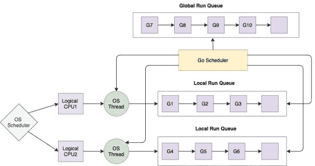

<!--yml

类别：未分类

日期：2024-10-13 06:23:18

-->

# Go 中的协程（Golang）

> 来源：[`golangbyexample.com/goroutines-golang/`](https://golangbyexample.com/goroutines-golang/)

这是 golang 综合教程系列的第二十三章。有关该系列其他章节，请参考此链接 – [Golang 综合教程系列](https://golangbyexample.com/golang-comprehensive-tutorial/)

**下一个教程** – [通道](https://golangbyexample.com/channel-golang/)

**上一个教程** – [Iota](https://golangbyexample.com/iota-in-golang)

现在让我们查看当前教程。以下是当前教程的目录。

目录

+   概述

+   启动一个 go 协程

+   主协程

+   创建多个协程

+   协程调度

    +   本地运行队列

    +   全局运行队列

+   Golang 调度器是一个协作调度器

+   协程相较于线程的优势

+   匿名协程

+   结论

# **概述**

协程可以被视为一种轻量级线程，具有独立的执行，并可以与其他协程并发执行。它是一个与其他协程并发执行的函数或方法。它完全由 GO 运行时管理。Golang 是一种并发语言。每个协程都是一个独立的执行。正是协程帮助在 golang 中实现并发。

# **启动一个 go 协程**

Golang 使用特殊关键字**‘go’**来启动协程。只需在函数或方法调用之前添加**go**关键字即可启动一个。该函数或方法现在将在协程中执行。请注意，并不是函数或方法决定是否是协程。如果我们用 go 关键字调用该方法或函数，那么该函数或方法就被认为是在协程中执行。

让我们理解正常运行函数与将函数作为协程运行之间的区别。

+   正常运行一个函数

```go
statment1
start()
statement2
```

在上述场景中正常运行函数。

1.  首先，将执行**statement1**

1.  然后将调用**start()**函数

1.  一旦 start()函数完成，**statement2**将被执行

+   将函数作为协程运行

```go
statment1
go start()
statement2
```

在上述场景中将函数作为协程运行

1.  首先，将执行 statement1

1.  然后将作为协程调用 start()函数，该函数将异步执行。

1.  **statement2**将立即执行。它不会等待**start()**函数完成。开始函数将作为协程并发执行，而程序的其余部分将继续执行。

所以基本上，当以协程方式调用一个函数时，调用将立即返回，执行将从下一行继续，而协程将在后台并发执行。此外，请注意，从协程返回的任何值都将被忽略。

让我们看一个程序以理解上述观点。

```go
package main

import (
    "fmt"
    "time"
)

func main() {
    go start()
    fmt.Println("Started")
    time.Sleep(1 * time.Second)
    fmt.Println("Finished")
}

func start() {
    fmt.Println("In Goroutine")
}
```

**输出**

```go
Started
In Goroutine
Finished
```

在上述程序中，我们在函数调用前使用“go”关键字来启动协程。

```go
go start()
```

上面的代码将启动一个协程，该协程将运行**start()**函数。程序首先打印“Started”。注意打印“Started”的行是在协程启动之后。这说明了上述提到的，在协程启动后调用会从下一行继续。然后我们设置一个超时。超时的目的是确保协程在主协程退出之前被调度。因此，现在协程执行并打印。

```go
In Goroutine
```

然后它打印。

```go
Finished
```

当我们移除超时时，会发生什么？让我们看一个程序。

```go
package main
import (
    "fmt"
)
func main() {
    go start()
    fmt.Println("Started")
    fmt.Println("Finished")
}
func start() {
    fmt.Println("In Goroutine")
}
```

**输出**

```go
Started
Finished
```

上面的程序从未打印。

```go
In Goroutine
```

这意味着协程从未被执行。这是因为主协程或程序在协程被调度之前就退出了。这引发了关于主协程的讨论。

# **主协程**

**main**包中的**main**函数是主协程。所有协程都是从主协程启动的。这些协程可以再启动多个其他协程，依此类推。

主协程代表主程序。一旦它退出，就意味着程序已退出。

协程没有父子关系。当你启动一个协程时，它只是与所有其他正在运行的协程并行执行。每个协程仅在其函数返回时退出。唯一的例外是所有协程在主协程（运行**main**函数的那个）退出时也会退出。

让我们看一个程序来演示协程没有父子关系。

```go
package main

import (
    "fmt"
    "time"
)

func main() {
    go start()
    fmt.Println("Started")
    time.Sleep(1 * time.Second)
    fmt.Println("Finished")
}

func start() {
    go start2()
    fmt.Println("In Goroutine")
}
func start2() {
    fmt.Println("In Goroutine2")
}
```

**输出**

```go
Started
In Goroutine
In Goroutine2
Finished
```

在上述程序中，第一个协程启动第二个协程。第一个协程然后打印**“In Goroutine”**，随后退出。第二个协程开始并打印**“In Goroutine2”**。这表明协程没有父子关系，它们作为独立的执行存在。

此外，请注意，超时只是为了说明，不应在生产环境中使用。

# **创建多个协程**

让我们看下面的程序以启动多个协程。这个例子也将演示协程是并发执行的。

```go
package main

import (
    "fmt"
    "time"
)

func execute(id int) {
    fmt.Printf("id: %d\n", id)
}

func main() {
    fmt.Println("Started")
    for i := 0; i < 10; i++ {
        go execute(i)
    }
    time.Sleep(time.Second * 2)
    fmt.Println("Finished")
}
```

**输出**

```go
Started
id: 4
id: 9
id: 1
id: 0
id: 8
id: 2
id: 6
id: 3
id: 7
id: 5
Finished
```

上述程序将在循环中生成 10 个协程。每次运行程序时，它都会给出不同的输出，因为协程将并发运行，无法确定哪个会先运行。

让我们了解 Go 调度器的工作原理。理解协程后将更容易。

# **协程的调度**

一旦 Go 程序启动，Go 运行时将启动与当前进程可用的逻辑 CPU 数量相等的操作系统线程。每个虚拟核心有一个逻辑 CPU，其中虚拟核心的含义是

```go
virtual_cores = x*number_of_physical_cores
```

其中 x=每个核心的硬件线程数量

**runtime.Numcpus**函数可用于获取可用于 Go 程序的逻辑处理器数量。见下面的程序

```go
package main
import (
    "fmt"
    "runtime"
)
func main() {
    fmt.Println(runtime.NumCPU())
}
```

在我的机器上显示 16。我的机器有 8 个物理核心，每个核心有 2 个硬件线程。因此 2*8=16。

Go 程序将启动与可用逻辑 CPU 数量相等的操作系统线程，或运行时的`runtime.NumCPU()`输出。这些线程将由操作系统管理，这些线程调度到 CPU 核心的责任仅在于操作系统。

Go 运行时有自己的调度器，它将在 Go 运行时的操作系统级线程上复用协程。因此，本质上每个协程在分配给逻辑 CPU 的操作系统线程上运行。

管理协程并将其分配给操作系统线程涉及两个队列

## **本地运行队列**

在 Go 运行时，每个操作系统线程都有一个关联的队列。称为本地运行队列。它包含在该线程上下文中执行的所有协程。Go 运行时将调度并进行上下文切换，将属于特定 LRQ 的协程分配到拥有该 LRQ 的相应操作系统线程。

## **全局运行队列**

它包含所有尚未移动到任何操作系统线程 LRQ 的协程。Go 调度器将从此队列中将一个协程分配到任何操作系统线程的本地运行队列。

下面的图示说明了调度器的工作原理。



# **Golang 调度器是一个协作调度器**

Go 调度器是一个协作调度器。这意味着它是非抢占式的。没有基于时间的抢占，这是抢占式调度器的情况。在协作调度器中，线程必须明确让出执行。协程可以在某些特定检查点让出其执行给其他协程。

运行时在函数调用时调用调度器，以决定是否需要调度一个新的协程。因此，当一个协程进行任何函数调用时，调度器将被调用，可能发生上下文切换，这意味着可能调度一个新的协程。现有的协程也可能继续执行。调度器还可以在以下事件中进行上下文切换。

1.  函数调用

1.  垃圾回收

1.  网络调用

1.  通道操作

1.  使用 go 关键字时

1.  在原语（如互斥锁等）上阻塞

需要提到的是，调度器在上述事件中运行，但这并不意味着上下文切换会发生。只是调度器获得了机会。是否进行上下文切换则取决于调度器。

# **goroutines 相对于线程的优势**

+   Goroutines 的初始大小为 8kb，其大小可以根据运行时需求进行增长或缩小。而操作系统线程的大小则超过 1 mb。因此，分配 goroutines 的成本极低。这样可以同时启动大量 goroutines。goroutine 的增长和缩小由 Go 运行时内部管理。由于 goroutines 成本低，你可以启动成千上万的 goroutines，而线程则只能启动几千个。

+   goroutine 的调度由 Go 运行时管理。如上所述，Go 运行时内部启动与逻辑 CPU 数量相等的操作系统线程。然后，它将 goroutines 重新调度到每个操作系统线程上。因此，goroutines 的调度由 Go 运行时完成，因此速度非常快。在线程的情况下，线程的调度由操作系统运行时完成。因此，goroutines 的上下文切换时间远快于线程的上下文切换时间。因此，成千上万的 goroutines 被多路复用在一两个操作系统线程上。如果你在 JAVA 中启动 1000 个线程，它将消耗大量资源，这 1000 个线程需要由操作系统管理。此外，这些线程的大小都将超过 1 MB。

+   Goroutines 通过内置的原始 channel 进行通信，这些 channel 是为处理竞争条件而设计的。因此，goroutines 之间的通信是安全的，并且避免了显式锁定。所以在 goroutines 之间共享的数据结构不需要被锁定。多线程编程需要使用锁来访问共享变量，这可能导致死锁和竞争条件，且难以检测。相比之下，goroutines 使用 channel 进行通信，整个同步由 Go 运行时管理。这样就避免了死锁和竞争条件。实际上，Go 信奉这样一个口号

```go
"Don't share memory for communication, instead share memory by communicating"
```

# **匿名 goroutines**

在 Golang 中，匿名函数也可以通过 goroutine 调用。有关匿名函数的更多理解，请参考这篇文章 - [`golangbyexample.com/go-anonymous-function/`](https://golangbyexample.com/go-anonymous-function/)

下面是调用匿名函数在 goroutine 中的格式

```go
go func(){
   //body
}(args..)
```

使用 goroutine 调用匿名函数和调用普通函数时，行为没有区别。

让我们看一个例子：

```go
package main

import (
    "fmt"
    "time"
)

func main() {
    go func() {
        fmt.Println("In Goroutine")
    }()

    fmt.Println("Started")
    time.Sleep(1 * time.Second)
    fmt.Println("Finished")
}
```

**输出**

```go
Started
In Goroutine
Finished
```

# **结论**

这就是关于 Golang 中 goroutines 的所有内容。希望你喜欢这个教程。请在评论中分享反馈/改进/错误。

**下一个教程** – [Channel](https://golangbyexample.com/channel-golang/)

**上一个教程** – [Iota](https://golangbyexample.com/iota-in-golang)

+   [go](https://golangbyexample.com/tag/go/)*   [golang](https://golangbyexample.com/tag/golang/)*
