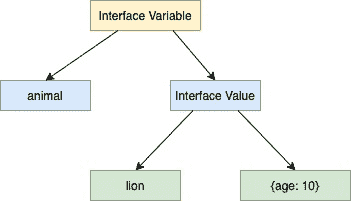

<!--yml

分类：未分类

日期：2024-10-13 06:22:47

-->

# Go（Golang）中接口的内部工作或内部机制

> 来源：[`golangbyexample.com/inner-working-interface-golang/`](https://golangbyexample.com/inner-working-interface-golang/)

目录

**   概览

+   代码

# **概览**

和其他变量一样，接口变量由类型和值表示。接口值在内部由两个元组组成

+   底层类型

+   底层值

请参见下图，说明我们上述提到的内容


让我们看看一个例子，然后为该例子创建一个类似于上述的图表。

假设我们有一个接口**动物**如下

```go
type animal interface {
    breathe()
    walk()
}
```

我们还有一个实现了这个**动物**接口的**狮子**结构

```go
type lion struct {
    age int
}
```

# **代码**

```go
package main

import "fmt"

type animal interface {
    breathe()
    walk()
}

type lion struct {
    age int
}

func (l lion) breathe() {
    fmt.Println("Lion breathes")
}

func (l lion) walk() {
    fmt.Println("Lion walk")
}

func main() {
    var a animal
    a = lion{age: 10}
    a.breathe()
    a.walk()
}
```

**输出**

```go
Lion breathes
Lion walk
```

对于上述案例，狮子结构实现动物接口如下所示



Golang 提供格式标识符来打印由接口值表示的底层类型和底层值。

+   %T 可以用于打印接口值的具体类型

+   %v 可以用于打印接口值的具体值。

```go
package main

import "fmt"

type animal interface {
    breathe()
    walk()
}

type lion struct {
    age int
}

func (l lion) breathe() {
    fmt.Println("Lion breathes")
}

func (l lion) walk() {
    fmt.Println("Lion walk")
}

func main() {
    var a animal
    a = lion{age: 10}
    fmt.Printf("Underlying Type: %T\n", a)
    fmt.Printf("Underlying Value: %v\n", a)
}
```

**输出**

```go
Concrete Type: main.lion
Concrete Value: {10}
```


