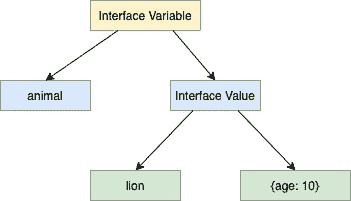

<!--yml

类别：未分类。

日期：2024-10-13 06:22:01。

-->

# Go 中的接口（Golang）。

> 来源：[https://golangbyexample.com/interface-in-golang/](https://golangbyexample.com/interface-in-golang/)。

这是 Go 语言综合教程系列的第 21 章。请参考此链接获取系列的其他章节 – [Golang 综合教程系列](https://golangbyexample.com/golang-comprehensive-tutorial/)。

**下一个教程** – [Iota](https://golangbyexample.com/iota-in-golang)。

**上一个教程** – [方法](https://golangbyexample.com/method-in-golang/)。

现在让我们看看当前的教程。下面是当前教程的目录。

目录。

**[概述](#Overview "概述")**。

+   [实现接口](#Implementing_an_Interface "实现接口")。

+   [接口是隐式实现的](#Interface_are_implemented_implicitly "接口是隐式实现的")。

+   [接口类型作为函数参数](#Interface_types_as_argument_to_a_function "接口类型作为函数参数")。

+   [为什么使用接口](#Why_Interface "为什么使用接口")。

+   [指针接收者在实现接口时](#Pointer_Receiver_while_implementing_an_interface "指针接收者在实现接口时")。

+   [非结构体自定义类型实现接口](#Non-struct_Custom_Type_Implementing_an_interface "非结构体自定义类型实现接口")。

+   [类型实现多个接口](#Type_Implementing_multiple_interfaces "类型实现多个接口")。

+   [接口的零值](#Zero_Value_of_Interface "接口的零值")。

+   [接口的内部工作原理](#Inner_Working_of_Interface "接口的内部工作原理")。

+   [嵌入接口](#Embedding_Interfaces "嵌入接口")。

    +   [在其他接口中嵌入接口](#Embedding_interface_in_other_interface "在其他接口中嵌入接口")。

    +   [在结构体中嵌入接口](#Embedding_interface_in_a_struct "在结构体中嵌入接口")。

+   [访问接口的底层变量](#Access_Underlying_Variable_of_Interface "访问接口的底层变量")。

    +   [类型断言](#Type_Assertion "类型断言")。

    +   [类型切换](#Type_Switch "类型切换")。

+   [空接口](#Empty_interface "空接口")。

+   [结论](#Conclusion "结论")*  *# **概述**

接口是 Go 中的一种类型，它是方法签名的集合。这些方法签名的集合旨在表示某种行为。接口只声明方法集，任何实现了接口所有方法的类型都是该接口类型。

接口让你在 Golang 中使用鸭子类型。现在，什么是鸭子类型？

鸭子类型是一种计算机编程方式，让你进行鸭子测试，我们不检查类型，而是只检查某些属性或方法的存在。因此，真正重要的是对象是否具有某些属性和方法，而不是它的类型。

鸭子类型源于以下短语。

```
If it walks like a duck and quack like a duck then it must be duck
```

再次回到接口。那么，什么是接口？正如之前提到的，它是方法签名的集合。它定义了一个类型可能拥有的确切方法集。下面是一个接口的签名，它仅包含方法签名。

```
type name_of_interface interface{
//Method signature 1
//Method signature 2
}
```

让我们通过一个例子来理解这个概念。这样会更加清晰。我们定义一个名为**动物**的接口。**动物**接口有两个方法**呼吸**和**行走**。它仅定义方法签名，而没有其他内容。

```
type animal interface {
    breathe()
    walk()
}
```

方法签名包括

+   方法的名称

+   参数的数量和每个参数的类型

+   返回值的数量和每个返回值的类型

根据上述声明，我们创建了一个新的接口类型，即**动物**。定义一个**动物**类型的变量是可以的。

让我们创建一个**动物**接口类型的变量。

```
package main

import "fmt"

type animal interface {
    breathe()
    walk()
}

func main() {
    var a animal
    fmt.Println(a)
}
```

**输出**

```
nil
```

如上程序所示，创建一个接口类型的变量是可以的。它打印nil，因为接口的默认零值是nil。

# **实现接口**

任何实现了呼吸和行走方法的类型都被称为实现了**动物**接口。所以如果我们定义一个**狮子**结构体并实现呼吸和行走方法，那么它就会实现动物接口。

```
package main

import "fmt"

type animal interface {
    breathe()
    walk()
}

type lion struct {
    age int
}

func (l lion) breathe() {
    fmt.Println("Lion breathes")
}

func (l lion) walk() {
    fmt.Println("Lion walk")
}

func main() {
    var a animal
    a = lion{age: 10}
    a.breathe()
    a.walk()
}
```

**输出**

```
Lion breathes
Lion walk
```

我们声明一个动物接口类型的变量。

```
var a animal
```

然后我们将一个狮子结构体的实例赋值给它。

```
a = lion{}
```

将**狮子**结构体的一个实例分配给**动物**接口类型的变量是可行的，因为**狮子**结构体实现了**呼吸**和**行走**这两个方法。在这个赋值过程中并不会检查类型，而只需检查被分配的类型是否实现了**呼吸**和**行走**这两个方法。这个概念类似于鸭子类型，**狮子**能够像**动物**一样**呼吸**和**行走**，因此它就是一种**动物**。

如果你注意到，并没有明确声明狮子类型实现了动物接口。这带来了与接口相关的一个非常重要的属性——“接口是隐式实现的”。

# **接口是隐式实现的**

并没有明确声明一个类型实现了一个接口。实际上，在Go中并不存在类似于Java的**“implements”**关键字。如果一个类型实现了接口的所有方法，它就实现了该接口。

如上所见，定义一个接口类型的变量是正确的，并且如果具体类型实现了接口的所有方法，我们可以将任何具体类型的值分配给这个变量。

并没有明确声明**狮子**结构体实现了**动物**接口。在编译期间，Go会注意到**狮子**结构体实现了**动物**接口的所有方法，因此这是允许的。任何实现了**动物**接口所有方法的其他类型都成为该接口类型。

让我们看看另一个类型实现动物接口的更复杂的例子。

如果我们定义一个**狗**结构并且它实现了**呼吸**和**行走**方法，那么它也将是动物。

```
package main

import "fmt"

type animal interface {
    breathe()
    walk()
}

type lion struct {
     age int
}

func (l lion) breathe() {
    fmt.Println("Lion breathes")
}

func (l lion) walk() {
    fmt.Println("Lion walk")
}

type dog struct {
     age int
}

func (l dog) breathe() {
    fmt.Println("Dog breathes")
}

func (l dog) walk() {
    fmt.Println("Dog walk")
}

func main() {
    var a animal

    a = lion{age: 10}
    a.breathe()
    a.walk()

    a = dog{age: 5}
    a.breathe()
    a.walk()
}
```

**输出**

```
Lion breathes
Lion walk
Dog breathes
Dog walk
```

**狮子**和**狗**都实现了呼吸和行走方法，因此它们属于动物类型，并且可以正确地分配给接口类型的变量。

接口变量a最初被分配为**狮子**实例，然后同一变量被分配为**狗**实例。因此，接口变量所引用的类型是动态的。它动态地持有对底层类型的引用。

需要注意的两个重要点：

+   接口静态检查是在编译时进行的——这意味着如果一个类型没有实现接口的所有方法，则将该类型实例分配给该接口类型的变量将在编译时引发错误。例如，在删除定义在狮子结构上的行走方法时，下面的错误将在赋值过程中被引发。

```
cannot use lion literal (type lion) as type animal in assignment:
```

+   根据实例的类型，在运行时调用正确的方法——这意味着根据接口变量引用的是狮子实例还是狗实例来调用相应的方法。如果它引用的是狮子实例，则调用狮子的方法；如果它引用的是狗实例，则调用狗的方法。这也从输出中得到了验证。这是在Go中实现运行时多态性的一种方式。

还需注意，类型定义的方法应与接口中方法的整个签名匹配，即应匹配。

+   方法的名称

+   参数的数量和每个参数的类型

+   返回值的数量和每个返回值的类型。

想象一下，**动物**接口还有另一个方法**速度**，返回动物速度的int值。

```
type animal interface {
    breathe()
    walk()
    speed() int
}
```

如果**狮子**结构具有如下的**速度**方法，但不返回int值，则**狮子**结构将不实现**动物**接口。

```
func (l lion) speed()
```

将狮子实例分配给动物类型的变量时将引发下面的编译错误。

```
cannot use lion literal (type lion) as type animal in assignment:
        lion does not implement animal (wrong type for speed method)
                have speed()
                want speed() int
```

因此，从本质上讲，方法签名在实现接口时是重要的。

# **作为函数参数的接口类型**

函数可以接受接口类型的参数。任何实现该接口的类型都可以作为该参数传递给该函数。例如，在下面的代码中，我们有**callBreathe**和**callWalk**函数，它们接受**动物**接口类型的参数。**狮子**和**狗**实例都可以传递给这个函数。我们创建狮子和狗类型的实例，并将其传递给函数。

它的工作方式类似于我们上面讨论的赋值。在编译过程中，调用函数时不会检查类型，而是只需检查传递给函数的类型是否实现了**呼吸**和**行走**方法。

```
package main

import "fmt"

type animal interface {
	breathe()
	walk()
}

type lion struct {
     age int
}

func (l lion) breathe() {
	fmt.Println("Lion breathes")
}

func (l lion) walk() {
	fmt.Println("Lion walk")
}

type dog struct {
     age int
}

func (l dog) breathe() {
	fmt.Println("Dog breathes")
}

func (l dog) walk() {
	fmt.Println("Dog walk")
}

func main() {
	l := lion{age: 10}
	callBreathe(l)
	callWalk(l)

	d := dog{age: 5}
	callBreathe(d)
	callWalk(d)
}

func callBreathe(a animal) {
	a.breathe()
}

func callWalk(a animal) {
	a.breathe()
}
```

**输出**

```
Lion breathes
Lion walk
Dog breathes
Dog walk
```

在上面的代码中，我们有**callBreathe**和**callWalk**函数，它们接受一个**animal**接口类型的参数。**lion**和**dog**实例都可以传递给这个函数。我们创建了**lion**和**dog**类型的实例并将其传递给函数。在编译期间，调用函数时不检查类型，而只需检查传递给函数的类型是否实现了**breathe**和**walk**方法。

# **为什么使用接口**

下面是使用接口的一些好处。

+   有助于在代码库的不同部分之间编写更模块化和解耦的代码——它可以帮助减少代码库不同部分之间的依赖，并提供松耦合。

比如想象一个与数据库层交互的应用程序。如果该应用程序通过接口与数据库交互，那么它永远不会知道后台使用的是哪种数据库。你可以在后台更改数据库的类型，比如从arango db更改为mongo db，而应用层无需任何更改，因为它通过实现该接口的arango db和mongo db与数据库层交互。

+   接口可以用于实现golang中的运行时多态性。运行时多态性意味着调用在运行时被解析。让我们通过一个示例了解如何使用接口实现运行时多态性。

不同国家有不同的税收计算方式。这可以通过接口来表示。

```
type taxCalculator interface{
    calculateTax()
}
```

现在不同国家可以有自己的结构体并实现**calculateTax()**方法。同样的**calculateTax**方法在不同上下文中用于计算税。编译器在看到这个调用时，会延迟确定在运行时调用哪个确切的方法。

```
package main

import "fmt"

type taxSystem interface {
    calculateTax() int
}
type indianTax struct {
    taxPercentage int
    income        int
}
func (i *indianTax) calculateTax() int {
    tax := i.income * i.taxPercentage / 100
    return tax
}
type singaporeTax struct {
    taxPercentage int
    income        int
}
func (i *singaporeTax) calculateTax() int {
    tax := i.income * i.taxPercentage / 100
    return tax
}
type usaTax struct {
    taxPercentage int
    income        int
}
func (i *usaTax) calculateTax() int {
    tax := i.income * i.taxPercentage / 100
    return tax
}
func main() {
    indianTax := &indianTax{
        taxPercentage: 30,
        income:        1000,
    }
    singaporeTax := &singaporeTax{
        taxPercentage: 10,
        income:        2000,
    }

    taxSystems := []taxSystem{indianTax, singaporeTax}
    totalTax := calculateTotalTax(taxSystems)

    fmt.Printf("Total Tax is %d\n", totalTax)
}
func calculateTotalTax(taxSystems []taxSystem) int {
    totalTax := 0
    for _, t := range taxSystems {
        totalTax += t.calculateTax() //This is where runtime polymorphism happens
    }
    return totalTax
}
```

**输出：**

```
Total Tax is 300
```

现在下面是运行时多态性发生的地方。

```
 totalTax += t.calculateTax() //This is where runtime polymorphism happens
```

正确的**calculateTax()**方法根据实例是否为**singaporeTax**结构体税或**indianTax**结构体税被调用。

# **使用指针接收器实现接口**

类型的方法可以具有指针接收器或值接收器。在上述示例中，我们只使用了值接收器。需要注意的是，指针接收器也可以用来实现接口。但这里有一个警告。

+   如果一个类型使用值接收器实现接口的所有方法，那么在将该类型的变量或该类型变量的指针赋值给接口或传递给接受该接口参数的函数时，两者都可以使用。

+   如果一个类型使用指针接收器实现接口的所有方法，那么在将该类型的变量赋值给接口或传递给接受该接口参数的函数时，只有该变量的指针可以使用。

示例以演示上述第一点

```
package main

import "fmt"

type animal interface {
    breathe()
    walk()
}

type lion struct {
    age int
}

func (l lion) breathe() {
    fmt.Println("Lion breathes")
}

func (l lion) walk() {
    fmt.Println("Lion walk")
}

func main() {
    var a animal

    a = lion{age: 10}
    a.breathe()
    a.walk()

    a = &lion{age: 5}
    a.breathe()
    a.walk()
}
```

**输出**

```
Lion breathes
Lion walk
Lion breathes
Lion walk
```

**狮子**结构体通过值接收器实现了**动物**接口。因此，它适用于**狮子**类型的变量和指向**狮子**类型变量的指针。

这可以工作。

```
a = lion{age: 10}
```

还有这一点。

```
a = &lion{age: 5}
```

示例以演示上述第二点。**狮子**结构体通过指针接收器实现了**动物**接口。因此，它仅适用于指向**狮子**类型变量的指针。

所以这可以工作。

```
 a = &lion{age: 5}
```

但这会引发编译错误。

```
a = lion{age: 10}
```

```
cannot use lion literal (type lion) as type animal in assignment:
        lion does not implement animal (breathe method has pointer receiver)
```

查看完整的工作代码。

```
package main

import "fmt"

type animal interface {
	breathe()
	walk()
}

type lion struct {
	age int
}

func (l *lion) breathe() {
	fmt.Println("Lion breathes")
}

func (l *lion) walk() {
	fmt.Println("Lion walk")
}

func main() {
	var a animal

	//a = lion{age: 10}
	a.breathe()
	a.walk()

	a = &lion{age: 5}
	a.breathe()
	a.walk()
}
```

取消注释该行。

```
a = lion{age: 10}
```

这也会引发编译错误。

```
cannot use lion literal (type lion) as type animal in assignment:
        lion does not implement animal (breathe method has pointer receiver)
```

# **非结构自定义类型实现接口**

到目前为止，我们只看到了结构类型实现接口的例子。任何非结构自定义类型实现接口也是完全可以的。让我们看一个例子。

```
package main

import "fmt"

type animal interface {
	breathe()
	walk()
}

type cat string

func (c cat) breathe() {
	fmt.Println("Cat breathes")
}

func (c cat) walk() {
	fmt.Println("Cat walk")
}

func main() {
	var a animal

	a = cat("smokey")
	a.breathe()
	a.walk()
}
```

**输出**

```
Cat breathes
Cat walk
```

上面的程序说明了任何自定义类型也可以实现接口的概念。**猫**是字符串类型，它实现了**呼吸**和**行走**方法，因此将**猫**类型的实例赋值给**动物**类型的变量是正确的。

# **类型实现多个接口**

如果一个类型定义了接口的所有方法，则该类型实现了该接口。如果它定义了另一个接口的所有方法，那么它也实现了那个接口。从本质上讲，一个类型可以实现多个接口。

在下面的程序中，我们有一个哺乳动物接口，具有一个进食方法。狮子结构体也定义了这个方法，因此它实现了哺乳动物接口。

```
package main

import "fmt"

type animal interface {
    breathe()
    walk()
}

type mammal interface {
    feed()
}

type lion struct {
     age int
}
func (l lion) breathe() {
    fmt.Println("Lion breathes")
}
func (l lion) walk() {
    fmt.Println("Lion walk")
}
func (l lion) feed() {
    fmt.Println("Lion feeds young")
}
func main() {
    var a animal
    l := lion{}
    a = l
    a.breathe()
    a.walk()
    var m mammal
    m = l
    m.feed()
}
```

**输出**

```
Lion breathes
Lion walk
Lion feeds young
```

# **接口的零值**

接口的默认或零值是nil。下面的程序演示了这一点。

```
package main

import "fmt"
type animal interface {
    breathe()
    walk()
}

func main() {
    var a animal
    fmt.Println(a)
}
```

**输出**

```
nil
```

# **接口的内部工作原理**

像其他变量一样，接口变量由类型和值表示。接口值在底层由两个元组组成。

+   底层类型

+   底层值

请看下面的图示，说明了我们上面提到的内容。


例如，狮子结构体实现动物接口如下。



Golang提供了格式标识符，以打印由接口值表示的底层类型和底层值。

+   %T可以用来打印接口值的具体类型。

+   %v可以用来打印接口值的具体值。

```
package main

import "fmt"

type animal interface {
    breathe()
    walk()
}

type lion struct {
    age int
}

func (l lion) breathe() {
    fmt.Println("Lion breathes")
}

func (l lion) walk() {
    fmt.Println("Lion walk")
}

func main() {
    var a animal
    a = lion{age: 10}
    fmt.Printf("Underlying Type: %T\n", a)
    fmt.Printf("Underlying Value: %v\n", a)
}
```

**输出**

```
Concrete Type: main.lion
Concrete Value: {10}
```

接口可以嵌入其他接口，也可以嵌入结构体。让我们逐一看看。

# **嵌入接口**

接口可以嵌入其他接口，也可以嵌入结构体。让我们逐一看看。

## **在其他接口中嵌入接口**

一个接口可以嵌入任意数量的接口，也可以嵌入任何接口。嵌入接口的所有方法都成为嵌入接口的一部分。这是通过合并一些小接口来创建新接口的一种方式。让我们通过一个例子来理解。

假设我们有一个接口**动物**如下。

```
type animal interface {
    breathe()
    walk()
}
```

假设还有一个名为 **human** 的接口，它嵌入了 **animal** 接口。

```
type human interface {
    animal
    speak()
}
```

因此，如果任何类型需要实现 **human** 接口，则必须定义

+   **breathe()** 和 **walk()** 方法的动物接口嵌入在 **human** 中

+   **speak()** 方法的人类接口

```
package main

import "fmt"

type animal interface {
	breathe()
	walk()
}

type human interface {
	animal
	speak()
}

type employee struct {
	name string
}

func (e employee) breathe() {
	fmt.Println("Employee breathes")
}

func (e employee) walk() {
	fmt.Println("Employee walk")
}

func (e employee) speak() {
	fmt.Println("Employee speaks")
}

func main() {
	var h human

	h = employee{name: "John"}
	h.breathe()
	h.walk()
	h.speak()
}
```

**输出**

```
Employee breathes
Employee walk
Employee speaks
```

作为另一个示例，golang 的 **io** 包的 ReaderWriter 接口 ([https://golang.org/pkg/io/#ReadWriter](https://golang.org/pkg/io/#ReadWriter)) 嵌入了两个其他接口。

+   reader 接口 – [https://golang.org/pkg/io/#Reader](https://golang.org/pkg/io/#Reader)

+   writer 接口 – [https://golang.org/pkg/io/#Writer](https://golang.org/pkg/io/#Writer)

```
type ReadWriter interface {
    Reader
    Writer
}
```

## **在结构中嵌入接口**

接口也可以嵌入到结构中。所有嵌入接口的方法都可以通过该结构调用。这些方法的调用方式取决于嵌入接口是命名字段还是未命名/匿名字段。

+   如果嵌入接口是命名字段，则接口方法必须通过命名接口名称调用

+   如果嵌入接口是未命名/匿名字段，则可以直接或通过接口名称引用接口方法

让我们来看一个程序，说明上述要点

```
package main

import "fmt"

type animal interface {
    breathe()
    walk()
}

type dog struct {
    age int
}

func (d dog) breathe() {
    fmt.Println("Dog breathes")
}

func (d dog) walk() {
    fmt.Println("Dog walk")
}

type pet1 struct {
    a    animal
    name string
}

type pet2 struct {
    animal
    name string
}

func main() {
    d := dog{age: 5}
    p1 := pet1{name: "Milo", a: d}

    fmt.Println(p1.name)
    // p1.breathe()
    // p1.walk()
    p1.a.breathe()
    p1.a.walk()

    p2 := pet2{name: "Oscar", animal: d}
    fmt.Println(p1.name)
    p2.breathe()
    p2.walk()
    p1.a.breathe()
    p1.a.walk()
}
```

**输出**

```
Milo
Dog breathes
Dod walk

Oscar
Dog breathes
Dog walk
Dog breathes
Dog walk
```

我们声明了两个结构 **pet1** 和 **pet2**。 **pet1** 结构中有命名的 **animal** 接口

```
type pet1 struct {
    a    animal
    name string
}
```

**pet2** 嵌入了未命名/匿名 **animal** 接口

```
type pet2 struct {
    animal
    name string
}
```

对于 **pet1** 结构的实例，我们可以这样调用 **breathe()** 和 **walk()** 方法。

```
p1.a.breathe()
p1.a.walk()
```

直接调用这些方法将引发编译错误

```
p1.breathe()
p1.walk()
```

```
p1.breathe undefined (type pet1 has no field or method breathe)
p1.walk undefined (type pet1 has no field or method walk)
```

对于 **pet2** 结构的实例，我们可以直接调用 **breathe()** 和 **walk()** 方法

```
p2.breathe()
p2.walk()
```

如果嵌入接口是匿名或未命名的，我们可以直接访问嵌入接口的方法。

下面也是有效的，另一种调用未命名/匿名嵌入接口方法的方式

```
p2.animal.breathe()
p2.animal.walk()
```

还请注意，在创建 **pet1** 或 **pet2** 结构的实例时，嵌入的接口 **animal** 是用实现该接口的类型 **dog** 初始化的。

```
p1 := pet1{name: "Milo", a: d}
p2 := pet2{name: "Oscar", animal: d}
```

如果我们不初始化嵌入接口 **animal**，则它将被初始化为接口的零值，即 nil。在这样的 **pet1** 或 **pet2** 结构的实例上调用 **breathe()** 和 **walk()** 方法将导致恐慌。

# **访问接口的底层变量**

可以通过两种方式访问底层变量

+   类型断言

+   类型切换

## **类型断言**

类型断言提供了一种通过断言底层值的正确类型来访问接口值内部的底层变量的方法。下面是其语法，其中 **i** 是一个接口。

```
val := i.({type})
```

上述声明断言接口中的底层值的类型为 {type}。如果这个断言成立，则将底层值分配给 **val**。如果不成立，则上述声明将导致恐慌。

```
package main

import "fmt"

type animal interface {
	breathe()
	walk()
}

type lion struct {
	age int
}

func (l lion) breathe() {
	fmt.Println("Lion breathes")
}

func (l lion) walk() {
	fmt.Println("Lion walk")
}

type dog struct {
	age int
}

func (d dog) breathe() {
	fmt.Println("Dog breathes")
}

func (d dog) walk() {
	fmt.Println("Dog walk")
}

func main() {
	var a animal

	a = lion{age: 10}
	print(a)

}

func print(a animal) {
	l := a.(lion)
	fmt.Printf("Age: %d\n", l.age)

	//d := a.(dog)
	//fmt.Printf("Age: %d\n", d.age)
}
```

**输出**

```
Age: 10
```

这就是我们如何断言变量 **a** 的类型 **animal** 为底层类型 **lion**。

```
l := a.(lion)
```

下面的行将引发程序崩溃，因为底层类型是**狮子**而不是**狗**。取消注释该行以查看效果。

```
//d := a.(dog)
```

类型断言提供了获取底层值的另一种方法，同时也能防止程序崩溃。其语法为：

```
val, ok := i.(<type>)</type>
```

在这种情况下，类型断言返回两个值，第一个值与上面讨论的相同，另一个值是布尔值，指示类型断言是否正确。这个值是：

+   如果类型断言正确，则返回true，意味着断言的类型与底层类型相同。

+   如果类型断言失败，则返回false。

所以第二种方法是一种良好的类型断言方式，因为它可以防止程序崩溃。让我们来看一个例子。

```
package main

import "fmt"

type animal interface {
	breathe()
	walk()
}

type lion struct {
	age int
}

func (l lion) breathe() {
	fmt.Println("Lion breathes")
}

func (l lion) walk() {
	fmt.Println("Lion walk")
}

type dog struct {
	age int
}

func (d dog) breathe() {
	fmt.Println("Dog breathes")
}

func (d dog) walk() {
	fmt.Println("Dog walk")
}

func main() {
	var a animal

	a = lion{age: 10}
	print(a)

}

func print(a animal) {
	l, ok := a.(lion)
	if ok {
		fmt.Println(l)
	} else {
		fmt.Println("a is not of type lion")
	}

	d, ok := a.(dog)
	if ok {
		fmt.Println(d)
	} else {
		fmt.Println("a is not of type lion")
	}
}
```

**输出：**

```
{10}
a is not of type lion
```

现在让我们继续讨论类型开关。

## **类型开关**

类型开关使我们能够连续进行上述类型断言。请参见下面的代码示例。

```
package main

import "fmt"

type animal interface {
	breathe()
	walk()
}

type lion struct {
	age int
}

func (l lion) breathe() {
	fmt.Println("Lion breathes")
}

func (l lion) walk() {
	fmt.Println("Lion walk")
}

type dog struct {
	age int
}

func (d dog) breathe() {
	fmt.Println("Dog breathes")
}

func (d dog) walk() {
	fmt.Println("Dog walk")
}

func main() {
	var a animal

	x = lion{age: 10}
	print(x)

}

func print(a animal) {
	switch v := a.(type) {
	case lion:
		fmt.Println("Type: lion")
	case dog:
		fmt.Println("Type: dog")
	default:
		fmt.Printf("Unknown Type %T", v)
	}
}
```

**输出：**

```
Type: lion
```

在上面的代码中，使用类型开关我们可以确定接口变量x中包含的值的类型是**狮子**、**狗**或其他某种类型。也可以在case语句中添加更多不同的类型。

# **空接口**

空接口没有方法，因此默认情况下，所有具体类型都实现空接口。如果你编写一个接受空接口的函数，那么你可以将任何类型传递给该函数。请参见下面的工作代码。

```
package main

import "fmt"

func main() {
    test("thisisstring")
    test("10")
    test(true)
}

func test(a interface{}) {
    fmt.Printf("(%v, %T)\n", a, a)
}
```

**输出**

```
(thisisstring, string)
(10, string)
(true, bool)
```

# **结论**

这就是Go语言中的接口。希望你喜欢这篇文章。请在评论中分享反馈/改进建议/错误。

**下一教程** – [Iota](https://golangbyexample.com/iota-in-golang)

**上一教程** – [方法](https://golangbyexample.com/method-in-golang/)

+   [go](https://golangbyexample.com/tag/go/)*
