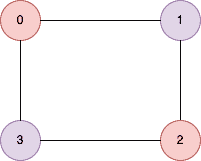

<!--yml

类别：未分类

日期：2024-10-13 06:51:34

-->

# Go（Golang）中的图是否为二分图程序

> 来源：[`golangbyexample.com/graph-bipartite-golang/`](https://golangbyexample.com/graph-bipartite-golang/)

目录

+   概述

+   程序

## **概述**

给定一个无向图。如果图的节点可以被分成两个子集，使得每条边连接第一个子集中的一个节点与第二个子集中的某个节点，则该图称为二分图。

图包含 n 个节点，编号从**0**到**n-1**。输入是一个名为**graph**的矩阵，它是一个二维矩阵，其中 graph[i]包含**第 i**个节点连接的节点。例如，如果

**graph[0] = [1,3]**

这意味着**节点 0**连接到**节点 1**和**节点 3**。

**示例 1**



```go
Input: [[1,3],[0,2],[1,3],[0,2]]
Output: true
```

**示例 2**


```go
Input: [[1,4],[0,2],[1,3],[2,4],[0,3]
Output: false
```

思路是使用 DFS。我们将尝试为每个节点分配红色或黑色。如果一个节点被涂成红色，则其邻居必须涂成黑色。

+   如果我们能够以这种方式上色，那么图就是二分图。

+   如果在上色时发现由边连接的两个节点具有相同的颜色，则图不是二分图。

让我们看看相应的程序

# **程序**

下面是相应的程序

```go
package main

import "fmt"

func isBipartite(graph [][]int) bool {
	nodeMap := make(map[int][]int)

	numNodes := len(graph)

	if numNodes == 1 {
		return true
	}
	for i := 0; i < numNodes; i++ {
		nodes := graph[i]
		for j := 0; j < len(nodes); j++ {
			nodeMap[i] = append(nodeMap[i], nodes[j])
		}
	}

	color := make(map[int]int)

	for i := 0; i < numNodes; i++ {
		if color[i] == 0 {
			color[i] = 1
			isBiPartite := visit(i, nodeMap, &color)
			if !isBiPartite {
				return false
			}
		}
	}

	return true

}

func visit(source int, nodeMap map[int][]int, color *map[int]int) bool {

	for _, neighbour := range nodeMap[source] {
		if (*color)[neighbour] == 0 {
			if (*color)[source] == 1 {
				(*color)[neighbour] = 2
			} else {
				(*color)[neighbour] = 1
			}
			isBipartite := visit(neighbour, nodeMap, color)
			if !isBipartite {
				return false
			}
		} else {
			if (*color)[source] == (*color)[neighbour] {
				return false
			}
		}
	}

	return true
}

func main() {
	output := isBipartite([][]int{{1, 3}, {0, 2}, {1, 3}, {0, 2}})
	fmt.Println(output)

	output = isBipartite([][]int{{1, 4}, {0, 2}, {1, 3}, {2, 4}, {0, 3}})
	fmt.Println(output)

}
```

**[输出：](http://Output:)**

```go
true
false
```

**注意：**请查看我们的 Golang 高级教程。本系列的教程内容详尽，我们努力涵盖所有概念并提供示例。本教程适合那些希望获得 Golang 专业知识和扎实理解的人 - [Golang 高级教程](https://golangbyexample.com/golang-comprehensive-tutorial/)

如果您有兴趣了解所有设计模式如何在 Golang 中实现。如果是，那么这篇文章适合您 - [所有设计模式 Golang](https://golangbyexample.com/all-design-patterns-golang/)

另外，请查看我们的系统设计教程系列 - [系统设计教程系列](https://techbyexample.com/system-design-questions/)

+   [go](https://golangbyexample.com/tag/go/)*
