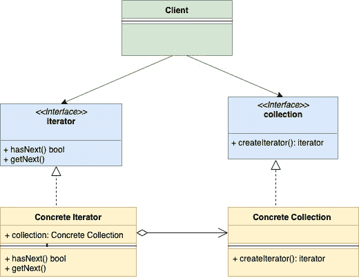

<!--yml

分类：未分类

日期：2024-10-13 06:04:22

-->

# Golang中的迭代器设计模式

> 来源：[https://golangbyexample.com/go-iterator-design-pattern/](https://golangbyexample.com/go-iterator-design-pattern/)

注意：如有兴趣了解其他设计模式如何在GO中实现，请查看此完整参考 – [Go中的所有设计模式 (Golang)](https://golangbyexample.com/all-design-patterns-golang/)

目录

**   [介绍：](#Introduction "Introduction:")

+   [UML图：](#UML_Diagram "UML Diagram:")

+   [映射](#Mapping "Mapping")

+   [示例](#Example "Example")

+   [完整工作代码：](#Full_Working_Code "Full Working Code:")*  *# **介绍：**

迭代器设计模式是一种行为设计模式。在此模式中，集合结构提供一个迭代器，让其能够顺序遍历集合结构中的每个元素，而不暴露其底层实现。

以下是迭代器设计模式的基本组件。

+   **迭代器** **接口**：该接口提供基本操作，如**hasNext()**、**getNext()**等。这些操作顾名思义可以让你遍历集合、重新开始迭代等。

+   **集合接口**：该接口表示需要遍历的集合。该接口定义了一个方法**createIterator()**，返回**迭代器**类型。

+   **具体迭代器**：迭代器接口的具体实现。

+   **具体集合**：集合接口的具体实现。

此模式的主要思想是将集合结构的迭代逻辑暴露到一个不同的对象中（该对象实现了迭代器接口）。此迭代器提供了一种独立于类型的遍历集合的通用方法。

# **UML图：**



# **映射**

以下表格表示UML图中参与者到实际实现参与者的映射，位于**“示例”**中。

| 集合 | collection.go |
| --- | --- |
| 具体集合 | userCollection.go |
| 迭代器 | mac.go |
| 具体迭代器 1 | userIterator.go |
| 客户端 | main.go |

# **示例**

**collection.go**

```
package main

type collection interface {
    createIterator() iterator
}
```

**userCollection.go**

```
package main

type userCollection struct {
    users []*user
}

func (u *userCollection) createIterator() iterator {
    return &userIterator{
        users: u.users,
    }
}
```

**iterator.go**

```
package main

type iterator interface {
    hasNext() bool
    getNext() *user
}
```

**userIterator.go**

```
package main

type userIterator struct {
    index int
    users []*user
}

func (u *userIterator) hasNext() bool {
    if u.index < len(u.users) {
        return true
    }
    return false
}

func (u *userIterator) getNext() *user {
    if u.hasNext() {
        user := u.users[u.index]
        u.index++
        return user
    }
    return nil
}
```

**user.go**

```
package main

type user struct {
    name string
    age  int
}
```

**main.go**

```
package main

import "fmt"

func main() {
    user1 := &user{
        name: "a",
        age:  30,
    }
    user2 := &user{
        name: "b",
        age:  20,
    }
    userCollection := &userCollection{
        users: []*user{user1, user2},
    }
    iterator := userCollection.createIterator()
    for iterator.hasNext() {
        user := iterator.getNext()
        fmt.Printf("User is %+v\n", user)
    }
}
```

**输出：**

```
User is &{name:a age:30}
User is &{name:b age:20}
```

# **完整工作代码：**

```
package main

import "fmt"

type collection interface {
    createIterator() iterator
}

type userCollection struct {
    users []*user
}

func (u *userCollection) createIterator() iterator {
    return &userIterator{
        users: u.users,
    }
}

type iterator interface {
    hasNext() bool
    getNext() *user
}

type userIterator struct {
    index int
    users []*user
}

func (u *userIterator) hasNext() bool {
    if u.index < len(u.users) {
        return true
    }
    return false
}

func (u *userIterator) getNext() *user {
    if u.hasNext() {
        user := u.users[u.index]
        u.index++
        return user
    }
    return nil
}

type user struct {
    name string
    age  int
}

func main() {
    user1 := &user{
        name: "a",
        age:  30,
    }
    user2 := &user{
        name: "b",
        age:  20,
    }
    userCollection := &userCollection{
        users: []*user{user1, user2},
    }
    iterator := userCollection.createIterator()
    for iterator.hasNext() {
        user := iterator.getNext()
        fmt.Printf("User is %+v\n", user)
    }
}
```

**输出：**

```
User is &{name:a age:30}
User is &{name:b age:20}
```

+   [go](https://golangbyexample.com/tag/go/)*   [golang](https://golangbyexample.com/tag/golang/)*   [iterator](https://golangbyexample.com/tag/iterator/)*
