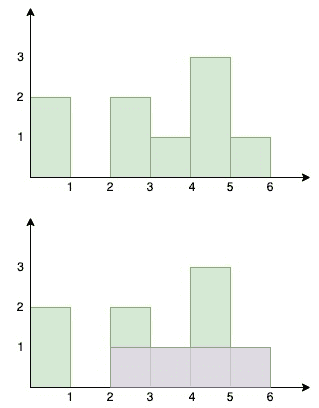

<!--yml

类别：未分类

日期：2024-10-13 06:46:54

-->

# Go（Golang）中的直方图最大矩形面积

> 来源：[https://golangbyexample.com/largest-rectangular-area-histogram-go/](https://golangbyexample.com/largest-rectangular-area-histogram-go/)

目录

**   [概述](#Overview "Overview")

+   [程序](#Program "Program")*  *## **概述**

有一组每个宽度为1单位但高度不同的柱子并排放置。柱子的高度用数组表示

```go
[2, 0 , 2, 1, 3, 1]
```

数组表示如下

+   柱子的总数为5

+   第一根柱子的高度为2

+   第二根柱子的高度为0

+   第三根柱子的高度为2

+   第四根柱子的高度为1

+   第五根柱子的高度为3

+   第六根柱子的高度为1

目标是在直方图中找到最大的矩形面积。从图中可以看出，最大矩形面积为4。



以下是解决此问题的方法。我们将使用栈，并在每个柱子的索引处找出假设该柱子完全包含在最大矩形中的面积。

+   将给定数组的第一个元素压入栈中。遍历给定数组。对于每根柱子，我们需要找出左侧最近的较小柱子和右侧最近的较小柱子

+   对于当前元素，检查顶部元素的高度是否大于当前元素的高度

+   如果是，那么当前元素就是右侧最近的较小柱子。栈中顶元素之后的元素是左侧最近的较小柱子。

+   弹出该元素并假设该柱子完全包含，计算最大的矩形面积。保持对最大矩形面积的跟踪

+   重复上述两步，直到栈为空或顶部元素的高度小于当前元素

+   将当前元素压入栈中

+   最后返回最大的矩形面积。

## **程序**

以下是相应的程序。

```go
package main

import "fmt"

type customStack struct {
	stack []int
}

func (c *customStack) Push(num int) {
	c.stack = append(c.stack, num)
}

func (c *customStack) Pop() (int, error) {
	length := len(c.stack)
	poppedItem := 0
	if length > 0 {
		poppedItem = c.stack[length-1]
		c.stack = c.stack[:length-1]
		return poppedItem, nil
	}
	return 0, fmt.Errorf("stack is empty")
}

func (c *customStack) Front() (int, error) {
	length := len(c.stack)
	if length > 0 {
		return c.stack[length-1], nil
	}
	return 0, fmt.Errorf("stack is empty")
}

func (c *customStack) Size() int {
	return len(c.stack)
}

func largestRectangleArea(heights []int) int {
	customStack := &customStack{}

	lenHeights := len(heights)

	customStack.Push(0)

	maxRectangleSize := heights[0]

	for i := 1; i < lenHeights; i++ {

		for customStack.Size() != 0 {
			current, _ := customStack.Front()
			if heights[current] > heights[i] {
				var rectangleUsingCurrentBar int
				current, _ := customStack.Pop()
				//Calcualte max rectangle using the current front
				previous, err := customStack.Front()
				if err != nil {
					previous = -1
				}
				rectangleUsingCurrentBar = (i - previous - 1) * heights[current]
				if rectangleUsingCurrentBar > maxRectangleSize {
					maxRectangleSize = rectangleUsingCurrentBar
				}
			} else {
				break
			}
		}
		customStack.Push(i)
	}

	front, err := customStack.Front()
	if err != nil {
		return maxRectangleSize
	}
	var rectangleUsingCurrentBar int
	for customStack.Size() != 0 {
		current, _ := customStack.Pop()
		previous, err := customStack.Front()
		if err != nil {
			previous = -1
		}
		rectangleUsingCurrentBar = (front - previous) * heights[current]
		if rectangleUsingCurrentBar > maxRectangleSize {
			maxRectangleSize = rectangleUsingCurrentBar
		}
	}
	return maxRectangleSize
}

func main() {
	output := largestRectangleArea([]int{2, 0, 2, 1, 3, 1})
	fmt.Println(output)
} 
```

**输出**

```go
4
```

**注意：** 请查看我们的Golang高级教程。本系列的教程详尽，我们尽量用示例涵盖所有概念。本教程适合那些希望获得专业知识并深入理解Golang的人 – [Golang高级教程](https://golangbyexample.com/golang-comprehensive-tutorial/)

如果你有兴趣了解如何在Golang中实现所有设计模式。如果是，那么这篇文章适合你 –[所有设计模式Golang](https://golangbyexample.com/all-design-patterns-golang/)

+   [go](https://golangbyexample.com/tag/go/)*   [golang](https://golangbyexample.com/tag/golang/)*
