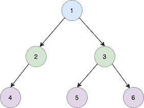

<!--yml

分类：未分类

日期：2024-10-13 06:45:04

-->

# Golang 中二叉树的层序遍历

> 来源：[`golangbyexample.com/level-order-traversal-binary-tree-golang/`](https://golangbyexample.com/level-order-traversal-binary-tree-golang/)

目录

+   概述

+   程序

## **概述**

目标是逐层打印二叉树。例如，假设我们有如下二叉树



这里我们有

+   第 1 级的节点 1

+   第 2 级的节点 2 和节点 3

+   第 3 级的节点 4、节点 5 和节点 6

所以输出应该是

```go
[[1] [2 3] [4 5 6]]
```

## **程序**

下面是相同的程序

```go
package main

import (
	"fmt"
)

type TreeNode struct {
	Val   int
	Left  *TreeNode
	Right *TreeNode
}

func levelOrder(root *TreeNode) [][]int {
	levelMapNode := make(map[int][]int)
	visit(root, 0, &levelMapNode)

	output := make([][]int, 0)

	i := 0
	for true {
		_, ok := levelMapNode[i]

		if ok {
			output = append(output, levelMapNode[i])
		} else {
			break
		}
		i = i + 1

	}
	return output

}

func visit(root *TreeNode, level int, levelMapNode *map[int][]int) {
	if root == nil {
		return
	}
	_, ok := (*levelMapNode)[level]
	if ok {
		(*levelMapNode)[level] = append((*levelMapNode)[level], root.Val)
	} else {
		(*levelMapNode)[level] = []int{root.Val}
	}

	if root.Left != nil {
		visit(root.Left, level+1, levelMapNode)
	}

	if root.Right != nil {
		visit(root.Right, level+1, levelMapNode)
	}
	return
}

func main() {
	root := TreeNode{Val: 1}
	root.Left = &TreeNode{Val: 2}
	root.Right = &TreeNode{Val: 3}
	root.Right.Left = &TreeNode{Val: 4}
	root.Right.Right = &TreeNode{Val: 5}

	output := levelOrder(&root)
	fmt.Println(output)

}
```

**输出**

```go
[[1] [2 3] [4 5 6]]
```

**注意：** 请查看我们的 Golang 高级教程。此系列教程内容详尽，我们尝试涵盖所有概念并附有示例。本教程适合那些希望获得专业知识和深入理解 Golang 的人 – [Golang 高级教程](https://golangbyexample.com/golang-comprehensive-tutorial/)

如果你有兴趣了解所有设计模式在 Golang 中如何实现。如果是的话，这篇文章就是为你准备的 –[所有设计模式 Golang](https://golangbyexample.com/all-design-patterns-golang/)

+   [去](https://golangbyexample.com/tag/go/)*   [Golang](https://golangbyexample.com/tag/golang/)*
