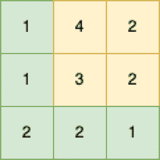

<!--yml

类别：未分类

日期：2024-10-13 06:48:40

-->

# Go (Golang)中的最小路径和程序

> 来源：[https://golangbyexample.com/minimum-path-sum-golang/](https://golangbyexample.com/minimum-path-sum-golang/)

目录

**   [概述](#Overview "Overview")

+   [程序](#Program "Program")*  *## **概述**

有一个包含非负整数的m*n矩阵。目标是找到从左上角到右下角的最小路径和。你只能向右或向下移动。

例如，假设我们有以下矩阵



然后最小和路径如下。它的和为1+1+2+2+1 = 7

```
[{0,0}, {1,0}, {1,1}, {2,1}, {2,2}
```

这是一个动态规划问题，因为它具有最优子结构。假设矩阵的名称是input。

+   minPath[0][0] = input[0][0]

+   minPath[i][j] = ming(minPath[i-1][j], minPath[i][j-1])) + input[i][j]

其中minPath[i][j]表示从{0,0}到{i,j}的最小和

## **程序**

这是相同程序。

```
package main

import "fmt"

func minPathSum(grid [][]int) int {
	rows := len(grid)
	columns := len(grid[0])
	sums := make([][]int, rows)

	for i := 0; i < rows; i++ {
		sums[i] = make([]int, columns)
	}

	sums[0][0] = grid[0][0]

	for i := 1; i < rows; i++ {
		sums[i][0] = grid[i][0] + sums[i-1][0]
	}

	for i := 1; i < columns; i++ {
		sums[0][i] = grid[0][i] + sums[0][i-1]
	}

	for i := 1; i < rows; i++ {
		for j := 1; j < columns; j++ {
			if sums[i-1][j] < sums[i][j-1] {
				sums[i][j] = grid[i][j] + sums[i-1][j]
			} else {
				sums[i][j] = grid[i][j] + sums[i][j-1]
			}
		}
	}

	return sums[rows-1][columns-1]

}

func main() {
	input := [][]int{{1, 4, 2}, {1, 3, 2}, {2, 2, 1}}
	output := minPathSum(input)
	fmt.Println(output)
}
```

**输出**

```
7
```

**注意：**查看我们的Golang高级教程。此系列的教程内容详尽，我们尽力覆盖所有概念及示例。本教程适合希望获得专业知识和对Golang有扎实理解的人 - [Golang高级教程](https://golangbyexample.com/golang-comprehensive-tutorial/)

如果你有兴趣了解所有设计模式如何在Golang中实现。如果是的话，这篇文章就是为你准备的 - [所有设计模式 Golang](https://golangbyexample.com/all-design-patterns-golang/)

+   [go](https://golangbyexample.com/tag/go/)*   [golang](https://golangbyexample.com/tag/golang/)*
