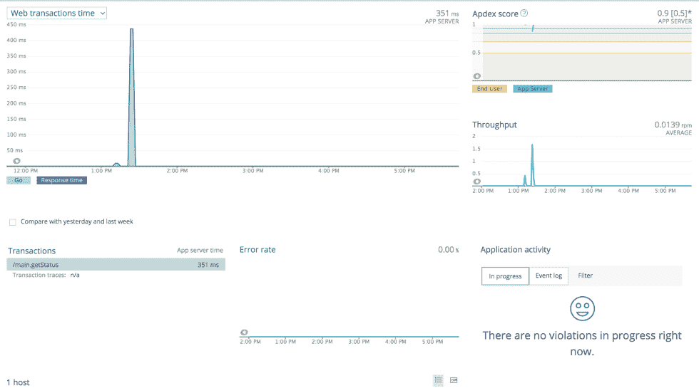
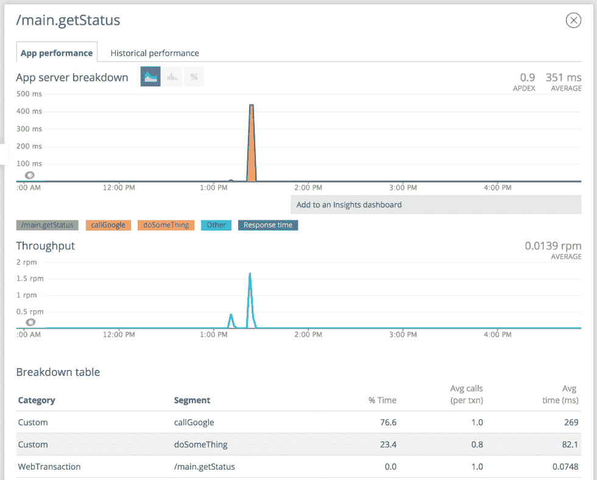

<!--yml

类别：未分类

日期：2024-10-13 06:00:28

-->

# GoLang中使用深度监控的New Relic示例

> 来源：[https://golangbyexample.com/go-new-relic-example-in-golang-with-deep-instrumentation/](https://golangbyexample.com/go-new-relic-example-in-golang-with-deep-instrumentation/)

在GoLang中集成newrelic很简单。我们只需要其中一个中间件来使用newrelic.Application。例如，在GO的GIN框架中，我们可以这样做。

```
nrConfig := newrelic.NewConfig("test", "somekey")
nrapp, err = newrelic.NewApplication(nrConfig)
r := gin.Default()
r.Use(nrgin.Middleware(nrapp))
```

通过这个更改，你将能够在New Relic中看到你的应用程序像这样。



但你将无法在“Transaction”中看到API的拆解，因为Go是一种编译语言。因此，与JAVA不同，要查看API的细分，你必须在golang中进行显式的深度监控。以下是如何在Go的GIN web框架中使用newrelic进行深度监控的简单示例。

**main.go**

```
package main

import (
	"context"
	"net/http"
	"time"

	"github.com/gin-gonic/gin"
	nr "github.com/newrelic/go-agent"
	"github.com/newrelic/go-agent/_integrations/nrgin/v1"
)

type key int

const (
   keyNrID key = iota
)

var (
    nrapp newrelic.Application
)

func main() {
	initNewRelic()
	r := gin.Default()
	r.Use(nrgin.Middleware(nrapp))
	r.Use(setNewRelicInContext())

	setUpRoutes(r)
	// Listen and Server in 0.0.0.0:8080
	s := &http.Server{
		Addr:         ":8080",
		Handler:      r,
	}
	s.ListenAndServe()
}

//populateNewRelicInContext get the request context populated
func setNewRelicInContext() gin.HandlerFunc {

	return func(c *gin.Context) {
		//Setup context
		ctx := c.Request.Context()

		//Set newrelic context
		var txn nr.Transaction
		//newRelicTransaction is the key populated by nrgin Middleware
		value, exists := c.Get("newRelicTransaction")
		if exists {
			if v, ok := value.(nr.Transaction); ok {
				txn = v
			}
			ctx = context.WithValue(ctx, keyNrID, txn)
		}
		c.Request = c.Request.WithContext(ctx)
		c.Next()
	}
}

func initNewRelic() {
	var err error
	nrConfig := newrelic.NewConfig("test", "somekey")
	nrapp, err = newrelic.NewApplication(nrConfig)
	if err != nil {
		panic("Failed to setup NewRelic: " + err.Error())
	}
} 
```

**routes.go**

```
package main

import (
	"context"
	"fmt"
	"net/http"
	"time"
	"github.com/gin-gonic/gin"
	nr "github.com/newrelic/go-agent"
)

//setUpRoutes set all the routes
func setUpRoutes(r *gin.Engine) {
	r.GET("/app/status", getStatus)
}

func getStatus(c *gin.Context) {
	ctx := c.Request.Context()
	err := callGoogle(ctx)
	if err != nil {
		c.Writer.WriteHeader(400)
		return
	}
	doSomeThing(ctx)
	c.Writer.WriteHeader(200)
}

func callGoogle(ctx context.Context) error {
	if t := ctx.Value(keyNrID); t != nil {
		txn := t.(nr.Transaction)
		defer nr.StartSegment(txn, "callGoogle").End()
	}
	resp, err := http.Get("http://google.com/")
	if err != nil {
		return fmt.Errorf("Some error occuerd %s", err.Error())
	}
	defer resp.Body.Close()
	return nil
}

func doSomeThing(ctx context.Context) {
	if t := ctx.Value(keyNrID); t != nil {
		txn := t.(nr.Transaction)
		defer nr.StartSegment(txn, "doSomeThing").End()
	}
	time.Sleep(time.Millisecond * 100)
}
```

这就是在NewRelic中如何显示拆解的方式。可以看到它显示了在“callGoogle”和“doSomeThing”函数中花费的平均时间。

*   [context](https://golangbyexample.com/tag/context/)*   [go](https://golangbyexample.com/tag/go/)*   [golang](https://golangbyexample.com/tag/golang/)*   [intrumentation](https://golangbyexample.com/tag/intrumentation/)*   [newrelic](https://golangbyexample.com/tag/newrelic/)
