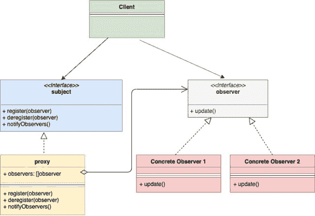

<!--yml

类别：未分类

日期：2024-10-13 06:03:59

-->

# Go 中的观察者设计模式

> 来源：[`golangbyexample.com/observer-design-pattern-golang/`](https://golangbyexample.com/observer-design-pattern-golang/)

注意：有兴趣了解其他所有设计模式如何在 GO 中实现。请参见此完整参考 – [Go 中的所有设计模式](https://golangbyexample.com/all-design-patterns-golang/)

目录

**   介绍：

+   UML 图：

+   映射：

+   实用示例：

+   完整工作代码：*  *# **介绍：**

观察者设计模式是一种行为设计模式。该模式允许一个实例**（称为主题）**将事件发布给多个实例**（称为观察者）。** 这些**观察者**订阅**主题**，因此在**主题**发生任何变化时会收到事件通知。

让我们举个例子。在电子商务网站上，许多商品会缺货。可能会有客户对某个缺货的特定商品感兴趣。对此问题有三种解决方案

1.  客户以某种频率检查项目的可用性。

1.  电子商务向客户推送所有新到的、现货商品。

1.  客户仅订阅他感兴趣的特定项目，并在该项目可用时收到通知。同时，多个客户可以订阅同一产品

选项 3 是最可行的，这正是观察者模式的核心。观察者模式的主要组件有：

1.  **主题** – 它是当任何变化发生时发布事件的实例。

1.  **观察者** – 它订阅主题并通过事件收到通知。

通常，**主题**和**观察者**实现为接口。两者的具体实现被使用

# **UML 图：**



# **映射：**

下表表示 UML 图中的角色与下面**“实用示例”**中的实际实现角色之间的映射

| 主题 | subject.go |
| --- | --- |
| 具体主题 | item.go |
| 观察者 | observer.go |
| 具体观察者 1 | customer.go |
| 客户端 | main.go |

# **实用示例：**

**subject.go**

```go
package main

type subject interface {
    register(Observer observer)
    deregister(Observer observer)
    notifyAll()
}
```

**item.go**

```go
package main

import "fmt"

type item struct {
    observerList []observer
    name         string
    inStock      bool
}

func newItem(name string) *item {
    return &item{
        name: name,
    }
}

func (i *item) updateAvailability() {
    fmt.Printf("Item %s is now in stock\n", i.name)
    i.inStock = true
    i.notifyAll()
}

func (i *item) register(o observer) {
    i.observerList = append(i.observerList, o)
}

func (i *item) deregister(o observer) {
    i.observerList = removeFromslice(i.observerList, o)
}

func (i *item) notifyAll() {
    for _, observer := range i.observerList {
        observer.update(i.name)
    }
}

func removeFromslice(observerList []observer, observerToRemove observer) []observer {
    observerListLength := len(observerList)
    for i, observer := range observerList {
        if observerToRemove.getID() == observer.getID() {
            observerList[observerListLength-1], observerList[i] = observerList[i], observerList[observerListLength-1]
            return observerList[:observerListLength-1]
        }
    }
    return observerList
}
```

**observer.go**

```go
package main

type observer interface {
    update(string)
    getID() string
}
```

**customer.go**

```go
package main

import "fmt"

type customer struct {
    id string
}

func (c *customer) update(itemName string) {
    fmt.Printf("Sending email to customer %s for item %s\n", c.id, itemName)
}

func (c *customer) getID() string {
    return c.id
}
```

**main.go**

```go
package main

func main() {
    shirtItem := newItem("Nike Shirt")
    observerFirst := &customer{id: "abc@gmail.com"}
    observerSecond := &customer{id: "xyz@gmail.com"}
    shirtItem.register(observerFirst)
    shirtItem.register(observerSecond)
    shirtItem.updateAvailability()
}
```

**输出：**

```go
Item Nike Shirt is now in stock
Sending email to customer abc@gmail.com for item Nike Shirt
Sending email to customer xyz@gmail.com for item Nike Shirt
```

# **完整工作代码：**

```go
package main

import "fmt"

type subject interface {
    register(Observer observer)
    deregister(Observer observer)
    notifyAll()
}

type item struct {
    observerList []observer
    name         string
    inStock      bool
}

func newItem(name string) *item {
    return &item{
        name: name,
    }
}

func (i *item) updateAvailability() {
    fmt.Printf("Item %s is now in stock\n", i.name)
    i.inStock = true
    i.notifyAll()
}

func (i *item) register(o observer) {
    i.observerList = append(i.observerList, o)
}

func (i *item) deregister(o observer) {
    i.observerList = removeFromslice(i.observerList, o)
}

func (i *item) notifyAll() {
    for _, observer := range i.observerList {
        observer.update(i.name)
    }
}

func removeFromslice(observerList []observer, observerToRemove observer) []observer {
    observerListLength := len(observerList)
    for i, observer := range observerList {
        if observerToRemove.getID() == observer.getID() {
            observerList[observerListLength-1], observerList[i] = observerList[i], observerList[observerListLength-1]
            return observerList[:observerListLength-1]
        }
    }
    return observerList
}

type observer interface {
    update(string)
    getID() string
}

type customer struct {
    id string
}

func (c *customer) update(itemName string) {
    fmt.Printf("Sending email to customer %s for item %s\n", c.id, itemName)
}

func (c *customer) getID() string {
    return c.id
}

func main() {
    shirtItem := newItem("Nike Shirt")
    observerFirst := &customer{id: "abc@gmail.com"}
    observerSecond := &customer{id: "xyz@gmail.com"}
    shirtItem.register(observerFirst)
    shirtItem.register(observerSecond)
    shirtItem.updateAvailability()
}
```

**输出：**

```go
Item Nike Shirt is now in stock
Sending email to customer abc@gmail.com for item Nike Shirt
Sending email to customer xyz@gmail.com for item Nike Shirt
```

+   [设计](https://golangbyexample.com/tag/design/)*   [Golang](https://golangbyexample.com/tag/golang/)*   [观察者](https://golangbyexample.com/tag/observer/)*   [Go 中的观察者设计模式](https://golangbyexample.com/tag/observer-design-pattern-in-go/)*   [模式](https://golangbyexample.com/tag/pattern/)*
