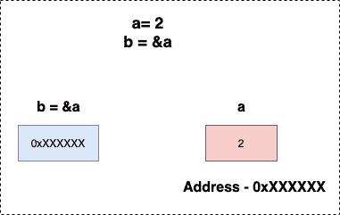

<!--yml

类别：未分类

日期：2024-10-13 06:28:47

-->

# Go 语言中的指针

> 来源：[`golangbyexample.com/pointer-golang/`](https://golangbyexample.com/pointer-golang/)

这是 Go 语言综合教程系列的第十五章。有关该系列其他章节，请参阅此链接 – [Golang 综合教程系列](https://golangbyexample.com/golang-comprehensive-tutorial/)

**下一教程** – [结构体](https://golangbyexample.com/struct-in-golang-complete-guide/)

**上一篇教程** – [Defer 关键字](https://golangbyexample.com/defer-golang)

现在让我们看看当前的教程。以下是当前教程的目录。

目录

+   概述

+   指针的声明

+   指针的初始化

    +   使用 new 运算符

    +   使用符号 ‘&’ 运算符

+   关于 * 或解引用指针

+   指向指针的指针

+   指针算术

+   指针的默认零值

+   结论

# **概述**

指针是一个变量，它保存另一个变量的内存地址。

# **指针的声明**

在下面的示例中，**ex** 是 **T** 类型的指针。

```go
var ex *T
```

在声明中，指针值被设置为其默认零值，即 nil。

# **指针的初始化**

初始化指针有两种方法

+   使用 **new** 运算符

+   使用符号 **‘&’** 运算符

## **使用 new 运算符**

指针可以使用 **new** 运算符进行初始化

```go
a := new(int)
*a = 10
fmt.Println(*a) //Output will be 10
```

***** 运算符可用于解引用指针，意味着获取存储在指针中的地址的值

```go
fmt.Println(*a) //Print the value stored at address a
```

## 使用符号 **‘&’** 运算符

**&** 用于获取变量的地址

```go
a := 2
b := &a
fmt.Println(*b) //Output will be 2
```



让我们看看一个涵盖以上所有要点的工作代码

```go
package main

import "fmt"

func main() {
    //Declare
    var b *int
    a := 2
    b = &a

    //Will print a address. Output will be different everytime.
    fmt.Println(b)
    fmt.Println(*b)
    b = new(int)
    *b = 10
    fmt.Println(*b) 
}
```

**输出：**

```go
2
10
0xc0000b0018
```

# **关于 * 或解引用指针**

***** 运算符可用于：

+   解引用指针意味着获取存储在指针中的地址的值。

+   也可以更改该指针位置的值

```go
package main

import "fmt"

func main() {
	a := 2
	b := &a
	fmt.Println(a)
	fmt.Println(*b)

	*b = 3
	fmt.Println(a)
	fmt.Println(*b)

	a = 4
	fmt.Println(a)
	fmt.Println(*b)
}
```

**输出**

```go
2
2
3
3
4
4
```

**a** 和 ***b** 在内部指向同一个变量。因此更改一个的值会反映在另一个上。此外，***** 和 **&** 也可以一起使用，但它们会互相抵消。

因此下面的两种方法是等效的，将打印 2

+   a

+   *&a

下面的三种方法是等效的，并将打印存储在变量 b 中的变量 a 的地址

+   b

+   *&b

+   &*b

注意： *a 不是有效操作，因为 a 不是指针

# **指向指针的指针**

在 Go 中也可以创建指向指针的指针

```go
a := 2
b := &a
c := &b
```

**c**在这里是一个指向指针的指针。它存储**b**的地址，而**b**又存储**a**的地址。使用*****运算符进行双重解引用可以打印指向指针的值。因此，****c**将打印值 2

以下图示描绘了指向指针的指针。

+   **b**包含**a**的地址

+   **c**包含**b**的地址


让我们来看看，一个描绘指向指针的程序

```go
package main

import "fmt"

func main() {
	a := 2
	b := &a
	c := &b

	fmt.Printf("a: %d\n", a)
	fmt.Printf("b: %x\n", b)
	fmt.Printf("c: %x\n", c)

	fmt.Println()
	fmt.Printf("a: %d\n", a)
	fmt.Printf("*&a: %d\n", *&a)
	fmt.Printf("*b: %d\n", *b)
	fmt.Printf("**c: %d\n", **c)

	fmt.Println()
	fmt.Printf("&a: %d\n", &a)
	fmt.Printf("b: %d\n", b)
	fmt.Printf("&*b: %d\n", &*b)
	fmt.Printf("*&b: %d\n", *&b)
	fmt.Printf("*c: %d\n", *c)

	fmt.Println()
	fmt.Printf("b: %d\n", &b)
	fmt.Printf("*c: %d\n", c)
}
```

**输出**

```go
a: 2
b: c000018078
c: c00000e028

a: 2
*&a: 2
*b: 2
**c: 2

&a: 824633819256
b: 824633819256
&*b: 824633819256
*&b: 824633819256
*c: 824633819256

b: 824633778216
*c: 824633778216
```

从输出可以清楚地看到

以下是与变量 a 的值相等且等同于 2

+   a

+   *&a

+   *b

+   **c

**以下是与变量 b 的值相等且等同于 a 的地址**

***   &a

+   b

+   &*b

+   *&b

+   *c

****以下是与变量 c 的值相等且等同于 b 的地址****

*****   b

+   *c

# **指针算术**

在 golang 中，指针算术是不可能的，这与 C 语言不同。这会引发编译错误。

```go
package main
func main() {
    a := 1
    b := &a
    b = b + 1
}
```

**输出**

上述程序引发编译错误

```go
invalid operation: b + 1 (mismatched types *int and int)
```

# **指针的默认零值**

指针的默认零值是 nil。让我们来看一个示例程序

```go
package main

import "fmt"

func main() {
    var a *int
    fmt.Print("Default Zero Value of a pointer: ")
    fmt.Println(a)
}
```

**输出：**

```go
Default value of pointer: 
```

# **结论**

这就是 golang 中的指针。希望你喜欢这篇文章。请在评论中分享反馈/改进/错误

**下一教程** – [结构体](https://golangbyexample.com/struct-in-golang-complete-guide/)

**上一篇教程** – [defer 关键字](https://golangbyexample.com/defer-golang)


