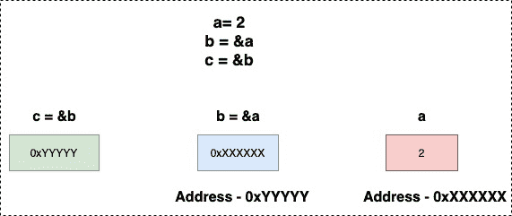

<!--yml

分类：未分类

日期：2024-10-13 06:28:51

-->

# Go (Golang)中的指向指针

> 来源：[`golangbyexample.com/pointer-to-pointer-golang/`](https://golangbyexample.com/pointer-to-pointer-golang/)

目录

+   概述

+   程序

# **概述**

在 Go 中也可以创建指向指针的指针。

```go
a := 2
b := &a
c := &b
```

**c**在这里是一个指向指针的指针。它存储**b**的地址，而**b**又存储**a**的地址。可以使用*****运算符进行双重解引用，从而打印指向指针的值。因此，****c**将打印值 2。

下图描绘了指向指针的指针。

+   **b**包含**a**的地址。

+   **c**包含**b**的地址。



# **程序**

让我们来看一个描绘指针的程序。

```go
package main

import "fmt"

func main() {
	a := 2
	b := &a
	c := &b

	fmt.Printf("a: %d\n", a)
	fmt.Printf("b: %x\n", b)
	fmt.Printf("c: %x\n", c)

	fmt.Println()
	fmt.Printf("a: %d\n", a)
	fmt.Printf("*&a: %d\n", *&a)
	fmt.Printf("*b: %d\n", *b)
	fmt.Printf("**c: %d\n", **c)

	fmt.Println()
	fmt.Printf("&a: %d\n", &a)
	fmt.Printf("b: %d\n", b)
	fmt.Printf("&*b: %d\n", &*b)
	fmt.Printf("*&b: %d\n", *b)
	fmt.Printf("*c: %d\n", *c)

	fmt.Println()
	fmt.Printf("b: %d\n", &b)
	fmt.Printf("*c: %d\n", c)
}
```

**输出**

```go
a: 2
b: c000018078
c: c00000e028

a: 2
*&a: 2
*b: 2
**c: 2

&a: 824633819256
b: 824633819256
&*b: 824633819256
*&b: 824633819256
*c: 824633819256

b: 824633778216
*c: 824633778216
```

从输出中可以清楚看出。

以下是等价且值为变量**a**的 2。

+   a

+   *&a

+   *b

+   **c

**以下是等价且值为变量**b**的**a**的地址。**

***   &a

+   b

+   &*b

+   *&b

+   *c

****以下是等价且值为变量**c**的**b**的地址。******

*****   b

+   *c


