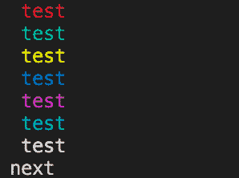

<!--yml

类别：未分类

日期：2024-10-13 06:15:59

-->

# 在控制台中以颜色输出文本

> 来源：[https://golangbyexample.com/print-output-text-color-console/](https://golangbyexample.com/print-output-text-color-console/)

**注意：** 如果你有兴趣学习Golang，我们有一个全面的Golang教程系列。请查看一下 – [Golang全面教程系列](https://golangbyexample.com/golang-comprehensive-tutorial/)。现在让我们看看当前的教程。下面是目录。

目录

**   [概述](#Overview "概述")

+   [代码](#Code "代码")*  *# **概述**

[ANSI转义码](http://en.wikipedia.org/wiki/ANSI_escape_code)可以用来在控制台中输出彩色文本。请注意

+   在MAC/Linux系统终端支持ANSI转义码

+   Windows命令提示符不支持它。在Windows上，你可以安装Cygwin。ANSI转义码在那个环境下可以工作。

另外需要提到的是，在下面的代码中，我们在打印后使用了colorReset。如果不使用它，颜色效果将保持，不会被清除。去掉下面代码中的colorReset，它将以青色显示文本“**next”**。

下面是用Golang实现相同功能的代码。

# **代码**

```
package main

import (
    "fmt"
)

func main() {
    colorReset := "\033[0m"

    colorRed := "\033[31m"
    colorGreen := "\033[32m"
    colorYellow := "\033[33m"
    colorBlue := "\033[34m"
    colorPurple := "\033[35m"
    colorCyan := "\033[36m"
    colorWhite := "\033[37m"

    fmt.Println(string(colorRed), "test")
    fmt.Println(string(colorGreen), "test")
    fmt.Println(string(colorYellow), "test")
    fmt.Println(string(colorBlue), "test")
    fmt.Println(string(colorPurple), "test")
    fmt.Println(string(colorWhite), "test")
    fmt.Println(string(colorCyan), "test", string(colorReset))
    fmt.Println("next")
}
```

**输出：**

在我的Mac机器上

*   [ansi](https://golangbyexample.com/tag/ansi/)*   [color](https://golangbyexample.com/tag/color/)*   [console](https://golangbyexample.com/tag/console/)*   [go](https://golangbyexample.com/tag/go/)*   [output](https://golangbyexample.com/tag/output/)*   [print](https://golangbyexample.com/tag/print/)*   [terminal](https://golangbyexample.com/tag/terminal/)*   [text](https://golangbyexample.com/tag/text/)*
