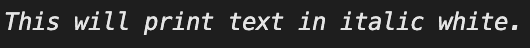

<!--yml

类别：未分类

日期：2024-10-13 06:41:24

-->

# 在 Go (Golang) 中以斜体打印/输出文本

> 来源：[https://golangbyexample.com/print-italic-text-golang/](https://golangbyexample.com/print-italic-text-golang/)

目录

**   [概述](#Overview "Overview")

+   [程序](#Program "Program")*  *# **概述**

我们可以使用 faith 包来实现相同的功能。

[https://github.com/fatih/color](https://github.com/fatih/color)

# **程序**

```
package main

import (
	"fmt"

	"github.com/fatih/color"
)

func main() {
	whilte := color.New(color.FgWhite)
	boldWhite := whilte.Add(color.Italic)
	boldWhite.Println("This will print text in italic white.")
}
```

**输出**

*   [前往](https://golangbyexample.com/tag/go/)*   [Golang](https://golangbyexample.com/tag/golang/)*
