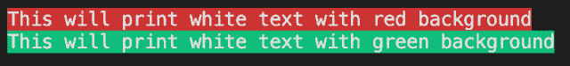

<!--yml

类别：未分类

日期：2024-10-13 06:41:30

-->

# 在 Go (Golang) 中打印/输出带背景的文本

> 来源：[`golangbyexample.com/print-text-background-golang/`](https://golangbyexample.com/print-text-background-golang/)

目录

+   概述

+   程序

# **概述**

我们可以使用 faith 包来实现相同的功能

[`github.com/fatih/color`](https://github.com/fatih/color)

# **程序**

在下面的程序中，我们将文本以白色字体打印在红色背景上

```go
package main

import (
	"fmt"

	"github.com/fatih/color"
)

func main() {
	whilte := color.New(color.FgWhite)
	boldWhite := whilte.Add(color.BgRed)
	boldWhite.Print("This will print white text with red background")
	fmt.Println()

	boldWhite = whilte.Add(color.BgGreen)
	boldWhite.Print("This will print white text with green background")
	fmt.Println()

}
```

**输出**



其他背景颜色选项有

[`github.com/fatih/color/blob/master/color.go`](https://github.com/fatih/color/blob/master/color.go)

```go
// Background text colors
const (
    BgBlack Attribute = iota + 40
    BgRed
    BgGreen
    BgYellow
    BgBlue
    BgMagenta
    BgCyan
    BgWhite
)
// Background Hi-Intensity text colors
const (
    BgHiBlack Attribute = iota + 100
    BgHiRed
    BgHiGreen
    BgHiYellow
    BgHiBlue
    BgHiMagenta
    BgHiCyan
    BgHiWhite
)
```

**注意：** 请查看我们的 Golang 高级教程。本系列的教程内容详尽，我们尝试涵盖所有概念并附有示例。本教程适合那些希望获得专业知识和扎实理解 Golang 的人 – [Golang 高级教程](https://golangbyexample.com/golang-comprehensive-tutorial/)

如果你有兴趣了解所有设计模式如何在 Golang 中实现。如果是的话，这篇文章就是为你准备的 – [所有设计模式 Golang](https://golangbyexample.com/all-design-patterns-golang/)


